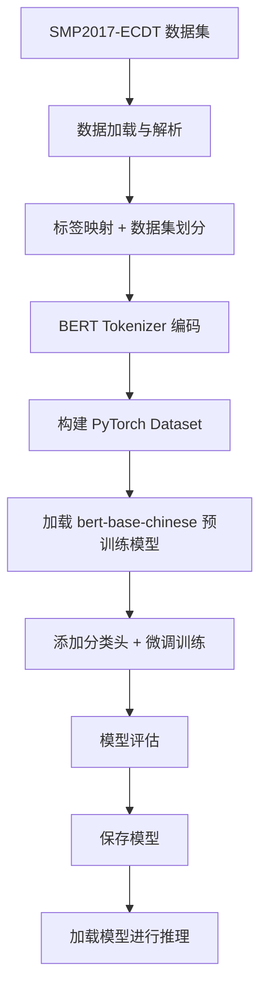
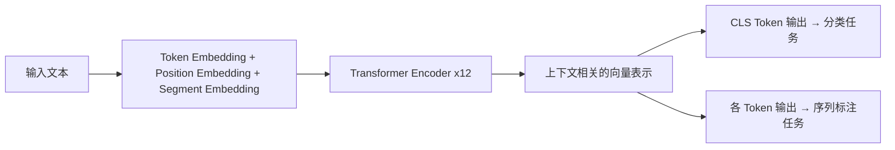
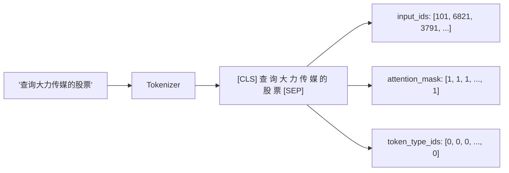
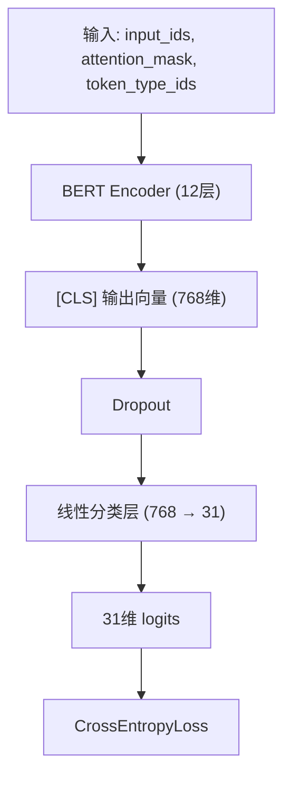
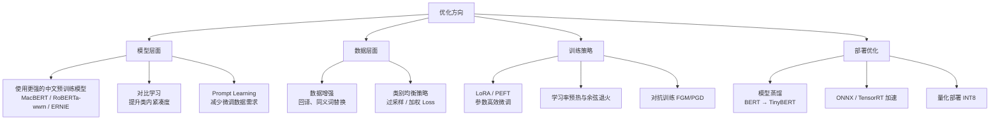

# 从零搭建中文意图识别系统：BERT 微调实战全记录

> 基于 SMP2017-ECDT 数据集，使用 `bert-base-chinese` 完成 31 类意图分类，验证集 Accuracy 94.2%、F1-Macro 0.93。本文从数据解析到模型部署，完整复现整个流程。

---

## 一、项目背景

### 1.1 什么是意图识别？

**意图识别（Intent Recognition / Intent Classification）** 是自然语言处理（NLP）中的一项基础任务，其目标是判断用户输入的自然语言文本属于哪个预定义的"意图类别"。

举个例子：

| 用户输入 | 识别意图 |
|---------|---------|
| "查询大力传媒的股票" | `stock` |
| "今天下雨吗？" | `weather` |
| "帮我订明天去北京的机票" | `flight` |
| "播放周杰伦的歌" | `music` |

### 1.2 为什么意图识别很重要？

意图识别是**智能客服、语音助手、问答系统、对话系统**等场景中的第一道关卡。只有准确理解用户"想干什么"，后续的流程才能正确执行。它在以下场景中具有核心地位：

- **智能客服系统**：判断用户是咨询、投诉、退款还是其他需求，自动路由到对应处理流程
- **语音助手（如小爱同学、天猫精灵）**：将用户的语音指令转化为可执行的操作
- **对话式 AI**：作为 Dialogue System 中 NLU（自然语言理解）模块的核心组件
- **搜索与推荐**：理解用户搜索 query 背后的真实需求

### 1.3 为什么选择 BERT？

传统的意图识别方法依赖于规则匹配或浅层模型（如 SVM + TF-IDF），存在以下局限：

- **语义理解能力弱**：无法处理同义不同形的表达
- **泛化能力差**：遇到训练集未覆盖的表达方式就容易失败
- **特征工程繁重**：需要大量人工设计特征

**BERT（Bidirectional Encoder Representations from Transformers）** 的出现彻底改变了这一局面。它通过**双向 Transformer Encoder** 捕获深层语义信息，在几乎所有 NLP 任务上都取得了 SOTA 级别的效果。对于中文意图识别来说，BERT 的优势在于：

1. **双向上下文建模**：能同时利用前文和后文信息，理解完整语义
2. **强大的迁移学习能力**：在大规模中文语料上预训练，微调即可适配下游任务
3. **端到端学习**：无需手动特征工程，直接从文本到分类结果

---

## 二、整体技术方案

整个项目的技术流程可以用下图概括：



**技术栈一览**：

| 组件 | 选型 |
|-----|------|
| 预训练模型 | `bert-base-chinese` |
| 框架 | PyTorch + HuggingFace Transformers |
| 数据集 | SMP2017-ECDT（Task1） |
| 训练环境 | Google Colab（GPU T4） |
| 评估指标 | Accuracy + F1-Macro |

---

## 三、BERT 模型原理介绍

### 3.1 从 Transformer 到 BERT

**Transformer** 是 2017 年 Google 在《Attention Is All You Need》中提出的架构，其核心是**自注意力机制（Self-Attention）**，能够让模型在处理每个词时"关注"到序列中所有其他词的信息。

Transformer 由两部分组成：
- **Encoder**：将输入序列编码为上下文相关的向量表示
- **Decoder**：基于 Encoder 的输出，逐步生成目标序列

BERT 只使用了 **Transformer Encoder** 部分。

### 3.2 BERT 的核心思想

BERT（Bidirectional Encoder Representations from Transformers）由 Google 在 2018 年提出，其核心创新在于**双向预训练**：

- **MLM（Masked Language Model）**：随机遮盖输入中 15% 的 token，让模型根据上下文预测被遮盖的词。这迫使模型同时利用左右两个方向的上下文信息，而非像 GPT 那样只能从左到右。
- **NSP（Next Sentence Prediction）**：判断两个句子是否为相邻句子，帮助模型理解句子间的关系。



### 3.3 `bert-base-chinese` 模型规格

本项目使用的 `bert-base-chinese` 具体参数如下：

| 参数 | 值 |
|-----|-----|
| 层数（Encoder Layers） | 12 |
| 隐藏层维度 | 768 |
| 注意力头数 | 12 |
| 词表大小 | 21,128（中文字符级） |
| 最大序列长度 | 512 |
| 参数量 | ~110M |

值得注意的是，`bert-base-chinese` 采用的是**字级别（Character-level）分词**，而非词级别。这意味着每个汉字作为一个 token，避免了中文分词带来的误差传播问题，这对意图识别任务来说是一个天然优势。

### 3.4 为什么 BERT 适合中文意图分类？

1. **字级分词避免分词错误**：中文不像英文有天然的空格分隔，字级 tokenization 更稳健
2. **预训练带来的语义理解**：在大规模中文语料上学习到的语言知识可以直接迁移
3. **微调简单高效**：只需在 BERT 顶部加一个线性分类层，就能完成分类任务
4. **短文本表现优秀**：意图识别的输入通常是短查询，BERT 对短文本的编码能力非常强

---

## 四、中文意图识别数据处理流程

### 4.1 数据集介绍

本项目使用的是 **SMP2017-ECDT** 数据集，这是由中国中文与语音学会（SMP）在 2017 年发布的中文对话语言理解数据集。该数据集包含了多种意图类别的用户查询文本，来源于真实场景。

**数据格式**：

数据集以 `.txt` 文件形式组织，每个文件对应一个意图类别，文件名格式为 `{split}_{intent}.txt`，例如：
- `train_stock.txt` → 训练集，stock 意图
- `develop_weather.txt` → 验证集，weather 意图
- `test_flight.txt` → 测试集，flight 意图

每个文件内每行一条文本数据，例如：

```
查询大力传媒的股票
平安保险的股票价格
永辉超市股份的价格
```

**标签体系**：

数据集共包含 **31 个意图类别**，涵盖了日常对话中的主要场景：

| 类别 | 含义 | 类别 | 含义 |
|-----|------|-----|------|
| `app` | 应用 | `bus` | 公交 |
| `calc` | 计算 | `chat` | 聊天 |
| `cinemas` | 影院 | `contacts` | 通讯录 |
| `cookbook` | 菜谱 | `datetime` | 时间日期 |
| `email` | 邮件 | `epg` | 节目预告 |
| `flight` | 航班 | `health` | 健康 |
| `lottery` | 彩票 | `map` | 地图 |
| `match` | 比赛 | `message` | 短信 |
| `music` | 音乐 | `news` | 新闻 |
| `novel` | 小说 | `poetry` | 诗词 |
| `radio` | 电台 | `riddle` | 谜语 |
| `schedule` | 日程 | `stock` | 股票 |
| `telephone` | 电话 | `train` | 火车 |
| `translation` | 翻译 | `tvchannel` | 电视频道 |
| `video` | 视频 | `weather` | 天气 |
| `website` | 网站 | | |

### 4.2 数据加载代码解析

```python
def load_smp_data(txt_files):
    texts, labels = [], []
    for file_path in txt_files:
        # 从文件名中提取意图标签
        # 例如 "train_stock.txt" → "stock"
        file_name = os.path.basename(file_path)
        label = file_name.split('_')[1].replace('.txt', '')

        with open(file_path, 'r', encoding='utf-8') as f:
            for line in f:
                line = line.strip()
                if line:  # 跳过空行
                    texts.append(line)
                    labels.append(label)
    return texts, labels
```

**设计思想**：

- **标签来源于文件名**：SMP2017-ECDT 的数据按意图分文件存储，因此标签直接从文件名中解析，无需额外的标注文件
- **逐行读取**：每个 `.txt` 文件每行一条样本，简单高效
- **过滤空行**：数据中可能存在空行，需要过滤掉以避免无效样本

最终加载得到 **2299 条训练样本**，覆盖 31 个类别。

### 4.3 标签映射与数据集划分

```python
from sklearn.model_selection import train_test_split

# 构建标签到 ID 的双向映射
unique_labels = sorted(set(labels))
label2id = {label: idx for idx, label in enumerate(unique_labels)}
id2label = {idx: label for label, idx in label2id.items()}

# 分层抽样划分训练集和验证集（85% / 15%）
train_texts, val_texts, train_labels, val_labels = train_test_split(
    texts, label_ids, test_size=0.15, random_state=42, stratify=label_ids
)
```

**关键设计点**：

- **`stratify=label_ids`**：使用**分层抽样**，确保训练集和验证集中每个类别的比例一致，避免某些小类别在验证集中完全缺失
- **`random_state=42`**：固定随机种子，保证实验可复现
- **划分比例 85/15**：训练集 1954 条，验证集 345 条

### 4.4 Tokenizer 编码处理

```python
from transformers import AutoTokenizer

tokenizer = AutoTokenizer.from_pretrained('bert-base-chinese')

train_encodings = tokenizer(
    train_texts,
    truncation=True,   # 超过 max_length 的文本截断
    padding=True,      # 短文本用 [PAD] 填充
    max_length=64      # 最大序列长度
)
```

**处理流程详解**：



- **`[CLS]` 和 `[SEP]`**：BERT 自动在序列首尾添加特殊标记。`[CLS]` 的输出向量将用于分类
- **`truncation=True`**：超过 64 个 token 的文本会被截断。意图识别的输入通常是短查询，64 已经足够
- **`padding=True`**：将同一 batch 内不同长度的序列用 `[PAD]` 填充到统一长度
- **`attention_mask`**：标记哪些位置是真实 token（1），哪些是 padding（0），防止模型关注填充位置

### 4.5 构建 PyTorch Dataset

```python
class IntentDataset(torch.utils.data.Dataset):
    def __init__(self, encodings, labels):
        self.encodings = encodings
        self.labels = labels

    def __getitem__(self, idx):
        # 将每个 token 的编码和标签转为 tensor
        item = {k: torch.tensor(v[idx]) for k, v in self.encodings.items()}
        item['labels'] = torch.tensor(self.labels[idx])
        return item

    def __len__(self):
        return len(self.labels)
```

**设计思想**：

- 继承 `torch.utils.data.Dataset`，与 PyTorch 的 `DataLoader` 无缝配合
- `__getitem__` 返回一个字典，包含 `input_ids`、`attention_mask`、`token_type_ids` 和 `labels`，这正是 `AutoModelForSequenceClassification` 所期望的输入格式
- 使用 `torch.tensor()` 将 numpy 数组转为 PyTorch 张量

---

## 五、模型训练代码解析

### 5.1 模型加载

```python
from transformers import AutoModelForSequenceClassification

model = AutoModelForSequenceClassification.from_pretrained(
    'bert-base-chinese',
    num_labels=31,          # 31 个意图类别
    id2label=id2label,      # ID → 标签名映射
    label2id=label2id,      # 标签名 → ID 映射
)
```

**模型结构解析**：



`AutoModelForSequenceClassification` 自动完成以下操作：

1. 加载 `bert-base-chinese` 的预训练权重
2. 丢弃原始的 MLM 和 NSP 预训练头（日志中显示为 `UNEXPECTED`）
3. **随机初始化**分类头 `classifier.weight` 和 `classifier.bias`（日志中显示为 `MISSING`）

这就是**迁移学习**的精髓：复用 BERT 学到的语言表示能力，只训练顶部的分类层。

### 5.2 评估指标定义

```python
from sklearn.metrics import accuracy_score, f1_score

def compute_metrics(eval_pred):
    logits, labels = eval_pred
    preds = np.argmax(logits, axis=1)  # 取 logits 最大值的索引作为预测类别
    return {
        'accuracy': accuracy_score(labels, preds),
        'f1_macro': f1_score(labels, preds, average='macro'),
    }
```

**为什么选择这两个指标？**

- **Accuracy（准确率）**：直观反映整体分类正确率
- **F1-Macro**：对所有类别的 F1 值取算术平均，**每个类别权重相同**。这比 Micro-F1 更能反映模型在少数类别上的表现——如果某个小类别完全分错，Macro-F1 会显著下降

### 5.3 训练参数配置

```python
from transformers import TrainingArguments

training_args = TrainingArguments(
    output_dir='./results',
    num_train_epochs=8,              # 训练 8 个 epoch
    per_device_train_batch_size=32,  # 训练 batch size
    per_device_eval_batch_size=32,   # 评估 batch size
    learning_rate=2e-5,              # 学习率
    weight_decay=0.01,               # L2 正则化
    eval_strategy='epoch',           # 每个 epoch 评估
    save_strategy='epoch',           # 每个 epoch 保存
    load_best_model_at_end=True,     # 训练结束后加载最优模型
    metric_for_best_model='f1_macro',# 以 F1-Macro 为选模标准
    logging_steps=20,                # 每 20 步打印日志
    report_to='none',                # 不上报到 WandB 等平台
)
```

**关键参数解读**：

| 参数 | 值 | 说明 |
|-----|-----|------|
| `learning_rate` | 2e-5 | BERT 微调的经典学习率，太小训练慢，太大容易破坏预训练权重 |
| `weight_decay` | 0.01 | 防止过拟合的 L2 正则化系数 |
| `num_train_epochs` | 8 | 数据量较小（~2000 条），需要较多 epoch 来充分学习 |
| `load_best_model_at_end` | True | 自动保存并加载验证集上表现最好的模型，避免过拟合带来的性能下降 |

### 5.4 Trainer 训练

```python
from transformers import Trainer

trainer = Trainer(
    model=model,
    args=training_args,
    train_dataset=train_dataset,
    eval_dataset=val_dataset,
    compute_metrics=compute_metrics,
)

trainer.train()
```

HuggingFace 的 `Trainer` 封装了完整的训练循环，包括：

- 自动学习率调度（默认 linear schedule with warmup）
- 梯度累积与混合精度训练（如果环境支持）
- 训练日志记录
- 模型 checkpoint 管理
- 评估与早停逻辑

---

## 六、模型训练过程分析

### 6.1 训练概况

根据训练输出，模型训练的关键数据如下：

| 指标 | 值 |
|-----|-----|
| 总训练步数 | 496 步 |
| 训练总 Loss | 0.7094（平均） |
| 训练耗时 | 237.8 秒（约 4 分钟） |
| 训练速度 | 65.7 samples/s，2.09 steps/s |
| 总计算量 | 401.76 TFLOPs |

### 6.2 Loss 变化分析

训练平均 Loss 为 **0.7094**。考虑到这是一个 31 分类任务，随机猜测的 Loss 约为 `-ln(1/31) ≈ 3.43`，说明模型在训练过程中**收敛效果良好**，从随机水平大幅下降。

> **Notebook 未提供**逐 step 或逐 epoch 的 Loss 曲线数据。如需更细致的分析，建议训练时配合 TensorBoard 或 WandB 记录每个 step 的 Loss 变化。

### 6.3 训练效率分析

在 Google Colab 的 T4 GPU 上，整个训练过程仅耗时约 **4 分钟**，这得益于：

- `bert-base-chinese` 模型规模适中（110M 参数）
- 数据量较小（1954 条训练样本）
- 序列长度较短（max_length=64）
- batch size 设置合理（32）

---

## 七、模型效果与优化方向

### 7.1 验证集评估结果

```python
metrics = trainer.evaluate()
```

评估结果：

| 指标 | 值 |
|-----|-----|
| **eval_loss** | 0.2596 |
| **eval_accuracy** | **94.20%** |
| **eval_f1_macro** | **0.9309** |

### 7.2 效果分析

**94.2% 的准确率和 0.93 的 Macro-F1** 是一个相当不错的结果，说明：

1. **BERT 的迁移学习能力强大**：仅用 ~2000 条数据微调，就能在 31 分类任务上达到 94%+ 的准确率
2. **评估 Loss（0.26）远低于训练 Loss（0.71）**：这可能是因为评估时模型已经收敛到较优状态，且评估集规模较小。但也需要关注是否存在**过拟合**的迹象
3. **Macro-F1 与 Accuracy 接近**：说明模型在各类别上的表现相对均衡，没有严重的类别倾斜问题

### 7.3 推理验证

```python
def predict_intent(query):
    inputs = tokenizer(query, return_tensors='pt', truncation=True, max_length=64)
    with torch.no_grad():
        outputs = model(**inputs)
    pred_id = int(outputs.logits.argmax(dim=1))
    return id2label[pred_id]

# 测试
query = '今天下雨吗？'
# 输出: 查询: 今天下雨吗？ -> 意图类别: weather ✅
```

模型成功将"今天下雨吗？"分类为 `weather`，符合预期。

### 7.4 技术难点与优化方向

#### 当前方案面临的挑战

**1. 数据量不足**

SMP2017-ECDT 训练集仅 2299 条，平均每个类别约 74 条。对于 BERT 微调来说，数据量偏少，可能导致：

- 部分类别学习不充分
- 模型泛化能力受限

**2. 类别不均衡**

不同意图类别的样本量可能差异较大（如 `chat` 类可能远多于 `riddle` 类），导致模型偏向多数类。

**3. 中文 NLP 的特殊挑战**

- 口语化表达多样：同一意图可能有多种表达方式
- 短文本语义稀疏：用户查询通常很短，上下文信息有限
- 歧义问题：如"帮我叫车"可能是 `map`（打车）也可能是 `telephone`（打电话叫车）

#### 进一步优化方案



**具体建议**：

| 优化方向 | 具体方案 | 预期收益 |
|---------|---------|---------|
| **更强预训练模型** | 换用 `hfl/chinese-macbert-base` 或 `hfl/chinese-roberta-wwm-ext` | 这些模型在中文任务上通常比原版 BERT 高 1-3 个点 |
| **数据增强** | 使用回译（中→英→中）、同义词替换、随机插入删除 | 扩充训练数据，缓解小样本问题 |
| **类别均衡** | 使用 `class_weight` 参数给少数类更高权重 | 提升少数类别的识别率 |
| **LoRA 微调** | 使用 PEFT 库只微调低秩适配矩阵 | 减少可训练参数，降低过拟合风险 |
| **对抗训练** | 在 embedding 层添加扰动（FGM/PGD） | 提升模型鲁棒性 |
| **模型蒸馏** | 将 BERT 蒸馏为 TinyBERT / MobileBERT | 推理速度提升 5-10 倍，适合线上部署 |
| **Prompt Learning** | 使用 P-Tuning / Prefix-Tuning | 在极少数据下也能取得不错效果 |

---

## 八、总结

### 8.1 本项目实现了什么

本项目完整实现了一个**基于 BERT 的中文意图识别系统**，涵盖了从数据到部署的全流程：

1. ✅ 从 GitHub 下载并解析 SMP2017-ECDT 数据集（2299 条样本，31 个类别）
2. ✅ 使用 `bert-base-chinese` Tokenizer 完成文本编码
3. ✅ 构建 PyTorch Dataset，配合 HuggingFace Trainer 进行微调
4. ✅ 在验证集上达到 **94.2% Accuracy** 和 **0.93 F1-Macro**
5. ✅ 实现模型保存与加载推理的完整闭环

### 8.2 核心技术要点回顾

- **BERT 的双向编码能力**使其在中文短文本分类中具有天然优势
- **字级 Tokenization** 避免了中文分词误差
- **分层抽样** 保证了数据划分的类别均衡
- **迁移学习** 让小样本场景也能取得优秀效果
- **F1-Macro** 作为选模标准，兼顾了所有类别的表现

### 8.3 后续扩展方向

如果你希望将这个项目扩展为生产级系统，可以考虑：

1. **接入更多数据**：收集真实业务场景的意图数据，扩充训练集
2. **层级意图体系**：将扁平的 31 类扩展为层级结构（如"出行→航班/火车/公交"）
3. **联合模型**：同时做意图识别和槽位填充（Joint Intent Classification and Slot Filling）
4. **在线学习**：部署后持续收集用户反馈，迭代优化模型
5. **多语言支持**：使用 `multilingual-BERT` 或 `XLM-R` 扩展到多语言场景

---

> **项目代码**：完整代码见 [Jupyter Notebook](中文意图识别_BERT训练.ipynb)，可在 Google Colab 中直接运行（选择 GPU 运行时即可）。
>
> **参考资源**：
> - [BERT 论文](https://arxiv.org/abs/1810.04805)
> - [HuggingFace Transformers 文档](https://huggingface.co/docs/transformers/)
> - [SMP2017-ECDT 数据集](https://github.com/HITlilingzhi/SMP2017ECDT-DATA)
