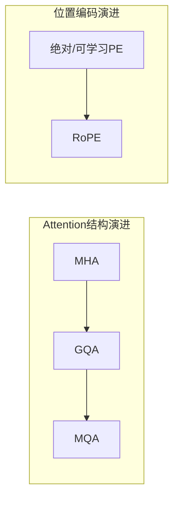
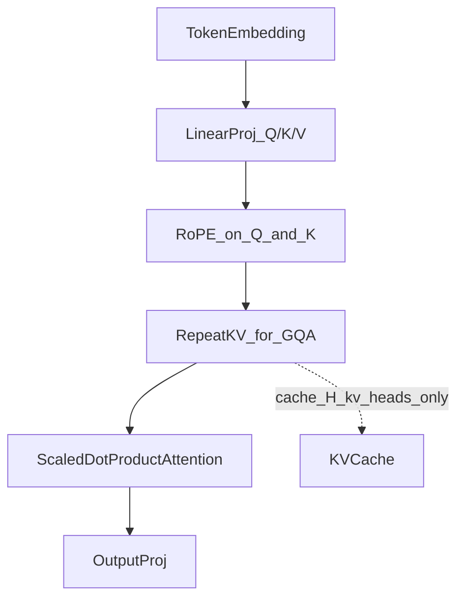

# 深入理解 GQA 与 RoPE：LLM 推理优化的两个关键组件

如果你已经熟悉 CNN 或 RNN，但对大语言模型（LLM）的内部结构还只是一知半解，那么 **Grouped Query Attention（GQA）** 和 **Rotary Position Embedding（RoPE）** 是两个非常值得搞清楚的模块。它们分别优化 Transformer 的两个正交维度：GQA 改的是注意力**头结构**，解决推理阶段的显存与 KV Cache 开销；RoPE 改的是**位置编码**，解决模型如何感知 token 顺序与相对距离。

二者常被组合使用——LLaMA 系列就是典型代表。本文基于 [手撕GQA & RoPE.ipynb](手撕GQA%20%26%20RoPE.ipynb) 中的手撕实现代码与原理图，从动机、原理、实现到对比，把这两个组件讲清楚。

---

## 一、背景与问题动机

在理解 GQA 和 RoPE 之前，先回顾 Transformer 解码器的两个基本事实：

1. **推理与训练的成本结构不同**。训练可以并行处理整个序列；推理（尤其是自回归生成）必须逐 token 生成，且每步都要对全部历史 token 做注意力计算。
2. **KV Cache 是推理优化的核心**。为避免每步重复计算历史 token 的 Key 和 Value，推理框架会把它们缓存起来。Cache 的体积正比于 `2 × num_kv_heads × head_dim × seq_len × num_layers`——序列越长、KV 头越多，显存压力越大。

### 1.1 GQA：KV Cache 太大了

标准 **Multi-Head Attention（MHA）** 为每个 Query 头维护独立的 Key 和 Value 头，即 `num_kv_heads = num_q_heads`。训练阶段这没问题——多头各自关注不同子空间，表达力充分。但推理阶段情况不同：自回归生成时，每生成一个新 token，都需要把该 token 在所有层的 K/V 追加到 Cache 中。Cache 大小与 `num_kv_heads` 成正比。

可以把它类比成：每个「提问者」（Q 头）都维护一份独立档案（K/V）。8 个 Q 头就意味着 8 份 K/V 档案；32 个 Q 头就是 32 份。当模型层数达到 32 层、序列长度达到 4096 时，这份「档案库」的体积会非常可观。

**Multi-Query Attention（MQA）** 走另一个极端：所有 Q 头共享**一组** K/V 头（`num_kv_heads = 1`）。KV Cache 大幅缩减，推理速度显著提升，但模型表达能力受损。参考资料示意图显示，相较 MHA，MQA 的模型质量约下降 5%（来源：参考资料示意图）。

**GQA** 在二者之间取折中：将 Q 头分组，组内共享 K/V。例如 8 个 Q 头配 2 个 KV 头，每 4 个 Q 头共用一组 K/V——相当于 4 个提问者共用一份档案。参考资料示意图给出的相对指标为：显存约为 MHA 的 40%，推理速度约为 MHA 的 3 倍，质量损失约 1%（来源：参考资料示意图）。GQA 因此被认为是工程上质量与效率的最佳平衡点。



### 1.2 RoPE：Transformer 不知道 token 的顺序

Transformer 的自注意力对输入 token 的排列是**置换不变**的——打乱顺序，注意力权重矩阵只是行列重排，模型无法区分「A 在 B 前面」还是「B 在 A 前面」。因此必须注入位置信息。

**主流旧方案**有两种：

- **绝对正弦位置编码**（原始 Transformer）：用固定的 sin/cos 函数为每个位置生成向量，加到 embedding 上。实现简单，但对训练长度之外的外推能力弱，且位置信息不直接进入 Q/K 的内积。
- **可学习位置编码**（如 BERT）：为每个位置学习一个向量。灵活，但参数随最大序列长度增长，长序列外推更困难。

**RoPE** 的思路不同：不往 embedding 上加向量，而是**旋转** Q 和 K 向量，让注意力分数 $\langle q, k \rangle$ 天然依赖两个 token 的**相对距离** $m - n$，而非各自的绝对位置。

用一个日常类比来理解：绝对位置编码像给每个座位贴固定编号（「第 3 号座」「第 7 号座」）；RoPE 则像把每个人转向不同角度——两个人「面对面」还是「背对背」，取决于他们之间的**相对角度差**，而不是各自面朝罗盘的绝对方向。这同时带来了更好的长度外推潜力和零额外可训练参数。

---

## 二、核心原理

### 2.1 GQA：分组共享 K/V

GQA 的核心参数关系：

$$\text{num\_groups} = \frac{\text{num\_q\_heads}}{\text{num\_kv\_heads}}$$

每个 KV 头对应 `num_groups` 个 Q 头。三个特例统一在同一框架下：

| 条件 | 退化为 |
|------|--------|
| `num_kv_heads == num_q_heads` | MHA |
| `num_kv_heads == 1` | MQA |
| 中间值 | GQA |

以参考资料示意图中的 8 Q 头 / 2 KV 头为例：

```
Group 1: Q1, Q2, Q3, Q4  →  共享 K1, V1
Group 2: Q5, Q6, Q7, Q8  →  共享 K2, V2
```


**计算流程**（四步，来源：参考资料示意图）：

1. 输入 $X$ 经线性投影得到 Q、K、V
2. Q 投影到 `num_q_heads` 个头，K/V 投影到 `num_kv_heads` 个头
3. 各组内独立计算 Scaled Dot-Product Attention
4. 拼接所有头的输出，经输出投影得到最终结果

**LLaMA 3 的实际配置**：`n_heads = 32`，`n_kv_heads = 8`，即 4:1 分组——Key/Value 头数仅为 Query 的 1/4（来源：`params.json`）。

### 2.2 RoPE：用旋转编码位置

RoPE 将 head_dim $d$ 按两维一组拆成 $d/2$ 个二维子空间，对每个子空间施加位置相关的 2D 旋转。

**Step 1**：频率计算（与 notebook 实现一致）

$$\text{freqs}_i = \frac{1}{\theta^{2i/d}}, \quad i = 0, 1, \ldots, \frac{d}{2} - 1$$

其中 $\theta$ 为基频，默认 10000；LLaMA 3 使用 `rope_theta = 500000`（来源：`params.json`）。维度越高，频率越低——低频分量编码长距离位置关系，高频分量编码短距离。

**Step 2**：对位置 $m$ 的 token，第 $i$ 对维度施加旋转

$$R(\theta_i, m) = \begin{bmatrix} \cos(m\theta_i) & -\sin(m\theta_i) \\ \sin(m\theta_i) & \cos(m\theta_i) \end{bmatrix}$$

$$\text{RoPE}(x_{2i}, x_{2i+1}, m) = R(\theta_i, m) \cdot \begin{bmatrix} x_{2i} \\ x_{2i+1} \end{bmatrix}$$

**Step 3**：相对位置性质的直觉

设位置 $m$ 的 query 和位置 $n$ 的 key 分别经 RoPE 旋转后做内积。由于旋转矩阵满足 $R_m^T R_n = R_{n-m}$（旋转的复合等价于相对角度的旋转），有：

$$\langle R_m q,\; R_n k \rangle = (R_m q)^T (R_n k) = q^T R_m^T R_n k = q^T R_{n-m} k = f(q, k, m - n)$$

内积结果只依赖于 $m - n$，而非 $m$ 和 $n$ 各自的绝对值。这就是 RoPE 能天然表达相对位置关系的数学根源——注意力分数随 token 间距变化，而非随绝对坐标变化。参考资料示意图亦指出，RoPE 还具备**远程衰减**特性：距离越远的 token 对，注意力权重倾向于自然衰减，这符合语言建模的局部性先验。

**Step 4**：两个重要性质

- **范数保持**：旋转不改变向量模长，$|\text{RoPE}(x)| = |x|$。notebook 示例代码对此有断言验证（`norm_orig ≈ norm_rot`）。
- **仅作用于 Q 和 K**：Value 向量不需要位置信息，不参与旋转（来源：notebook 注释）。


---

## 三、实现细节

以下代码从 notebook 精简而来，保留核心逻辑，可直接运行理解。

### 3.1 RoPE 实现

```python
import torch
import torch.nn as nn

class RoPE(nn.Module):
    """旋转位置编码：对 Q/K 向量按位置施加 2D 旋转"""

    def __init__(self, dim: int, max_seq_len: int, theta: float = 10000.0):
        super().__init__()
        assert dim % 2 == 0, "head_dim 必须为偶数"

        # 计算各维度对的旋转频率：freqs_i = 1 / (theta^(2i/dim))
        freqs = 1.0 / (theta ** (torch.arange(0, dim, 2).float() / dim))
        # 位置索引 t = [0, 1, ..., max_seq_len-1]
        t = torch.arange(max_seq_len)
        # 外积得到每个 (位置, 维度对) 的旋转角度 m * freqs_i
        freqs_outer = torch.outer(t, freqs)  # 形状: (max_seq_len, dim/2)
        # 转为复数 e^(j * m * freqs_i)，等价于 cos + j*sin
        freqs_cis = torch.polar(torch.ones_like(freqs_outer), freqs_outer)
        # 注册为 buffer：不参与训练，但会随模型一起搬到 GPU
        self.register_buffer("freqs_cis", freqs_cis)

    def forward(self, x: torch.Tensor, current_pos: int = 0):
        """
        Args:
            x: Q 或 K 张量，形状 (B, H, S, D) 或 (B, S, H, D)
            current_pos: 当前 token 的起始位置，KV Cache 增量解码时使用
        """
        seq_len = x.shape[-2]  # 倒数第二维为序列长度
        # 取出 [current_pos, current_pos+seq_len) 区间对应的旋转因子
        freqs = self.freqs_cis[current_pos : current_pos + seq_len]
        # 将最后一维拆成 (dim/2, 2)，再视为复数，便于做旋转乘法
        x_complex = torch.view_as_complex(x.float().reshape(*x.shape[:-1], -1, 2))
        # 调整 freqs 形状以广播到 (B, H, S, D/2)
        freqs = freqs.unsqueeze(0).unsqueeze(0)
        # 复数乘法 = 2D 旋转：(x_r + j*x_i) * e^(j*angle)
        x_rotated = x_complex * freqs
        # 转回实数张量，恢复原始形状
        return torch.view_as_real(x_rotated).reshape(*x.shape).type_as(x)
```

**关键点**：

- `dim` 必须为偶数——RoPE 成对操作维度。
- 用复数乘法 `(x_r + j·x_i) × e^(j·m·θ)` 等价于 2D 旋转，实现简洁。
- `current_pos` 参数配合 KV Cache：增量解码时只对新 token 取 `freqs_cis[current_pos:]`，而非每次从 0 开始。

### 3.2 GQA 实现

```python
import math
import torch.nn as nn
import torch.nn.functional as F

class GroupedQueryAttention(nn.Module):
    """分组查询注意力：多个 Q 头共享同一组 K/V 头"""

    def __init__(self, embed_dim, num_q_heads, num_kv_heads, head_dim):
        super().__init__()
        assert num_q_heads % num_kv_heads == 0, "Q 头数必须能被 KV 头数整除"

        self.num_q_heads = num_q_heads
        self.num_kv_heads = num_kv_heads
        self.head_dim = head_dim
        # 每个 KV 头对应 num_groups 个 Q 头
        self.num_groups = num_q_heads // num_kv_heads

        # Q 投影到全部 Q 头；K/V 只投影到较少的 KV 头
        self.W_q = nn.Linear(embed_dim, num_q_heads * head_dim, bias=False)
        self.W_k = nn.Linear(embed_dim, num_kv_heads * head_dim, bias=False)
        self.W_v = nn.Linear(embed_dim, num_kv_heads * head_dim, bias=False)
        # 多头输出拼接后的输出投影
        self.W_o = nn.Linear(num_q_heads * head_dim, embed_dim, bias=False)

    def _repeat_kv(self, x):
        """将 K/V 从 H_kv 个头扩展（复制）到 H_q 个头，以匹配 Q 头数"""
        # x 形状: (B, S, H_kv, D)
        if self.num_groups == 1:
            return x  # num_kv_heads == num_q_heads，即 MHA，无需扩展
        B, S, _, D = x.shape
        # 插入分组维度后复制，再 reshape 为 (B, S, H_q, D)
        x = x.unsqueeze(3).repeat(1, 1, 1, self.num_groups, 1)
        return x.reshape(B, S, self.num_q_heads, D)

    def forward(self, query, key, value, mask=None, apply_rope_func=None,
                current_pos_q=0, current_pos_k=0):
        B, q_S, _ = query.shape
        _, kv_S, _ = key.shape

        # 1. 线性投影并拆成多头
        q = self.W_q(query).view(B, q_S, self.num_q_heads, self.head_dim)
        k = self.W_k(key).view(B, kv_S, self.num_kv_heads, self.head_dim)
        v = self.W_v(value).view(B, kv_S, self.num_kv_heads, self.head_dim)

        # 2. 对 Q/K 施加 RoPE（V 不需要位置编码）
        if apply_rope_func:
            q = apply_rope_func(q, current_pos_q)
            k = apply_rope_func(k, current_pos_k)

        # 3. 扩展 K/V 头数以匹配 Q 头数（GQA/MQA 的关键步骤）
        k = self._repeat_kv(k)
        v = self._repeat_kv(v)

        # 4. 调整维度顺序为 (B, H, S, D)，便于批量矩阵乘法
        q, k, v = [t.transpose(1, 2) for t in (q, k, v)]

        # 5. Scaled Dot-Product Attention
        scores = torch.matmul(q, k.transpose(-2, -1)) / math.sqrt(self.head_dim)
        if mask is not None:
            # mask 中 0 表示需要屏蔽的位置
            scores = scores.masked_fill(mask.unsqueeze(1) == 0, float('-inf'))
        out = torch.matmul(F.softmax(scores, dim=-1), v)

        # 6. 合并多头并做输出投影
        out = out.transpose(1, 2).reshape(B, q_S, -1)
        return self.W_o(out)
```

**关键点**：

- K/V 投影维度是 `num_kv_heads × head_dim`，仅为 Q 的 `num_kv_heads / num_q_heads`。
- `_repeat_kv` 通过 `unsqueeze → repeat → reshape` 将 K/V 从 $H_{kv}$ 扩展到 $H_q$，计算时才对齐。
- RoPE 在 `_repeat_kv` **之前**作用于 Q/K；V 不旋转。

### 3.3 常见实现陷阱

| 问题 | 说明 |
|------|------|
| `num_q_heads % num_kv_heads != 0` | 分组必须整除，否则无法均匀分配 |
| RoPE 的 `head_dim` 为奇数 | 直接报错；必须偶数 |
| RoPE 应用顺序错误 | 应先旋转 Q/K，再 repeat K/V |
| KV Cache + RoPE | 新 token 的 `current_pos` 应为已有序列长度，不能总传 0 |
| KV Cache + GQA | 缓存**未 repeat** 的 K/V（$H_{kv}$ 份），这是显存节省的来源 |
| 张量布局不一致 | RoPE 假设倒数第二维是 seq_len；转置 `(B,S,H,D) ↔ (B,H,S,D)` 时需注意 |

notebook 示例配置：`embed_dim=128, num_q_heads=8, num_kv_heads=2, head_dim=16`，同一实现可通过设置 `num_kv_heads=8` 退化为 MHA，或 `num_kv_heads=1` 退化为 MQA。

### 3.4 GQA + RoPE + KV Cache 的推理循环

将三者放在一起，一个典型的增量解码步骤如下：

1. 新 token 经 embedding 得到 $x_t$，计算 Q/K/V 投影（K/V 仅 $H_{kv}$ 个头）。
2. 对 Q 和 K 施加 RoPE，`current_pos = t`（当前序列长度）。
3. 将 K/V **追加**到 Cache（注意：缓存的是未 repeat 的 $H_{kv}$ 份，而非 $H_q$ 份）。
4. 从 Cache 取出全部历史 K/V，执行 `_repeat_kv` 扩展至 $H_q$ 头。
5. 计算注意力，输出经 $W_o$ 投影，进入 FFN 和下一层。

notebook 的 RoPE 示例专门验证了增量解码的正确性：对完整序列一次性旋转，与只取最后一个 token 并用 `current_pos = seq_len - 1` 旋转，结果完全一致（`torch.allclose` 断言通过）。这一性质对 KV Cache 的正确性至关重要。

---

## 四、对比分析

### 4.1 GQA vs MHA vs MQA

| 指标 | MHA | GQA | MQA |
|------|-----|-----|-----|
| KV Cache 显存（相对） | 100% | ~40% | ~20% |
| 推理速度（相对） | 基准 | ~3× | ~5× |
| 模型质量（相对） | 最优 | ~降 1% | ~降 5% |

*数据来源：参考资料示意图*

定性补充：

- **计算量**：Q 投影的计算量不变；K/V 投影与 Cache 按 `num_kv_heads / num_q_heads` 同比缩减。LLaMA 3 的 K/V 头数为 Q 的 1/4，KV Cache 相应缩减约 75%。
- **质量权衡**：GQA 通过保留多组 KV 头（而非 MQA 的单一头），维持了接近 MHA 的表达能力，同时获得显著的推理加速。

### 4.2 RoPE vs 绝对/可学习位置编码

| 维度 | 绝对正弦 / 可学习 PE | RoPE |
|------|---------------------|------|
| 相对位置建模 | 间接（依赖后续层学习） | 内积天然含 $m - n$ |
| 长度外推 | 较弱 | 较好（资料称可保持更长序列的位置关系） |
| 额外参数 | 可学习 PE 有 | 无（仅预计算频率） |
| 实现复杂度 | 低（向量加法） | 中（Q/K 旋转 + Cache 配合） |
| 应用对象 | 通常加在 embedding | 仅 Q 和 K |

*RoPE 优势项来源：参考资料示意图；实现特性来源：notebook*

### 4.3 为何 GQA 与 RoPE 常组合使用

二者解决的是不同层面的问题，没有结构性冲突：



- **GQA** 减少 KV Cache 体积，让长序列推理更可行。
- **RoPE** 在更少的 K 头上仍正确编码位置，使注意力分数反映 token 间距。
- **增量解码自然配合**：RoPE 的 `current_pos` 与 GQA 的 KV Cache 追加在同一循环中完成——新 token 计算 K/V（$H_{kv}$ 份），旋转后存入 Cache；下一步 `current_pos` 递增。

LLaMA 3 的配置（`n_heads=32, n_kv_heads=8, rope_theta=500000`，来源：`params.json`）是这一组合的典型实例：32 个 Q 头保持 MHA 级别的查询多样性，8 个 KV 头将 Cache 缩减至原来的 1/4，而 `rope_theta` 从默认的 10000 提升到 500000，降低了高频分量的旋转速度，有助于更长上下文的位置区分（来源：`params.json` 及 RoPE 原理图）。

RoPE 原理图亦指出，RoPE 已被 LLaMA、ChatGLM、Qwen 等现代 LLM 广泛采用（来源：参考资料示意图）。LLaMA 3 同时采用 GQA 与 RoPE（来源：`params.json`），二者组合并非偶然——它们分别回答了「怎么存」和「怎么定位」，在推理管线中各就其位、互不干扰。

---

## 五、总结与展望

### 适用场景与局限

**GQA** 适合长序列推理、显存受限的部署场景，尤其是需要在 MHA 质量附近换取推理加速时。局限在于 `num_kv_heads` 需要调参——分组过粗会逼近 MQA 的质量损失；若追求极致压缩，MQA 仍是更激进的选择。

**RoPE** 已成为自回归 LLM 位置编码的事实标准之一，实现无额外参数、与 Flash Attention 等优化兼容良好。局限在于超出训练长度的外推并非完美，工程上常配合 NTK 缩放、YaRN 等技巧进一步扩展上下文——这些属于后续优化方向，不在本文展开。

### 后续演进方向

- **MLA（Multi-head Latent Attention）**：通过低秩压缩进一步减少 KV Cache，代表如 DeepSeek-V2。
- **动态 NTK / YaRN**：调整 RoPE 频率以改善超长上下文的外推表现。

GQA 与 RoPE 的组合，代表了大模型在「推理效率」与「位置建模」两条线上各取最优解的工程思路。理解它们的原理与实现细节，是读懂 LLaMA 等主流架构、乃至动手实现推理优化的基础。

---

*参考资料：[手撕GQA & RoPE.ipynb](手撕GQA%20%26%20RoPE.ipynb)、LLaMA 3 `params.json`*
