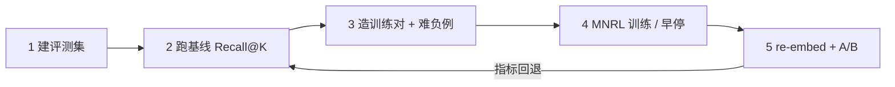
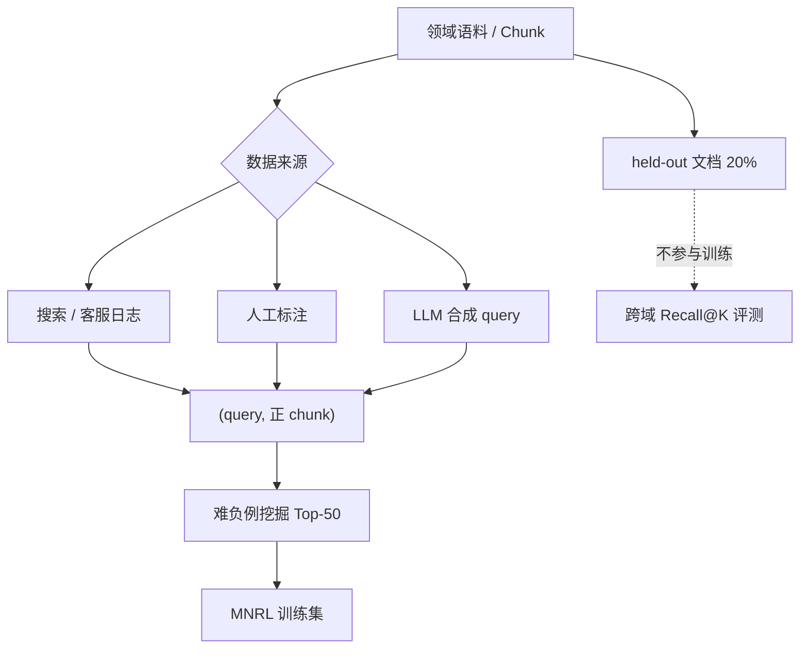
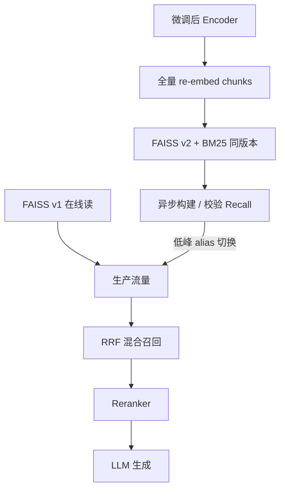
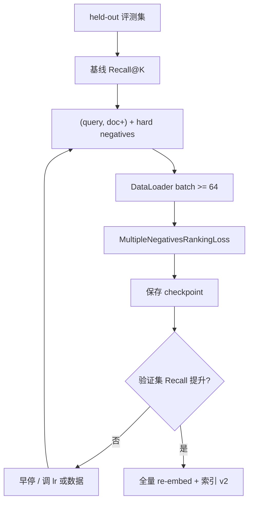

# Embedding 模型微调：如何提升 RAG 领域检索效果（原理与实战）

**直接回答：** 要提升领域检索，优先用你业务里的 (查询, 正文档) 对，在 BGE 等双塔 Embedding 上做对比学习微调（常用 Multiple Negatives Ranking Loss），再用 Recall@K / Hit Rate 在 held-out 集上验证；若 Recall@10 已高于 0.8，应先调 [Chunk、混合检索与 Reranker](https://tangentllm.github.io/weblog/post/rag-hybrid-retrieval-strategy/)，再考虑 Embedding 微调。

小陈按 [RAG 生产实战](https://tangentllm.github.io/weblog/post/rag-production-refactor/) 上了 bge-m3、FAISS 和 Reranker，生成质量却时好时坏。他花了两周改 Prompt，直到把一次失败 query 的 Top-10 检索结果摊开：排第一的 chunk 压根没提到「`ListModels` 的 `page_token` 分页」——问题在检索空间，不在 LLM。这类场景，**Embedding 模型微调**往往比再堆一层 Prompt 更划算。

本文面向已落地 RAG、能跑向量检索的工程师：讲清**何时该微调**、对比学习在学什么、如何造数据与挖难负例、如何用 Sentence-Transformers 微调中文 BGE，以及怎样接入现有 FAISS 索引。阅读前建议已了解 Cosine 相似度与 [RAG 检索增强背景](https://tangentllm.github.io/weblog/post/paper-rag-survey/)。

> **Key Takeaways**
> - **Embedding 微调不是 RAG 优化的第一步**：Chunk、BM25+向量混合检索、Reranker 往往 ROI 更高；Recall@10 基线已 >0.8 时，优先别动 Embedding。
> - **微调本质**是用领域 (query, doc+) 对重塑向量空间；损失函数常用 MNRL，batch 内其他样本自动当负例，再配合**难负例挖掘**拉开边界。
> - **评测只看 Recall@K / MRR**，别看训练 loss；合成 query 必须在**跨域 held-out** 上验证，否则容易在训练分布上过拟合、线上崩盘。
> - 公开案例里，领域微调常见 **+7%～25% Recall@10**（视数据质量而定）；合成数据分布错位时，held-out 指标**会下降**。
> - 上线微调模型 = **全量 re-embed + 索引版本管理**；与 [混合检索](https://tangentllm.github.io/weblog/post/rag-hybrid-retrieval-strategy/) 和 Reranker 叠加时，顺序是：召回（含微调向量）→ 融合 → 精排。

**想先对照自己的 RAG 链路？** 建议打开 [RAG 生产踩坑笔记](https://tangentllm.github.io/weblog/post/rag-production-refactor/)，确认 Chunk 与 bge-m3 基线指标，再决定是否进入微调。

### Embedding 微调五步流程（可复用清单）

1. **建评测集**：≥100 条真实或高质合成 query，按文档 ID 划分 held-out。
2. **跑基线**：记录 Recall@5/@10、MRR，导出 Top-10 错误 case。
3. **造训练对**：(query, 正 chunk) + 难负例；控制合成句式分布。
4. **训练与早停**：MNRL、batch≥64、验证集 Recall 不再升则停。
5. **re-embed 上线**：新索引版本、A/B、保留回滚路径。

*图 0：从评测到上线的五步闭环；任何一步跳过都容易「训练集好看、线上崩盘」。*



---

## 前置知识

- 向量检索、归一化 Cosine 相似度、Top-K 召回。
- 已读过或愿意对照：[词嵌入与向量空间](https://tangentllm.github.io/weblog/post/embedding-from-scratch/)（理解「几何拉近/推远」）。
- Python 3.10+，`sentence-transformers>=3.0`，单卡 GPU 或 Colab 即可跑通下文实验。
- 若你正在做 [LLM 微调](https://tangentllm.github.io/weblog/post/llm-sft-note/) 而非检索编码器，目标不同：本文只讨论 **RAG 召回侧的 Embedding 模型微调**。

---

## 什么时候该做 Embedding 模型微调？

很多教程默认「检索差 → 先微调 Embedding」。工程上更稳妥的顺序是：

| 步骤 | 手段 | 典型收益 | 成本 |
|------|------|----------|------|
| 1 | Chunk 策略、元数据过滤 | 高 | 低 |
| 2 | [BM25 + 向量混合检索](https://tangentllm.github.io/weblog/post/rag-hybrid-retrieval-strategy/) | 专有名词、SKU、API 名 | 中 |
| 3 | Cross-Encoder Reranker | 精排准确率 | 中（延迟） |
| 4 | **Embedding 微调** | 领域语义、别名、口语 query | 高（数据 + re-embed） |

### 适合微调的信号

- **Recall@10 长期 <0.65**，且错误 case 多为「语义相关但用词不同」（口语问法 vs 文档书面语）。
- 语料含大量**内部代号、法规条文号、API 字段**；通用模型把 `page_token` 和 `password` 排在相近区域。
- 你有 **≥500 条** 可信 (query, 正文档) 对，或能合成但经过 held-out 验证。

### 不适合微调的情况

- 语料接近百科/新闻，bge-m3 已够用。
- 训练对 <300，或没有稳定评测集（只能看 loss 曲线）。
- 团队没人维护**索引版本**与回滚；微调后必须全量 re-embed，李工曾估算：800 万 chunk、768 维、单卡 V100 约 **6～10 小时** 仅编码，还不算 FAISS 重建与双写切换。

**结论：** 把 Embedding 微调当成「检索表示层的专项优化」，而不是 RAG 入门第一课。

### 决策树（何时进入微调）

```text
检索答案经常错？
├─ 否 → 先优化生成/Prompt
└─ 是 → Chunk/元数据是否已调优？
 ├─ 否 → 调 Chunk、过滤规则
 └─ 是 → 混合检索 + Reranker 是否已上？
 ├─ 否 → 上 BM25+向量、Reranker
 └─ 是 → Recall@10 < 0.65 且有 ≥500 训练对？
 ├─ 否 → 收集数据或接受现状
 └─ 是 → 开始 Embedding 微调
```

Phil Schmid 在 NVIDIA SEC 财报语料上用约 6.3k 合成对微调，约 **3 分钟** 完成训练并得到约 **7%** 检索指标提升（[实验记录](https://www.philschmid.de/fine-tune-embedding-model-for-rag)）。这不是承诺你能复现同样幅度，而是说明：**数据规模中等时，微调成本可以很低**，关键在评测是否可信。

---

## 检索 Embedding 在学什么？对比学习直觉

RAG 召回常用 **Bi-Encoder（双塔）**：查询和文档分别编码，再算相似度。微调改的是编码器权重，不是生成式 LLM。Cross-Encoder（Reranker）把 query 和 doc 拼在一起过 Transformer，更准但更慢，一般放在精排，不在此重复训练。

### In-batch negatives 与 MNRL

一批里有 $B$ 个 (query, 正文档) 对。对第 $i$ 个 query，第 $j \neq i$ 的文档天然是「负例」。**Multiple Negatives Ranking Loss（MNRL）** 最大化 query 与自家正文档的相似度，相对压低与同 batch 其他文档的相似度。直觉上像在向量空间里：**把配对拉近，把邻居推远**。

相似度常用归一化后的点积（等价 Cosine）：

$$
\text{sim}(q, d) = \frac{E(q) \cdot E(d)}{\|E(q)\|\|E(d)\|}
$$

训练时 batch 越大，负例越多，判别边界往往越清晰；显存允许时 **batch ≥ 64** 是常见起点（[Sentence Transformers 训练文档](https://www.sbert.net/docs/training/overview.html)）。

*图 2：微调前 query 与正文档距离远、难负例易混淆；微调后正例拉近、难负例被推远。*


### 为什么随机负例不够？

随机抽的文档和 query 往往差很远，模型「躺赢」，梯度很小。**难负例（hard negatives）** 与 query 表面相似但不相关，才能逼模型学细粒度边界。Xiong et al. (2020) 的 ANCE 即强调：用当前检索器挖「差点被召回了的错文档」当负例，比纯随机更有效。

---

## 训练数据：从业务语料到 (query, doc+) 对

### 数据来源

1. **搜索/客服日志**：真实 query + 点击或人工标注的正确 chunk。
2. **人工标注**：贵但最稳，适合法务、医疗等高风险域。
3. **LLM 合成**：从文档块反推问题，成本低，必须做分布控制（见下）。

*图 3：训练数据从语料到 (query, doc+) 对的数据流；held-out 必须按文档 ID 隔离。*



### 合成数据 pipeline（示例）

对每条 chunk，用 LLM 生成 1～3 个用户可能问法。下面是一段**可改的 Prompt 骨架**（强调多样句式，避免全是「什么是 XXX」）：

```text
你是企业内部知识库用户。根据【文档片段】生成 2 个真实搜索问题。
要求：
1. 一个问题口语化、短；一个偏正式、含术语；
2. 不要使用「请问」「什么是」「总结一下」开头；
3. 问题必须能被该片段回答，且不要照抄片段首句。
【文档片段】
{chunk}
```

过滤过短/重复/泄露答案的 query。注意：

- query 长度分布应接近线上（不要全是「请总结下文」）。
- 保留 **20% 完全 held-out 文档** 做跨域验证，不参与训练。
- 负例不要只来自随机 chunk；用基线 retriever **挖 Top-50 里未标注为正的** 作难负例。

### 合成翻车：林薇的教训

林薇用 2 万条合成医疗问答微调 bge-small-zh，训练集 Hit@10 从 0.71 升到 0.89。她很高兴，直到用**另一套公开医疗评测集**做 held-out：指标从 0.68 **跌到 0.61**。根因是合成 query 句式单一（全是「请问 XXX 的定义是什么」），模型学会了句式捷径，没学到领域语义。社区实战也有类似结论：合成分布错位时，跨域验证会崩盘（可参考 [CSDN 嵌入微调实战](https://blog.csdn.net/2401_85343303/article/details/148495839) 中的 held-out 讨论）。

### 数据格式检查清单

- [ ] 训练 / 验证 / held-out 按**文档 ID** 划分，非随机行划分
- [ ] 每条正例对应唯一 chunk_id，避免同一 doc 泄漏到验证集
- [ ] 难负例 per query ≥ 5，且来自同一 retriever 分布
- [ ] 合成 query 人工抽检 ≥ 50 条
- [ ] 记录 `embedding_model_version` 与训练数据 hash

---

## Embedding 模型微调实战：BGE 中文全流程

以下以 `BAAI/bge-small-zh-v1.5` 为例（小、快、适合实验）；生产可与 [bge-m3 选型](https://tangentllm.github.io/weblog/post/rag-production-refactor/) 对齐，流程相同，注意 `normalize_embeddings=True` 与 `max_seq_length` 一致。

### 1. 环境与依赖

```bash
pip install "sentence-transformers>=3.0" datasets accelerate
```

### 2. 基线评估（Recall@K）

```python
# eval_recall.py, 在固定 corpus + queries 上算 Recall@K
from sentence_transformers import SentenceTransformer
import numpy as np

MODEL_NAME = "BAAI/bge-small-zh-v1.5"
QUERIES = ["ListModels 分页参数怎么用", "..."] # 你的评测 query
CORPUS = ["chunk text ...", "..."] # 全库或子集
GROUND_TRUTH = [12, 45, ...] # 每个 query 正确 chunk 的下标

def recall_at_k(model, queries, corpus, gt_indices, k=10):
 q_emb = model.encode(queries, normalize_embeddings=True)
 d_emb = model.encode(corpus, normalize_embeddings=True)
 scores = q_emb @ d_emb.T # 已归一化，即 cosine
 topk = np.argsort(-scores, axis=1)[:,:k]
 hits = sum(1 for i, row in enumerate(topk) if gt_indices[i] in row)
 return hits / len(queries)

model = SentenceTransformer(MODEL_NAME)
print("Recall@10:", recall_at_k(model, QUERIES, CORPUS, GROUND_TRUTH, k=10))
```

公开参考：LlamaIndex 在 bge-small-en 上 Hit Rate **78% → 84%**（[合成数据微调文](https://medium.com/llamaindex-blog/fine-tuning-embeddings-for-rag-with-synthetic-data-e534409a3971)）；中文证券领域案例有 **8.9% → 23.5%** 命中率提升（[火山引擎社区](https://developer.volcengine.com/articles/7577300750437974067)）。你的幅度取决于领域难度与数据质量。

### 3. 构造训练样本并微调

```python
# train_embedding.py
from sentence_transformers import SentenceTransformer, InputExample, losses
from torch.utils.data import DataLoader

model = SentenceTransformer("BAAI/bge-small-zh-v1.5")
train_examples = [
 InputExample(texts=["ListModels 怎么翻页", "page_token 字段表示下一页游标..."]),
 # ... 更多 (query, positive_passage)
]
train_dataloader = DataLoader(train_examples, shuffle=True, batch_size=64)
train_loss = losses.MultipleNegativesRankingLoss(model)

model.fit(
 train_objectives=[(train_dataloader, train_loss)],
 epochs=2,
 warmup_steps=100,
 optimizer_params={"lr": 2e-5},
 output_path="./checkpoints/bge-small-zh-domain",
 show_progress_bar=True,
)
```

**超参起点：** `lr` 1e-5～2e-5，`epochs` 1～3，过大学习率易灾难性遗忘通用语义。NeMo 文档建议 embedding 微调常用更低 lr、较大 batch（[NVIDIA 教程](https://docs.nvidia.com/nemo/microservices/26.3.0/customizer/tutorials/embedding-customization-job.html)）。

### 4. 难负例挖掘（思路）

```python
# 用当前模型编码 corpus，对每个 query 取 Top-N 中「非正例」作为 negatives
# sentence_transformers.util.mine_hard_negatives 在 3.x 中可辅助构造三元组
from sentence_transformers import SentenceTransformer
import faiss # 或你现有的 FAISS 索引

# 伪代码：retrieve top 50 -> filter positives -> keep 10-15 hard negatives per query
```

### 5. 加载微调权重做推理

```python
finetuned = SentenceTransformer("./checkpoints/bge-small-zh-domain")
finetuned.max_seq_length = 512 # 与建库时一致
q = finetuned.encode(["查询"], normalize_embeddings=True)
```

**推理一致性：** 训练、建库、在线查询必须同一 `max_seq_length`、同一 `normalize` 策略，否则 Cosine 分布漂移，旧索引等于作废。

### 6. 三元组格式（可选，难负例已备好）

若已挖掘 hard negatives，可改用显式三元组：

```python
from sentence_transformers import InputExample

train_examples = [
 InputExample(
 texts=[
 "page_token 怎么用",
 "ListModels 的 page_token 字段说明...",
 "认证失败时如何刷新 API Key...", # hard negative
 ]
 ),
]
```

| 格式 | 字段 | 适用损失 | 何时用 |
|------|------|----------|--------|
| Pair | query, positive | MNRL | 默认首选 |
| Triplet | anchor, pos, neg | TripletLoss | 已有高质量 hard neg |
| Labeled pair | query, doc, 0/1 | CosineSimilarityLoss | 显式负标注 |

### 7. LlamaIndex 路径（与手写训练等价）

栈内若已是 LlamaIndex，可用 `SentenceTransformersFinetuneEngine`：先 `generate_qa_embedding_pairs`，再 `finetune`。少写 Trainer 样板；自定义难负例时不如 Sentence-Transformers 透明。**评测脚本应独立于训练框架**，避免只用训练库自带 evaluate。

### 消融示例（说明方法，非承诺收益）

| 配置 | Recall@10 |
|------|-----------|
| bge-small-zh 基线 | 0.62 |
| 1 epoch，仅合成 pair，无 hard neg | 0.58（held-out 下降） |
| 2 epoch + 10 hard neg / query | 0.71 |
| 仅混合检索 RRF | 0.68 |

第二行对应合成分布翻车；第三、四行说明难负例与混合检索往往比盲目加 epoch 更值得先做。

---

## 领域检索评测：别只看训练 loss

| 指标 | 适用场景 |
|------|----------|
| Recall@K / Hit@K | 主指标：正确 doc 是否进 Top-K |
| MRR | 关心第一个正确结果排第几 |
| NDCG | 多级相关度标注时 |

**MTEB 榜单**反映通用能力；领域 RAG 以**你自己的评测集**为准。每次迭代固定 query 集，做错误分析表（假阳性：语义像但答案错；假阴性：同义词未召回）。

示例（内部 API 知识库，节选）：

| Query | 现象 | 类型 | 下一步 |
|-------|------|------|--------|
| `ListModels 分页` | Top-3 全是「认证错误」章节 | 假阳性 | 加难负例：同 API 不同错误码 |
| `怎么传 page_token` | 正确 chunk 排第 18 | 假阴性 | 合成口语 query + 微调 |
| `模型列表接口` | BM25 命中、向量未进 Top-10 | 混合检索可解 | 先 RRF，再决定是否微调 |

ML Journey 归纳：技术语料上对比学习微调 **Recall@10 提升 10%～25%** 并不罕见，但前提是评测集代表线上分布（[对比学习微调文](https://mljourney.com/how-to-fine-tune-embedding-models-with-contrastive-learning/)）。若你的提升只出现在训练同源合成集上，这个数字没有参考价值。

**已跑通基线？** 把微调前后 Recall@10 填进表格，再决定是否上生产；需要对照混合检索增益，可看 [RRF 融合实践](https://tangentllm.github.io/weblog/post/rag-hybrid-retrieval-strategy/)。

---

## 接入生产：bge-m3 + FAISS 对齐

1. **版本化：** `embedder=v20250928-finetuned`，与 FAISS 索引目录同版本。
2. **全量 re-embed：** 所有 chunk 用新模型编码；增量文档单独队列，避免混用旧向量。
3. **叠加顺序：** 向量召回（微调后）+ BM25 → RRF → [Reranker 精排](https://tangentllm.github.io/weblog/post/rag-production-refactor/) → LLM。微调替换不了 Reranker，二者常叠加。
4. **A/B：** 10% 流量走新索引，对比「检索命中人工标注」与端到端答案采纳率；保留旧索引 7 天便于回滚。

小陈在 re-embed 窗口用了双索引：旧索引服务读，新索引异步构建，切换凌晨低峰一次 alias 翻转，避免白天检索空洞。

*图 4：微调模型接入生产的索引版本与双写切换；向量路与 BM25 路需同版本发布。*



### 成本粗算（做到心里有数）

设 chunk 数 $N$，维度 $d$，仅编码（不含训练）：

- 存储（float32）：约 $4 N d$ 字节；768 维、100 万 chunk ≈ 3 GB 量级。
- 编码耗时：与 GPU、batch、序列长度线性相关；换模型后**必须全量重算**，无法「只改新文档的旧向量」混用。

训练侧：bge-small-zh 全参微调在单卡 24G 上，万级样本、2 epoch 通常在**数十分钟到数小时**；难负例挖掘往往比训练更耗 CPU/GPU（要对全库做近邻搜索）。

---

## 进阶与边界

### LoRA 微调 Embedding

全参微调效果最好，但显存紧时可对 Transformer 层加 LoRA（PEFT）。工程上常见：小数据用全参 small 模型，大数据再考虑 LoRA + 更大底座。

### Matryoshka Representation Learning（MRL）

训练时随机截断向量维度，推理可用 256 维存库、768 维精排，存储降约 3 倍，召回损失通常很小（[Phil Schmid 的金融 RAG 实验](https://www.philschmid.de/fine-tune-embedding-model-for-rag) 报告约 7% 提升且可 MRL 压缩）。

### 与「微调 LLM」的区别

| | Embedding 微调 | [LLM SFT](https://tangentllm.github.io/weblog/post/llm-sft-note/) |
|--|----------------|---------------------------------------------------------------------|
| 目标 | 检索相似度 | 生成/遵循指令 |
| 数据 | (query, doc) 对 | 指令-回答对 |
| 影响 | 只改召回 | 改生成风格与知识 |

RAG 里二者正交：检索不到，生成再好也胡编。

---

## Sentence Transformers 训练流程（可视化）

下图对应上文 `train_embedding.py` 与难负例挖掘：先固定评测集，再在 batch 内用 MNRL 做对比学习；**验证集 Recall 不升则早停**，通过后再进入 re-embed。

*图 5：训练与评估闭环（替代外链视频，便于评审与 onboarding）。*



---

## 常见问题（FAQ）

<!-- 发布时可加 FAQPage JSON-LD，主实体为以下五问 -->

**什么是 Embedding 模型微调（RAG 场景）？** 
用领域内的 (查询, 正文档) 对继续训练双塔编码器，使向量空间更贴合你的检索分布；常用对比学习损失 MNRL，并用 Recall@K 在 held-out 集验证，而不是只看训练 loss。

**微调后要不要动 Reranker？** 
建议用同一评测集再看一眼精排后指标。检索候选更准时，Reranker 输入分布会变，有时需重标少量精排样本。

**只有英文文档、中文 query 怎么办？** 
优先用多语底座（如 bge-m3）；或分别建语言索引再融合。单纯微调 monolingual 中文模型对纯英文 chunk 帮助有限。

**和 HyDE、Query Rewrite 谁先？** 
Query 改写成本低，可先试；若改写后仍召不回「同一概念不同说法」，再考虑 Embedding 微调。

**微调后通用能力会变差吗？** 
有可能（灾难性遗忘）。若你还服务开放域问答，可保留原模型做路由：内部库用微调版，公开 FAQ 用 bge-m3 原版；或在训练中加入 10%～20% 通用 (query, doc) 对作正则。

**Zilliz 等 FAQ 还提到什么？** 
除对比学习外，可尝试 layer-wise 较小学习率、在冻结底层只调上层（需自己实验）；工程上更常见仍是全参微调 small 模型，而不是一上来动 7B 底座（[领域微调 FAQ](https://zilliz.com/ai-faq/how-do-i-finetune-an-embedding-model-for-my-specific-domain)）。

---

<script type="application/ld+json">
{
  "@context": "https://schema.org",
  "@type": "FAQPage",
  "mainEntity": [
    {
      "@type": "Question",
      "name": "什么是 Embedding 模型微调（RAG 场景）？",
      "acceptedAnswer": {
        "@type": "Answer",
        "text": "用领域内的查询与正文档对继续训练双塔编码器，使向量空间更贴合检索分布，常用 MNRL 损失，并用 Recall@K 在 held-out 集验证。"
      }
    },
    {
      "@type": "Question",
      "name": "什么时候应该微调 Embedding 而不是先调 Reranker？",
      "acceptedAnswer": {
        "@type": "Answer",
        "text": "当 Chunk、混合检索与 Reranker 已优化后，Recall@10 仍低于约 0.65，且语料含大量领域术语时，再考虑 Embedding 微调。"
      }
    },
    {
      "@type": "Question",
      "name": "微调 Embedding 后需要重建向量索引吗？",
      "acceptedAnswer": {
        "@type": "Answer",
        "text": "需要。必须全量 re-embed 并做索引版本管理，训练、建库与在线查询的 max_seq_length 与 normalize 策略须一致。"
      }
    }
  ]
}
</script>

## 总结

1. **先优化 Chunk、混合检索、Reranker**，再在低 Recall 且术语密集时做 **Embedding 模型微调**。
2. 用 **MNRL + 难负例** 做对比学习，batch 尽量大，学习率保守。
3. **合成数据必须跨域验证**，避免训练集虚高、线上崩盘。
4. 上线 = **re-embed + 索引版本 + A/B**，与现有 [RAG 生产链路](https://tangentllm.github.io/weblog/post/rag-production-refactor/) 对齐。

**下一步阅读：** [RAG 混合检索策略](https://tangentllm.github.io/weblog/post/rag-hybrid-retrieval-strategy/) · [RAG 论文演化路径](https://tangentllm.github.io/weblog/post/paper-rag-survey/) · [Tokenizer 与中文分词](https://tangentllm.github.io/weblog/post/tokenization-guide/)

---

## 参考文献

- Karpukhin et al. (2020). *Dense Passage Retrieval for Open-Domain Question Answering.* [arXiv:2004.04906](https://arxiv.org/abs/2004.04906)
- Xiong et al. (2020). *Approximate Nearest Neighbor Negative Contrastive Learning for Dense Text Retrieval.* [arXiv:2007.00808](https://arxiv.org/abs/2007.00808)
- BAAI BGE 模型族: [HuggingFace BAAI](https://huggingface.co/BAAI)
- Sentence Transformers 训练总览: [sbert.net](https://www.sbert.net/docs/training/overview.html)
- LlamaIndex Embedding 微调: [官方示例](https://docs.llamaindex.ai/en/stable/examples/finetuning/embeddings/)

