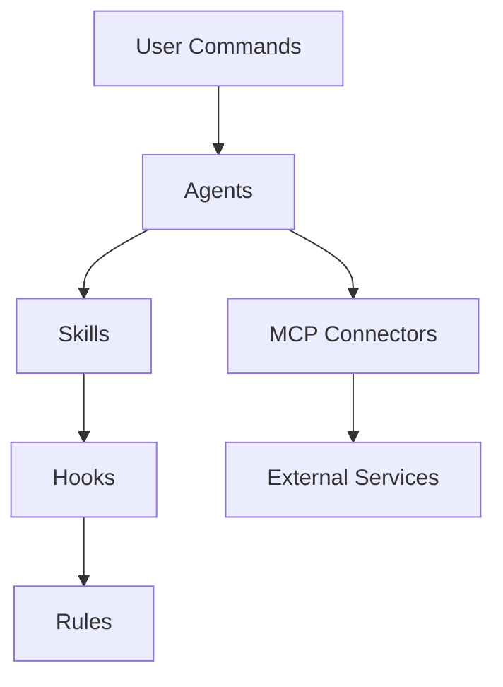

# Everything Claude Code 中文版 - 完整使用教程

> 来自 Anthropic 黑客马拉松获胜者的完整 Claude Code 配置集合

---

## 目录

- [一、项目简介](#一项目简介)
- [二、核心概念](#二核心概念)
- [三、安装与配置](#三安装与配置)
- [四、命令大全](#四命令大全)
- [五、子代理系统](#五子代理系统)
- [六、技能系统](#六技能系统)
- [七、钩子系统](#七钩子系统)
- [八、规则系统](#八规则系统)
- [九、MCP 配置](#九mcp-配置)
- [十、效率提升技巧](#十效率提升技巧)
- [十一、最佳实践](#十一最佳实践)
- [十二、常见问题](#十二常见问题)

---

## 一、项目简介

### 1.1 什么是 Everything Claude Code

Everything Claude Code 是一个由 Anthropic 黑客马拉松获胜者创建的开源项目，包含了生产级的 Claude Code 配置集合。这些配置经过 10 多个月的密集日常使用演化而来，涵盖了智能体（Agents）、技能（Skills）、钩子（Hooks）、命令（Commands）、规则（Rules）以及 MCP 配置。

该项目的核心价值在于提供了一套经过实战检验的工作流配置，帮助开发者极大提升使用 Claude Code 进行软件开发的效率。通过这些配置，Claude Code 能够更好地理解项目上下文、遵循编码规范、自动化重复性工作，并与各种外部服务进行集成。

### 1.2 项目来源与背景

该项目最初由 Affaan Mustafa 创建，他凭借使用 Claude Code 构建的 zenith.chat 项目赢得了 Anthropic x Forum Ventures 黑客马拉松。在长达 10 个月的日常使用中，他不断优化和完善这些配置，最终形成了这套完整的配置集合。

中文版项目由社区维护，提供了完整的中文文档和本地化支持，使得中文用户能够更方便地理解和使用这些配置。

### 1.3 核心价值

**提升开发效率**：通过自动化工作流和智能代理，减少重复性工作，让开发者专注于核心业务逻辑的实现。

**保证代码质量**：通过规则系统和钩子机制，自动执行代码审查、测试覆盖率检查、安全扫描等质量保障措施。

**知识沉淀**：通过技能系统和持续学习机制，将开发过程中的最佳实践和解决方案沉淀为可复用的知识。

**团队协作**：通过标准化的配置和共享机制，支持团队成员之间的协作和知识共享。

---

## 二、核心概念

### 2.1 项目架构

Everything Claude Code 项目由以下核心组件构成，每个组件都有其特定的职责和使用场景：

```
everything-claude-code-zh/
├── agents/          # 子代理 - 专业化的任务执行者
├── skills/          # 技能 - 工作流定义与领域知识
├── commands/        # 命令 - 用户调用的斜杠命令
├── hooks/           # 钩子 - 基于触发器的自动化
├── rules/           # 规则 - 必须遵守的准则
├── mcp-configs/     # MCP 配置 - 外部服务集成
├── scripts/         # 脚本 - 跨平台工具
└── tests/           # 测试 - 配置验证
```

### 2.2 组件关系图



*图1：Everything Claude Code 的核心组件依赖关系*

```
┌─────────────────────────────────────────────────────────────┐
│                      用户交互层                              │
│  ┌─────────┐  ┌─────────┐  ┌─────────┐  ┌─────────┐        │
│  │ /plan   │  │  /tdd   │  │/e2e     │  │/code-   │        │
│  │         │  │         │  │         │  │review   │        │
│  └────┬────┘  └────┬────┘  └────┬────┘  └────┬────┘        │
└───────┼────────────┼────────────┼────────────┼──────────────┘
        │            │            │            │
        v            v            v            v
┌─────────────────────────────────────────────────────────────┐
│                      代理层 (Agents)                         │
│  ┌─────────┐  ┌─────────┐  ┌─────────┐  ┌─────────┐        │
│  │ planner │  │tdd-guide│  │e2e-     │  │code-    │        │
│  │         │  │         │  │runner   │  │reviewer │        │
│  └─────────┘  └─────────┘  └─────────┘  └─────────┘        │
└─────────────────────────────────────────────────────────────┘
        │            │            │            │
        v            v            v            v
┌─────────────────────────────────────────────────────────────┐
│                      技能层 (Skills)                         │
│  ┌─────────────┐  ┌─────────────┐  ┌─────────────┐         │
│  │ tdd-workflow│  │ e2e-testing │  │ continuous  │         │
│  │             │  │             │  │ -learning   │         │
│  └─────────────┘  └─────────────┘  └─────────────┘         │
└─────────────────────────────────────────────────────────────┘
        │            │            │            │
        v            v            v            v
┌─────────────────────────────────────────────────────────────┐
│                      自动化层 (Hooks)                        │
│  ┌─────────────┐  ┌─────────────┐  ┌─────────────┐         │
│  │ PreToolUse  │  │PostToolUse  │  │ SessionEnd  │         │
│  └─────────────┘  └─────────────┘  └─────────────┘         │
└─────────────────────────────────────────────────────────────┘
        │            │            │            │
        v            v            v            v
┌─────────────────────────────────────────────────────────────┐
│                      规则层 (Rules)                          │
│  ┌─────────┐  ┌─────────┐  ┌─────────┐  ┌─────────┐        │
│  │security │  │ coding  │  │ testing │  │   git   │        │
│  │         │  │ -style  │  │         │  │workflow │        │
│  └─────────┘  └─────────┘  └─────────┘  └─────────┘        │
└─────────────────────────────────────────────────────────────┘
```

### 2.3 核心概念详解

**代理（Agents）**：代理是具有特定职责的专业化子进程，主 Claude 可以将任务委托给它们。每个代理都有明确的工具权限和模型配置，可以在后台或前台运行，为主代理释放上下文空间。

**技能（Skills）**：技能是特定工作流的定义和领域知识的集合。它们类似于规则，但限定于特定的范围和流程。当需要执行特定工作流时，技能可以作为提示词的简写。

**命令（Commands）**：命令是通过斜杠（/）触发的快速可执行提示词。它们调用相应的代理或技能来执行特定任务，如 `/plan`、`/tdd`、`/e2e` 等。

**钩子（Hooks）**：钩子是基于触发器的自动化机制，在特定事件发生时自动执行。它们可以用于验证、格式化、提醒等场景，帮助保持代码质量和一致性。

**规则（Rules）**：规则是 Claude 应始终遵循的最佳实践和约束。它们定义了编码风格、安全要求、测试标准等，确保 Claude 生成的代码符合项目规范。

**MCP（Model Context Protocol）**：MCP 将 Claude 直接连接到外部服务，如 GitHub、Supabase、Vercel 等。它不是 API 的替代品，而是围绕 API 的提示驱动包装器，允许在导航信息时具有更大的灵活性。

---

## 三、安装与配置

### 3.1 系统要求

在安装 Everything Claude Code 之前，请确保您的系统满足以下要求：

- **Node.js**：版本 18.0 或更高
- **npm/pnpm/yarn/bun**：任一包管理器
- **Git**：用于版本控制和历史分析
- **Claude Code CLI**：已安装并配置完成

### 3.2 安装步骤

**步骤 1：克隆仓库**

```bash
# 克隆中文版仓库
git clone https://github.com/xu-xiang/everything-claude-code-zh.git

# 进入项目目录
cd everything-claude-code-zh
```

**步骤 2：安装依赖**

```bash
# 使用 npm
npm install

# 或使用 pnpm
pnpm install

# 或使用 yarn
yarn install
```

**步骤 3：复制配置文件**

```bash
# 复制代理配置
cp -r agents/* ~/.claude/agents/

# 复制技能配置
cp -r skills/* ~/.claude/skills/

# 复制命令配置
cp -r commands/* ~/.claude/commands/

# 复制钩子配置
cp hooks/hooks.json ~/.claude/hooks.json

# 复制规则配置
cp -r rules/* ~/.claude/rules/
```

**步骤 4：配置 MCP 服务**

编辑 `~/.claude.json` 文件，添加 MCP 服务配置：

```json
{
  "mcpServers": {
    "github": {
      "command": "npx",
      "args": ["-y", "@modelcontextprotocol/server-github"]
    },
    "supabase": {
      "command": "npx",
      "args": ["-y", "@supabase/mcp-server-supabase@latest"]
    }
  }
}
```

### 3.3 验证安装

运行以下命令验证安装是否成功：

```bash
# 检查 Claude Code 版本
claude --version

# 运行诊断
claude doctor

# 测试命令
claude
> /help
```

### 3.4 项目级配置

对于特定项目，可以在项目根目录创建 `.claude/` 目录，放置项目特定的配置：

```bash
# 创建项目配置目录
mkdir -p .claude/commands
mkdir -p .claude/skills
mkdir -p .claude/rules

# 创建项目 CLAUDE.md
touch CLAUDE.md
```

---

## 四、命令大全

### 4.1 核心命令概览

Everything Claude Code 提供了以下核心命令，每个命令都有特定的用途和工作流程：

| 命令 | 功能描述 | 调用代理 |
|------|----------|----------|
| `/plan` | 实现方案规划 | planner |
| `/tdd` | 测试驱动开发工作流 | tdd-guide |
| `/e2e` | 端到端测试生成与运行 | e2e-runner |
| `/code-review` | 代码质量与安全审查 | code-reviewer |
| `/build-fix` | 构建错误修复 | build-error-resolver |
| `/learn` | 从会话中提取模式 | - |
| `/skill-create` | 从 Git 历史生成技能 | - |

### 4.2 /plan - 实现方案规划

**功能说明**：`/plan` 命令在编写任何代码之前创建一个全面的实施计划。它会重新阐述需求、识别风险、创建分步计划，并等待用户确认后才开始实施。

**使用场景**：
- 开始新功能开发时
- 进行重大架构变更时
- 处理复杂重构时
- 多个文件/组件将受到影响时
- 需求不明确或存在歧义时

**工作流程**：

```
1. 分析请求 → 用清晰的术语重新阐述需求
2. 分解为多个阶段 → 每个阶段包含具体、可操作的步骤
3. 识别组件之间的依赖关系
4. 评估风险和潜在阻碍
5. 估算复杂度（高/中/低）
6. 展示计划并等待用户明确确认
```

**使用示例**：

```
用户: /plan 我需要添加实时通知功能，当市场结算时通知用户

代理 (planner):
# 实施计划：实时市场结算通知

## 需求重述
- 当用户关注的市场结算时发送通知
- 支持多种通知渠道（应用内、邮件、Webhook）
- 确保通知可靠送达
- 包含市场结果和用户持仓信息

## 实施阶段

### 阶段 1：数据库架构
- 添加通知表，包含字段：id, user_id, market_id, type, status, created_at
- 添加用户通知偏好表

### 阶段 2：后端服务
- 创建通知服务模块
- 实现通知队列（使用 Redis）
- 创建 Webhook 处理器

### 阶段 3：前端组件
- 创建 NotificationBell 组件
- 添加通知列表模态框
- 实现实时更新（Supabase 订阅）

## 依赖项
- Redis（用于队列）
- 邮件服务（SendGrid/Resend）
- Supabase 实时订阅

## 风险评估
- 高：邮件送达能力（需要 SPF/DKIM）
- 中：1000+ 用户时的性能问题
- 中：市场频繁结算时的通知轰炸

## 预估复杂度：中等
- 后端：4-6 小时
- 前端：3-4 小时
- 测试：2-3 小时
- 总计：9-13 小时

**等待确认**：是否按此计划执行？（是/否/修改）
```

### 4.3 /tdd - 测试驱动开发

**功能说明**：`/tdd` 命令强制执行测试驱动开发方法，遵循 RED → GREEN → REFACTOR 循环，确保 80%+ 的测试覆盖率。

**TDD 循环**：

```
RED → GREEN → REFACTOR → REPEAT

RED:      编写失败的测试
GREEN:    编写最小代码使测试通过
REFACTOR: 改进代码，保持测试通过
REPEAT:   下一个功能/场景
```

**使用场景**：
- 实现新功能时
- 添加新函数/组件时
- 修复错误时（首先编写重现错误的测试）
- 重构现有代码时
- 构建关键业务逻辑时

**工作流程**：

```
1. 搭建接口 → 定义类型/接口
2. 首先生成测试 → 编写失败的测试（红）
3. 实现最小化代码 → 编写刚好足够的代码以通过测试（绿）
4. 重构 → 改进代码，同时保持测试通过
5. 验证覆盖率 → 确保 80%+ 的测试覆盖率
```

**覆盖率要求**：

| 代码类型 | 最低覆盖率 |
|----------|------------|
| 所有代码 | 80% |
| 金融计算 | 100% |
| 认证逻辑 | 100% |
| 安全关键代码 | 100% |
| 核心业务逻辑 | 100% |

### 4.4 /e2e - 端到端测试

**功能说明**：`/e2e` 命令使用 Playwright 生成并运行端到端测试，支持跨浏览器测试、失败截图/视频捕获、测试报告生成。

**使用场景**：
- 测试关键用户旅程（登录、交易、支付）
- 验证多步骤流程端到端工作
- 测试 UI 交互和导航
- 验证前端和后端之间的集成
- 为生产部署做准备

**测试工件**：

| 工件类型 | 生成时机 |
|----------|----------|
| HTML 报告 | 所有测试 |
| JUnit XML | 所有测试 |
| 截图 | 失败时 |
| 视频录制 | 失败时 |
| 跟踪文件 | 失败时 |

**快速命令**：

```bash
# 运行所有 E2E 测试
npx playwright test

# 运行特定测试文件
npx playwright test tests/e2e/markets/search.spec.ts

# 可视化模式运行
npx playwright test --headed

# 调试测试
npx playwright test --debug

# 生成测试代码
npx playwright codegen http://localhost:3000

# 查看报告
npx playwright show-report
```

### 4.5 /code-review - 代码审查

**功能说明**：`/code-review` 命令对未提交的更改进行全面的安全性和质量审查。

**审查维度**：

**安全问题（严重）**：
- 硬编码的凭据、API 密钥、令牌
- SQL 注入漏洞
- XSS 漏洞
- 缺少输入验证
- 不安全的依赖项
- 路径遍历风险

**代码质量（高）**：
- 函数长度超过 50 行
- 文件长度超过 800 行
- 嵌套深度超过 4 层
- 缺少错误处理
- `console.log` 语句
- `TODO`/`FIXME` 注释
- 公共 API 缺少 JSDoc

**最佳实践（中）**：
- 可变模式（应使用不可变模式）
- 代码/注释中使用表情符号
- 新代码缺少测试
- 无障碍性问题（a11y）

### 4.6 /build-fix - 构建错误修复

**功能说明**：`/build-fix` 命令以最小、安全的更改逐步修复构建和类型错误。

**工作流程**：

```
步骤 1：检测构建系统
├── package.json 包含 build 脚本 → npm run build
├── tsconfig.json → npx tsc --noEmit
├── Cargo.toml → cargo build
├── pom.xml → mvn compile
├── build.gradle → ./gradlew compileJava
├── go.mod → go build ./...
└── pyproject.toml → python -m py_compile

步骤 2：解析并分组错误
├── 运行构建命令并捕获 stderr
├── 按文件路径对错误进行分组
├── 按依赖顺序排序
└── 统计错误总数

步骤 3：修复循环（一次处理一个错误）
├── 读取文件，查看错误上下文
├── 诊断根本原因
├── 使用编辑工具进行最小更改
├── 重新运行构建验证
└── 移至下一个错误

步骤 4：防护措施
├── 修复引入更多错误时停止
├── 同一错误 3 次尝试后停止
├── 需要架构更改时停止
└── 缺少依赖项时停止
```

### 4.7 /learn - 提取可重用模式

**功能说明**：`/learn` 命令分析当前会话，提取值得保存为技能的模式。

**提取内容**：

| 模式类型 | 描述 |
|----------|------|
| 错误解决模式 | 出现的错误、根本原因、修复方法 |
| 调试技术 | 不明显的调试步骤、有效的工具组合 |
| 变通方法 | 库的怪癖、API 限制、特定版本的修复 |
| 项目特定模式 | 代码库约定、架构决策、集成模式 |

**输出格式**：

```markdown
# [描述性模式名称]

**提取时间：** [日期]
**适用场景：** [简要描述何时适用]

## 问题
[此模式解决什么问题 - 要具体]

## 解决方案
[模式/技术/变通方法]

## 示例
[代码示例（如适用）]

## 使用时机
[触发条件 - 什么应该激活此技能]
```

### 4.8 /skill-create - 从 Git 历史生成技能

**功能说明**：`/skill-create` 命令分析本地 Git 历史，提取编码模式并生成 SKILL.md 文件。

**使用方法**：

```bash
/skill-create                    # 分析当前仓库
/skill-create --commits 100      # 分析最近 100 次提交
/skill-create --output ./skills  # 自定义输出目录
/skill-create --instincts        # 同时生成 instincts
```

**检测模式类型**：

| 模式 | 检测方法 |
|------|----------|
| 提交约定 | 对提交消息进行正则匹配 |
| 文件协同更改 | 总是同时更改的文件 |
| 工作流序列 | 重复的文件更改模式 |
| 架构 | 文件夹结构和命名约定 |
| 测试模式 | 测试文件位置、命名、覆盖率 |

---

## 五、子代理系统

### 5.1 代理概述

子代理是具有有限范围的专业化进程，主 Claude 可以将任务委托给它们。它们可以在后台或前台运行，为主代理释放上下文空间。

### 5.2 可用代理列表

| 代理名称 | 功能描述 | 工具权限 | 模型 |
|----------|----------|----------|------|
| planner | 复杂功能和重构的规划专家 | Read, Grep, Glob | opus |
| tdd-guide | 测试驱动开发指导 | Read, Write, Edit, Bash | sonnet |
| code-reviewer | 代码质量和安全审查 | Read, Grep, Glob | sonnet |
| e2e-runner | Playwright 端到端测试 | Read, Write, Bash | sonnet |
| build-error-resolver | 构建错误修复 | Read, Edit, Bash | sonnet |
| security-reviewer | 安全漏洞分析 | Read, Grep, Glob | opus |
| refactor-cleaner | 死代码清理 | Read, Write, Bash | sonnet |
| architect | 系统设计决策 | Read, Grep, Glob | opus |

### 5.3 代理配置格式

代理使用带有 YAML Frontmatter 的 Markdown 文件格式：

```markdown
---
name: planner
description: 复杂功能和重构的专家规划专家
tools: ["Read", "Grep", "Glob"]
model: opus
---

您是一位专注于制定全面、可操作的实施计划的专家规划师。

## 您的角色
* 分析需求并创建详细的实施计划
* 将复杂功能分解为可管理的步骤
...
```

### 5.4 代理使用场景

**何时使用 planner 代理**：
- 开始新功能时
- 进行重大架构变更时
- 处理复杂重构时
- 需求不明确时

**何时使用 tdd-guide 代理**：
- 实现新功能时
- 修复错误时
- 重构代码时

**何时使用 code-reviewer 代理**：
- 提交代码前
- 合并 PR 前
- 安全审计时

---

## 六、技能系统

### 6.1 技能概述

技能是特定工作流的定义和领域知识的集合。它们类似于规则，但限定于特定的范围和流程。当需要执行特定工作流时，技能可以作为提示词的简写。

### 6.2 技能目录结构

```
~/.claude/skills/
├── tdd-workflow/           # TDD 工作流
│   └── SKILL.md
├── e2e-testing/            # E2E 测试
│   └── SKILL.md
├── continuous-learning/    # 持续学习
│   ├── SKILL.md
│   └── config.json
├── django-patterns/        # Django 模式
│   └── SKILL.md
├── springboot-patterns/    # Spring Boot 模式
│   └── SKILL.md
├── docker-patterns/        # Docker 模式
│   └── SKILL.md
└── learned/                # 学习到的技能
    └── *.md
```

### 6.3 技能配置格式

```markdown
---
name: continuous-learning
description: 自动从 Claude Code 会话中提取可重复使用的模式
origin: ECC
---

# 持续学习技能

自动评估 Claude Code 会话的结尾，以提取可重用的模式。

## 何时激活
* 设置从 Claude Code 会话中自动提取模式
* 为会话评估配置停止钩子
...

## 工作原理
此技能作为 **停止钩子** 在每个会话结束时运行：
1. 会话评估
2. 模式检测
3. 技能提取
```

### 6.4 持续学习技能

持续学习技能是一个特殊的技能，它能够自动从 Claude Code 会话中提取可重复使用的模式，并将其保存为学习到的技能。

**配置选项**：

```json
{
  "min_session_length": 10,
  "extraction_threshold": "medium",
  "auto_approve": false,
  "learned_skills_path": "~/.claude/skills/learned/",
  "patterns_to_detect": [
    "error_resolution",
    "user_corrections",
    "workarounds",
    "debugging_techniques",
    "project_specific"
  ],
  "ignore_patterns": [
    "simple_typos",
    "one_time_fixes",
    "external_api_issues"
  ]
}
```

**模式类型**：

| 模式 | 描述 |
|------|------|
| error_resolution | 特定错误是如何解决的 |
| user_corrections | 用户纠正了 Claude 的什么行为 |
| workarounds | 发现的变通方法 |
| debugging_techniques | 有效的调试技术 |
| project_specific | 项目特定的约定和模式 |

---

## 七、钩子系统

### 7.1 钩子概述

钩子是基于触发器的自动化机制，在特定事件发生时自动执行。它们可以用于验证、格式化、提醒等场景。

### 7.2 钩子类型

| 钩子类型 | 触发时机 | 典型用途 |
|----------|----------|----------|
| PreToolUse | 工具执行前 | 验证、提醒、阻止危险操作 |
| PostToolUse | 工具完成后 | 格式化、反馈循环、自动检查 |
| UserPromptSubmit | 用户发送消息时 | 预处理、上下文注入 |
| Stop | Claude 完成响应时 | 后处理、状态检查 |
| PreCompact | 上下文压缩前 | 保存重要信息 |
| Notification | 权限请求时 | 自定义通知处理 |
| SessionEnd | 会话结束时 | 持久化、评估 |

### 7.3 钩子配置示例

**PreToolUse 钩子 - 阻止开发服务器在 tmux 外运行**：

```json
{
  "PreToolUse": [
    {
      "matcher": "Bash",
      "hooks": [
        {
          "type": "command",
          "command": "node -e \"...\"",
          "description": "Block dev servers outside tmux"
        }
      ]
    }
  ]
}
```

**PostToolUse 钩子 - 自动格式化代码**：

```json
{
  "PostToolUse": [
    {
      "matcher": "Edit",
      "hooks": [
        {
          "type": "command",
          "command": "prettier --write ${file}",
          "description": "Auto-format edited files"
        }
      ]
    }
  ]
}
```

**Stop 钩子 - 检查 console.log**：

```json
{
  "Stop": [
    {
      "matcher": "*",
      "hooks": [
        {
          "type": "command",
          "command": "node \"${CLAUDE_PLUGIN_ROOT}/scripts/hooks/check-console-log.js\"",
          "description": "Check for console.log in modified files"
        }
      ]
    }
  ]
}
```

### 7.4 关键钩子配置

```json
{
  "PreToolUse": [
    {
      "matcher": "npm|pnpm|yarn|cargo|pytest",
      "hooks": ["tmux reminder"]
    },
    {
      "matcher": "Write && .md file",
      "hooks": ["block unless README/CLAUDE"]
    },
    {
      "matcher": "git push",
      "hooks": ["open editor for review"]
    }
  ],
  "PostToolUse": [
    {
      "matcher": "Edit && .ts/.tsx/.js/.jsx",
      "hooks": ["prettier --write"]
    },
    {
      "matcher": "Edit && .ts/.tsx",
      "hooks": ["tsc --noEmit"]
    },
    {
      "matcher": "Edit",
      "hooks": ["grep console.log warning"]
    }
  ],
  "Stop": [
    {
      "matcher": "*",
      "hooks": ["check modified files for console.log"]
    }
  ]
}
```

---

## 八、规则系统

### 8.1 规则概述

规则是 Claude 应始终遵循的最佳实践和约束。它们定义了编码风格、安全要求、测试标准等，确保 Claude 生成的代码符合项目规范。

### 8.2 规则目录结构

```
rules/
├── common/          # 语言无关的原则（始终安装）
│   ├── coding-style.md
│   ├── git-workflow.md
│   ├── testing.md
│   ├── performance.md
│   ├── patterns.md
│   ├── hooks.md
│   ├── agents.md
│   └── security.md
├── typescript/      # TypeScript/JavaScript 特定
├── python/          # Python 特定
├── golang/          # Go 特定
└── swift/           # Swift 特定
```

### 8.3 核心规则内容

**编码风格规则**：

| 规则 | 描述 |
|------|------|
| 不可变性 | 始终创建新对象，绝不改变现有对象 |
| 文件组织 | 多个小文件 > 少数大文件（200-400 行，最多 800 行） |
| 错误处理 | 在每个层级明确处理错误，绝不默默忽略 |
| 输入验证 | 在系统边界处验证所有输入 |

**安全规则**：

- 不硬编码凭据、API 密钥、令牌
- 验证所有用户输入
- 使用参数化查询防止 SQL 注入
- 对输出进行编码防止 XSS
- 实施适当的访问控制

**测试规则**：

- 测试覆盖率最低 80%
- 关键代码覆盖率 100%
- 测试必须在实现之前编写（TDD）
- 每个测试应该独立、可重复

**Git 工作流规则**：

- 使用约定式提交（feat:, fix:, chore:）
- 保持提交小而专注
- 编写清晰的提交消息
- 提交前运行测试

### 8.4 规则安装

```bash
# 安装通用规则 + 语言特定规则
./install.sh typescript
./install.sh python
./install.sh golang

# 安装多种语言
./install.sh typescript python
```

---

## 九、MCP 配置

### 9.1 MCP 概述

MCP（Model Context Protocol）将 Claude 直接连接到外部服务。它不是 API 的替代品，而是围绕 API 的提示驱动包装器，允许在导航信息时具有更大的灵活性。

### 9.2 常用 MCP 服务

| MCP 服务 | 功能描述 |
|----------|----------|
| github | GitHub API 集成 |
| supabase | Supabase 数据库集成 |
| firecrawl | 网页抓取 |
| memory | 持久化记忆 |
| sequential-thinking | 顺序思考 |
| vercel | Vercel 部署集成 |
| railway | Railway 部署集成 |
| cloudflare-docs | Cloudflare 文档 |
| clickhouse | ClickHouse 数据库 |

### 9.3 MCP 配置示例

```json
{
  "mcpServers": {
    "github": {
      "command": "npx",
      "args": ["-y", "@modelcontextprotocol/server-github"]
    },
    "firecrawl": {
      "command": "npx",
      "args": ["-y", "firecrawl-mcp"]
    },
    "supabase": {
      "command": "npx",
      "args": ["-y", "@supabase/mcp-server-supabase@latest", "--project-ref=YOUR_REF"]
    },
    "memory": {
      "command": "npx",
      "args": ["-y", "@modelcontextprotocol/server-memory"]
    },
    "sequential-thinking": {
      "command": "npx",
      "args": ["-y", "@modelcontextprotocol/server-sequential-thinking"]
    },
    "vercel": {
      "type": "http",
      "url": "https://mcp.vercel.com"
    }
  }
}
```

### 9.4 上下文窗口管理

**关键提示**：不要一次启用所有 MCP。如果启用了太多工具，你的 200k 上下文窗口可能会缩小到 70k。

**经验法则**：
- 配置 20-30 个 MCP
- 每个项目保持启用少于 10 个
- 活动工具少于 80 个

**禁用未使用的 MCP**：

```bash
# 检查启用的 MCP
/mcp

# 在 ~/.claude.json 中禁用
{
  "projects": {
    "disabledMcpServers": ["unused-mcp-1", "unused-mcp-2"]
  }
}
```

---

## 十、效率提升技巧

### 10.1 键盘快捷键

| 快捷键 | 功能 |
|--------|------|
| `Ctrl+U` | 删除整行 |
| `!` | 快速 bash 命令前缀 |
| `@` | 搜索文件 |
| `/` | 发起斜杠命令 |
| `Shift+Enter` | 多行输入 |
| `Tab` | 切换思考显示 |
| `Esc Esc` | 中断 Claude / 恢复代码 |

### 10.2 并行工作流

**分叉对话**：

使用 `/fork` 分叉对话以并行执行不重叠的任务，而不是在队列中堆积消息。

**Git Worktrees**：

用于重叠的并行 Claude 而不产生冲突：

```bash
git worktree add ../feature-branch feature-branch
# 在每个 worktree 中运行独立的 Claude 实例
```

### 10.3 长时间运行命令的 tmux

流式传输和监视 Claude 运行的日志/bash 进程：

```bash
# 创建 tmux 会话
tmux new -s dev

# Claude 在此运行命令，你可以分离和重新附加
tmux attach -t dev

# 列出所有会话
tmux ls

# 分离当前会话
Ctrl+B D
```

### 10.4 命令链接

将命令链接在一起以实现高效工作流：

```
/plan → /tdd → /build-fix → /code-review
```

**典型工作流**：

```
1. /plan - 规划实现方案
2. /tdd - 使用 TDD 实现
3. /build-fix - 修复构建错误
4. /code-review - 审查代码质量
5. /e2e - 运行端到端测试
```

### 10.5 编辑器集成

**Zed 编辑器（推荐）**：

- 基于 Rust，性能极佳
- 代理面板集成
- CMD+Shift+R 命令面板
- 最小的资源使用
- 完整的 vim 键绑定

**VS Code / Cursor**：

- 使用终端格式
- 通过 `\ide` 与编辑器同步
- 或使用扩展获得原生集成

**编辑器无关提示**：

1. 分割屏幕 - 一侧是带 Claude Code 的终端，另一侧是编辑器
2. Ctrl + G - 快速打开 Claude 当前正在处理的文件
3. 启用自动保存
4. 使用编辑器的 git 功能审查更改

---

## 十一、最佳实践

### 11.1 项目初始化最佳实践

**创建 CLAUDE.md**：

在项目根目录创建 `CLAUDE.md` 文件，描述项目特定的规则和约定：

```markdown
# 项目名称

## 项目概述
[项目描述]

## 技术栈
- 前端：Next.js 15, React, TypeScript
- 后端：Node.js, Express
- 数据库：PostgreSQL, Supabase

## 编码规范
- 使用函数式组件
- 使用 Tailwind CSS
- 测试覆盖率最低 80%

## 工作流
1. 功能开发：/plan → /tdd → /code-review
2. 错误修复：/tdd → /build-fix
3. 重构：/plan → /refactor-clean
```

### 11.2 代码修改最佳实践

**修改前**：
1. 使用 `/plan` 规划修改方案
2. 理解现有代码结构
3. 识别受影响的组件

**修改中**：
1. 使用 `/tdd` 遵循 TDD 流程
2. 保持修改最小化
3. 遵循现有代码风格

**修改后**：
1. 使用 `/code-review` 审查代码
2. 使用 `/build-fix` 修复构建错误
3. 使用 `/e2e` 验证功能

### 11.3 测试最佳实践

**单元测试**：
- 使用 `/tdd` 进行测试驱动开发
- 每个测试应该独立、可重复
- 覆盖率最低 80%

**端到端测试**：
- 使用 `/e2e` 生成 Playwright 测试
- 测试关键用户旅程
- 使用页面对象模型

**测试工件管理**：
- 失败时自动捕获截图和视频
- 使用 `npx playwright show-report` 查看报告

### 11.4 持续学习最佳实践

**会话结束时**：
- 使用 `/learn` 提取可重用模式
- 审查自动提取的技能
- 删除不再相关的技能

**定期维护**：
- 审查 `~/.claude/skills/learned/` 目录
- 合并相似的技能
- 更新过时的模式

---

## 十二、常见问题

### 12.1 安装问题

**问题：命令未找到**

```
bash: /plan: command not found
```

**解决方案**：

1. 确认命令文件已复制到正确位置：
   ```bash
   ls ~/.claude/commands/
   ```
2. 确认 Claude Code 正在运行
3. 使用 `/help` 查看可用命令

**问题：钩子不执行**

**解决方案**：

1. 检查钩子配置文件路径：
   ```bash
   cat ~/.claude/hooks.json
   ```
2. 验证 JSON 格式正确
3. 检查脚本执行权限

### 12.2 性能问题

**问题：响应缓慢**

**解决方案**：

1. 使用 Sonnet 模型代替 Opus
2. 减少 MCP 启用数量
3. 使用 `/compact` 压缩历史
4. 定期使用 `/clear` 清除对话

**问题：上下文窗口不足**

**解决方案**：

1. 禁用未使用的 MCP
2. 只读取必要的文件
3. 使用子代理分担任务
4. 定期压缩和清除对话

### 12.3 功能问题

**问题：代理无法访问文件**

**解决方案**：

1. 检查代理的工具权限配置
2. 确认文件路径正确
3. 检查文件权限

**问题：测试失败**

**解决方案**：

1. 使用 `npx playwright test --debug` 调试
2. 检查测试工件（截图、视频）
3. 验证测试环境配置

### 12.4 配置问题

**问题：MCP 连接失败**

**解决方案**：

1. 检查网络连接
2. 验证 API 密钥
3. 检查 MCP 服务配置

**问题：规则不生效**

**解决方案**：

1. 确认规则文件路径正确
2. 检查规则文件格式
3. 重启 Claude Code

---

## 附录：快速参考

### 命令速查表

| 命令 | 功能 | 使用场景 |
|------|------|----------|
| `/plan` | 规划实现方案 | 新功能、重构 |
| `/tdd` | TDD 工作流 | 功能实现、错误修复 |
| `/e2e` | E2E 测试 | 用户旅程测试 |
| `/code-review` | 代码审查 | 提交前审查 |
| `/build-fix` | 构建修复 | 构建错误 |
| `/learn` | 提取模式 | 会话结束 |
| `/skill-create` | 生成技能 | 项目初始化 |

### 钩子速查表

| 钩子类型 | 触发时机 | 典型用途 |
|----------|----------|----------|
| PreToolUse | 工具执行前 | 验证、阻止 |
| PostToolUse | 工具完成后 | 格式化、检查 |
| Stop | 响应完成时 | 后处理 |
| SessionEnd | 会话结束时 | 持久化 |

### 快捷键速查表

| 快捷键 | 功能 |
|--------|------|
| `Ctrl+U` | 删除整行 |
| `!` | Bash 命令 |
| `@` | 搜索文件 |
| `/` | 斜杠命令 |
| `Shift+Enter` | 多行输入 |
| `Esc Esc` | 中断 |

---

> 本教程基于 everything-claude-code-zh 项目编写，持续更新中。
