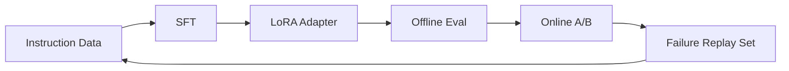

## 任务定义

目标：让基础模型在“技术问答 + 代码解释”场景下提升可控性与稳定性。



*图1：SFT + LoRA 的训练与评估回流闭环*

## 数据准备

```json
{
  "instruction": "解释梯度裁剪的意义",
  "input": "",
  "output": "梯度裁剪可以限制梯度范数，避免训练早期出现梯度爆炸。"
}
```

## 训练配置（LoRA）

```bash
python train.py \
  --model_name_or_path meta-llama/Llama-3-8b \
  --lora_r 64 --lora_alpha 128 \
  --learning_rate 2e-5 \
  --per_device_train_batch_size 2 \
  --gradient_accumulation_steps 16
```

<details>
<summary>参数选择经验（展开查看）</summary>

- 对小数据集，优先减小学习率，避免过拟合到模板化表达。  
- 对长回答任务，增大 max_seq_length 并配合 packing。  
- 先做烟雾测试，再做完整训练，能节省大量排障时间。  

</details>

## 评估闭环

1. 离线：抽样高价值问题做人审打分。  
2. 在线：灰度 A/B 对比平均回复长度与用户停留时间。  
3. 回流：将低分样本与拒答失败样本纳入下一轮训练。  

