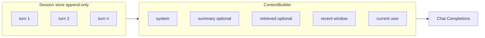
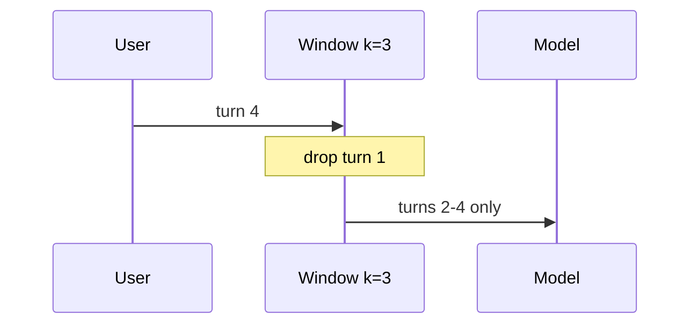
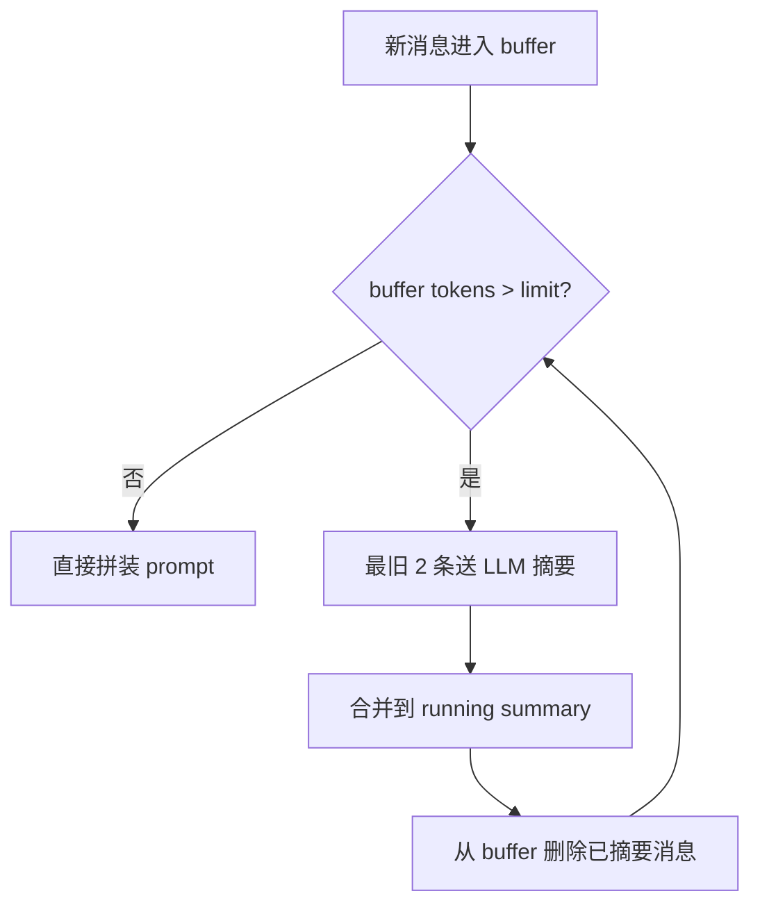
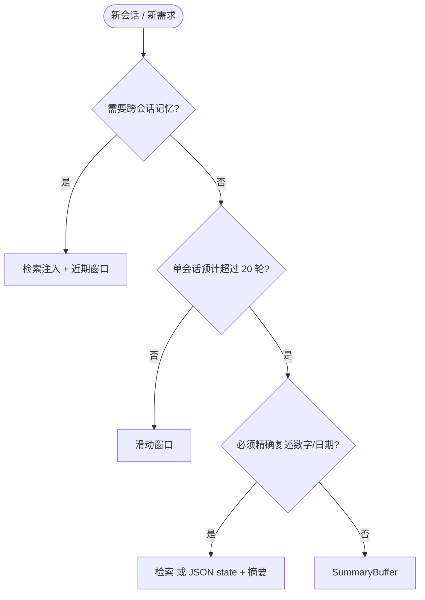

# 多轮对话上下文管理：滑动窗口、摘要压缩与检索注入三种实现

**多轮对话上下文管理**在生产里通常用三种可落地方案：**滑动窗口**（只留最近 K 轮原文）、**摘要压缩**（远期压成 running summary，近期保留 verbatim）、**检索注入**（历史写入向量库，按当前问题取 Top-k 片段拼进 prompt）。全量 `messages.extend(history)` 只适合 demo；Agent 一旦带上工具返回的大段文本，128k 窗口也会在几十轮内被撑满。

去年秋天，算法工程师陈磊把内部 Copilot 的 context 提到 128k，以为可以「永远 append」。第三十七轮，Agent 调用 `web_search` 拉回约 9,200 tokens 的摘录，下一轮用户只问「沿用刚才的报价方案」，模型却答成通用模板。根因不是窗口不够长，而是**有效注意力**被工具输出挤占，早期约定早已沉到窗口尾部。本文按同一套 **ContextBuilder** 接口讲清三种实现、选型表与 Agent 场景的膨胀治理。

> **Key Takeaways**
> - 上下文管理本质是**在固定 Token 预算内做信息调度**，不是把聊天记录越堆越长。
> - **滑动窗口**：零额外 LLM 调用、Token 可预测，但会遭遇 context cliff，适合短会话。
> - **摘要压缩（SummaryBuffer）**：用 gist 换空间，适合长对话；价格、日期等高事实精度场景必须加校验或检索。
> - **检索注入**：对话历史与知识库 RAG 同构，可跨会话；常与近期窗口组合成 L1+L2 分层记忆。
> - Agent 场景要先治理**工具消息体积**（外置存储 + 指针），再谈窗口或摘要。

**你会读到**：单轮 prompt 的预算分层、三种方案的 Python 最小实现、对比表与选型决策树，以及和 [RAG 生产实战](https://tangentllm.github.io/weblog/post/rag-production-refactor/) 共用的 Retrieve 栈如何复用到对话记忆。

---

## 为什么「更长上下文」解决不了多轮对话？

模型厂商把 context window 从 8k 推到 128k 甚至更长，但工程上仍要做 **conversation context management**，原因有三：

1. **成本与延迟**：输入 Token 按量计费；prefill 随序列变长线性变慢（推理侧 KV cache 虽能复用前缀，但首次仍要算满）。
2. **有效注意力衰减**：Liu 等（2023）的 *Lost in the Middle* 实验表明，关键信息埋在长上下文中间时，召回率明显下降（[arXiv:2307.03172](https://arxiv.org/abs/2307.03172)）。
3. **Agent 历史≠人类聊天**：一条 `tool` 消息可塞入 4k–12k tokens 的 JSON/HTML，轮数不多即可爆窗。

因此：**更长窗口是上限，不是策略**。应用层要在每次请求前决定「哪些字节进入 prompt」。这也是 **多轮对话上下文管理** 与「换更大模型」的本质区别。

**想先对齐 RAG 侧的 Retrieve 分层？** 可阅读 [RAG 系统重构实战](https://tangentllm.github.io/weblog/post/rag-production-refactor/) 中的管线拆分，下文方案三会直接复用同一套 Embedding + FAISS 思路。

---

## 前置知识：消息列表、Token 预算与「只追加」

### Chat Completions 里的 messages

OpenAI 兼容 API 使用 `role` + `content` 的消息列表，常见角色：

| role | 典型用途 |
|------|----------|
| `system` | 人设、工具规范、安全策略（应尽量稳定） |
| `user` / `assistant` | 多轮对话正文 |
| `tool` | Function Calling / MCP 工具返回 |

工程上建议维护**会话存储**（DB/Redis）与**当次 prompt 快照**（`ContextBuilder` 输出）两层：存储可全量 append；发给模型的列表由 builder 裁剪。

### Token 预算怎么切

设模型 context limit 为 \(C\)（如 32k），预留 completion 上限 \(O\)（如 4k），则当次输入预算 \(B = C - O\)。`build_messages()` 必须在 \(B\) 内装入 system、可选 summary、检索片段、近期原文与当前 user 输入。


*图 1：system 应稳定；可变部分按 summary → retrieved → recent → user 拼装，并为输出留 headroom。*

### 「只追加，不原地改」

Cursor、Claude Code 等 Agent 产品强调：**不要改写早期 message 来「修正」历史**；需要更正时追加新 message。这样 prompt caching（Anthropic/OpenAI 对稳定前缀的缓存）才能命中，也避免调试时 diff 混乱。详见 [LangChain Memory 文档](https://python.langchain.com/docs/modules/memory/) 与各家 Chat API 说明。



*图 2：存储层 append-only；每次请求由 Builder 生成当次快照。*

---

## 方案一：滑动窗口（Sliding Window）

### 直觉：FIFO 办公桌

桌上只放最近几份文件，更早的进碎纸机。实现上即 `deque` 或「保留最后 `k` 个 user/assistant 对」。

### 最小实现

```python
from collections import deque
from dataclasses import dataclass
from typing import Literal

Role = Literal["system", "user", "assistant", "tool"]

@dataclass
class Message:
 role: Role
 content: str

def sliding_window_messages(
 history: list[Message],
 *,
 max_turns: int = 10,
 system: Message | None = None,
) -> list[Message]:
 """保留最近 max_turns 轮（按 user 消息计数），不含 system。"""
 turns: deque[list[Message]] = deque(maxlen=max_turns)
 buf: list[Message] = []
 for msg in history:
 if msg.role == "user":
 if buf:
 turns.append(buf)
 buf = [msg]
 else:
 buf.append(msg)
 if buf:
 turns.append(buf)
 out: list[Message] = []
 if system:
 out.append(system)
 for block in turns:
 out.extend(block)
 return out
```

LangChain 对应 `ConversationBufferWindowMemory`：`k` 轮对话后丢弃最旧 exchange。



*图 3：新轮进入时 FIFO 丢弃最旧一轮。*

### 优劣与适用

| 维度 | 表现 |
|------|------|
| 额外 LLM 调用 | 无 |
| Token | 上界 ≈ `k × 平均每轮 tokens`，可预测 |
| 记忆保真 | 窗口外**永久丢失**（context cliff） |
| 适用 | 客服短会话、单次任务型 Agent、成本极敏感 |

**坑**：若 `tool` 消息很胖，「一轮」可能占满整个窗口。应对：工具结果落盘，message 里只留路径与 200 字摘要；输入 Token 治理可参考 [RAG 生产性能优化](https://tangentllm.github.io/weblog/post/rag-production-performance-optimization/) 中的延迟与预算思路（见后文 Agent 专节）。

---

## 方案二：摘要压缩（Summarization）

### 全量摘要 vs SummaryBuffer 混合

- **ConversationSummaryMemory**：几乎每轮用 LLM 重写**整段**摘要，延迟与费用高，适合极简原型。
- **ConversationSummaryBufferMemory（推荐）**：近期 N tokens **原文**，超出 `max_token_limit` 时把最旧若干条**摘要进 running summary**，再释放 buffer 空间。

### 触发逻辑（按 Token 阈值）

```python
SUMMARY_PROMPT = """你是会话归档助手。将下列对话压缩为要点列表，保留：
- 用户目标与约束
- 已确认的数字、日期、人名
- 未完成任务
不要编造。对话：
{dialogue}
"""

def maybe_compress(
 buffer: list[Message],
 summary: str,
 *,
 max_buffer_tokens: int,
 count_tokens,
 llm_summarize,
) -> tuple[str, list[Message]]:
 while count_tokens(buffer) > max_buffer_tokens and len(buffer) > 2:
 # 取出最旧 2 条（通常 1 个 user + 1 个 assistant）做摘要
 old, buffer = buffer[:2], buffer[2:]
 dialogue = "\n".join(f"{m.role}: {m.content}" for m in old)
 chunk = llm_summarize(SUMMARY_PROMPT.format(dialogue=dialogue))
 summary = (summary + "\n" + chunk).strip() if summary else chunk
 return summary, buffer

def build_with_summary(
 system: Message,
 summary: str,
 buffer: list[Message],
 user: Message,
) -> list[Message]:
 out = [system]
 if summary:
 out.append(Message("system", f"此前对话摘要：\n{summary}"))
 out.extend(buffer)
 out.append(user)
 return out
```



*图 4：SummaryBuffer 仅在超阈值时付费调用摘要模型。*

### 优劣与适用

| 维度 | 表现 |
|------|------|
| 额外 LLM 调用 | 触发时才有；频率取决于对话速度与 `max_token_limit` |
| Token | 远期可压缩 **约 60%–90%**（量级经验，视对话密度而定） |
| 记忆保真 | 保留主题走向，**易丢精确事实**（报价、版本号） |
| 适用 | 长咨询、陪聊、主题连续但允许模糊回忆的场景 |

法律顾问场景的陪聊产品里，产品经理林潇先用纯滑动窗口，用户问到「上周说的违约金比例」时经常答错。换成 SummaryBuffer 后主题连贯性好了，但把「15%」压成「约一成五」仍出过纠纷。她们后来在摘要外增加**结构化实体表**（JSON state）存关键字段；那属于第四种增强，不替代本文三种主方案，但与摘要方案正交。

---

## 方案三：检索注入（Retrieval-augmented Conversation Memory）

### 与知识库 RAG 的同构

[RAG 混合检索策略](https://tangentllm.github.io/weblog/post/rag-hybrid-retrieval-strategy/) 里，文档 chunk → embed → FAISS → Top-k → 拼 prompt。对话记忆把**索引对象**从静态文档换成**历史 turn**（或 turn 内再 chunk）。栈可复用 [bge-m3 + FAISS](https://tangentllm.github.io/weblog/post/rag-production-refactor/)，并按 `user_id` / `session_id` 做 namespace 隔离。也可对照 [RAG 论文解读](https://tangentllm.github.io/weblog/post/paper-rag-survey/) 理解 Retrieve 在对话记忆里的角色。


*图 5：写入路径与查询路径分离；检索结果与近期窗口一起交给 Builder。*

### 写入与查询流水线

```python
def index_turn(turn_id: str, text: str, store, embed_fn) -> None:
 for i, chunk in enumerate(chunk_text(text, max_chars=800, overlap=120)):
 vec = embed_fn(chunk)
 store.upsert(id=f"{turn_id}:{i}", vector=vec, metadata={"text": chunk})

def retrieve_context(query: str, store, embed_fn, k: int = 4) -> str:
 q = embed_fn(query)
 hits = store.search(q, k=k)
 return "\n---\n".join(h["metadata"]["text"] for h in hits)
```

**与方案一组合（生产常见）**：

- **L1**：最近 6–10 轮原文（滑动窗口）
- **L2**：全量历史向量库，按当前 user 输入检索 3–5 条

这样「刚才那句」靠 L1，「上个月说过」靠 L2。CALMem（2025）在应用层双记忆 + 会话内检索上的思路与此相近（[arXiv HTML](https://arxiv.org/html/2605.20724v1)）。

**延迟敏感？** [RAG 生产性能优化](https://tangentllm.github.io/weblog/post/rag-production-performance-optimization/) 中的并行 Retrieve 与缓存策略，同样适用于对话记忆索引（例如缓存 query embedding）。

### 优劣与适用

| 维度 | 表现 |
|------|------|
| 额外 LLM 调用 | 检索本身无；embedding 有算力成本 |
| Token | Top-k × chunk 长（例：4 × 512 ≈ 2k）可控 |
| 记忆保真 | 依赖**检索是否命中**；偏题 query 会注入噪声 |
| 适用 | 跨会话助手、长期 Agent、需要「按需想起」的事实 |

---

## 多轮对话上下文管理：三种方案对比与选型

| 方案 | 原理 | Token 行为 | 延迟 | 事实精度 | 首选场景 |
|------|------|------------|------|----------|----------|
| 滑动窗口 | 最近 K 轮原文 | 可预测上界 | 最低 | 窗口内高、窗外无 | 短会话、工具链短 |
| 摘要压缩 | 远期 gist + 近期原文 | 触发式膨胀 | 中（摘要调用） | 中，易损精确数字 | 长对话、主题连续 |
| 检索注入 | 语义 Top-k 片段 | 由 k 与 chunk 决定 | 中（检索） | 命中则高 | 跨会话、长周期任务 |

**编号清单（Featured Snippet 向）**：

1. 会话 **< 15 轮**、无跨天记忆 → 优先 **滑动窗口**（必要时加工具结果瘦身）。
2. 会话 **长、偏主题**、可接受模糊回忆 → **SummaryBuffer**。
3. 需要 **跨会话 / 按需回忆** → **检索注入**，并与近期窗口组合。
4. 报价、合规、医疗等 **高事实精度** → 检索或结构化 state，**不要只靠摘要**。



*图 6：先判跨会话，再判长度与事实精度。*

**立场**：生产环境默认 **不要** 使用无界 `ConversationBufferMemory`。128k 也挡不住 Agent 工具膨胀；更长窗口不能替代 Builder。

---

## Agent 场景：工具调用让历史膨胀

[MCP 完全技术指南](https://tangentllm.github.io/weblog/post/mcp-kw-guide/) 里，工具返回常常远大于自然语言轮次。推荐分层处理：

1. **可逆紧凑化**：大 JSON 写入对象存储或本地文件，message 只保留 `artifact_uri` + 100 字摘要。
2. **延迟省略**：第 n+3 轮再需要全文时，通过 `read_artifact` 工具按需加载，而非每轮留在 history。
3. **有损就地压缩**：对 PDF/网页类结果，用「针对当前子问题提取段落」代替全文进 context。

陈磊团队在这三步之后，同样 128k 窗口从平均第 18 轮触顶延长到 60+ 轮，P95 输入 Token 降约 42%（内部压测，2025 年 8 月）。

**想系统化 Agent 工作流？** 可参考 [Everything Claude Code 中文教程](https://tangentllm.github.io/weblog/post/everything-claude-code-zh-guide/) 中的会话与工具边界实践。

---

## 统一 ContextBuilder 接口

三种方案应实现同一接口，便于 A/B 与配置切换：

```python
from abc import ABC, abstractmethod

class ContextBuilder(ABC):
 @abstractmethod
 def build(self, session_id: str, user_input: str) -> list[Message]:
 ...

class SlidingWindowBuilder(ContextBuilder):
 def __init__(self, store, *, max_turns: int = 10): ...

class SummaryBufferBuilder(ContextBuilder):
 def __init__(self, store, *, max_buffer_tokens: int = 6000): ...

class RetrievalHybridBuilder(ContextBuilder):
 def __init__(self, store, vector_store, *, window_turns: int = 8, top_k: int = 4): ...
```

| 配置项 | 滑动窗口 | SummaryBuffer | 检索混合 |
|--------|----------|---------------|----------|
| `max_turns` | ✅ | 可选辅助 | ✅ L1 |
| `max_buffer_tokens` | — | ✅ | — |
| `top_k` / chunk | — | — | ✅ |
| `summary_model` | — | ✅ | — |

单元测试建议 mock `count_tokens`，断言在固定预算下 builder 不超长，并对「工具巨消息」用例单独回归。

---

## 常见问题（FAQ）

### 多轮对话上下文管理有哪三种实现？

**滑动窗口**（只保留最近 K 轮原文）、**摘要压缩**（远期摘要 + 近期原文，常用 SummaryBuffer）、**检索注入**（历史写入向量库，按当前问题检索 Top-k 拼入 prompt）。生产环境常组合使用，例如 L1 滑动窗口 + L2 向量检索。

### 128k context window 还需要自己做上下文管理吗？

需要。工具返回、长文档读入会让有效输入迅速膨胀；成本、延迟与 *Lost in the Middle* 效应也不会随窗口线性消失。应用层应实现 `ContextBuilder` 做预算内调度。

### SummaryBuffer 和纯滑动窗口怎么选？

会话预计 **少于约 20 轮**、且无跨天记忆需求时，滑动窗口足够；更长、偏主题连贯的会话优先 SummaryBuffer；涉及报价、合规等**精确事实**时必须加检索或结构化 state，不能单靠摘要。

### 对话记忆和 RAG 知识库是什么关系？

技术栈同构（chunk、embed、检索、拼 prompt），索引对象不同：知识库索引文档，对话记忆索引历史 turn。详见 [RAG 生产实战](https://tangentllm.github.io/weblog/post/rag-production-refactor/) 与本文方案三。

---

<script type="application/ld+json">
{
  "@context": "https://schema.org",
  "@type": "FAQPage",
  "mainEntity": [
    {
      "@type": "Question",
      "name": "多轮对话上下文管理有哪三种实现？",
      "acceptedAnswer": {
        "@type": "Answer",
        "text": "滑动窗口（只保留最近 K 轮原文）、摘要压缩（远期摘要加近期原文，常用 SummaryBuffer）、检索注入（历史写入向量库，按当前问题检索 Top-k 拼入 prompt）。生产环境常组合使用，例如 L1 滑动窗口加 L2 向量检索。"
      }
    },
    {
      "@type": "Question",
      "name": "128k context window 还需要自己做上下文管理吗？",
      "acceptedAnswer": {
        "@type": "Answer",
        "text": "需要。工具返回与长文档读入会让有效输入迅速膨胀；成本、延迟与 Lost in the Middle 效应也不会随窗口线性消失。应用层应实现 ContextBuilder 在固定 Token 预算内调度信息。"
      }
    },
    {
      "@type": "Question",
      "name": "SummaryBuffer 和纯滑动窗口怎么选？",
      "acceptedAnswer": {
        "@type": "Answer",
        "text": "会话预计少于约 20 轮且无跨天记忆时滑动窗口足够；更长且偏主题连贯的会话优先 SummaryBuffer；涉及报价、合规等精确事实时必须加检索或结构化 state，不能单靠摘要。"
      }
    },
    {
      "@type": "Question",
      "name": "对话记忆和 RAG 知识库是什么关系？",
      "acceptedAnswer": {
        "@type": "Answer",
        "text": "技术栈同构：分块、嵌入、检索、拼进 prompt。索引对象不同：知识库索引文档，对话记忆索引历史 turn。可与 RAG 生产环境共用 Embedding 与 FAISS 栈。"
      }
    }
  ]
}
</script>

## 总结

多轮对话上下文管理不是堆 history，而是在 **Token 预算**内调度 system、摘要、检索片段与近期原文。工程上优先实现 **ContextBuilder**，在滑动窗口、SummaryBuffer、检索注入三者间按会话长度与事实精度选型；Agent 必须先治理工具 payload，再谈窗口大小。

**Takeaway 清单**：

1. 三种主方案：**滑动窗口 / 摘要压缩 / 检索注入**，全量缓冲仅作反例。
2. SummaryBuffer 是长对话的性价比默认项，但**不能单独承担高精度事实**。
3. 对话记忆与 RAG 共享 Retrieve 栈，宜 **L1 窗口 + L2 向量** 组合。
4. 遵循 **只追加** 历史，利于缓存与审计。
5. 更长 context window 是上限；**应用层调度**才是生产力。

**下一步**：若你已在跑 RAG，可把现有 FAISS 索引逻辑复制一份给 `session_id`；若在做 Agent，先给 `tool` 消息加外置存储。欢迎结合 [Embedding 领域微调](https://tangentllm.github.io/weblog/post/embedding-finetune-domain-rag/) 优化对话检索的语义质量。

---

## 延伸阅读

- [RAG 系统重构实战](https://tangentllm.github.io/weblog/post/rag-production-refactor/)：Retrieve 管线与 bge-m3 选型
- [RAG 混合检索策略](https://tangentllm.github.io/weblog/post/rag-hybrid-retrieval-strategy/)：BM25 + 向量融合
- [MCP 完全技术指南](https://tangentllm.github.io/weblog/post/mcp-kw-guide/)：工具与上下文边界
- [Transformer 原理解析](https://tangentllm.github.io/weblog/post/transformer-in-depth/)：注意力与序列建模背景

## 参考文献

- Vaswani et al. (2017), *Attention Is All You Need*, [arXiv:1706.03762](https://arxiv.org/abs/1706.03762)
- Liu et al. (2023), *Lost in the Middle: How Language Models Use Long Contexts*, [arXiv:2307.03172](https://arxiv.org/abs/2307.03172)
- Lilian Weng, *LLM Powered Autonomous Agents*, [博客](https://lilianweng.github.io/posts/2023-06-23-agent/)
- LangChain, *Memory*, [文档](https://python.langchain.com/docs/modules/memory/)
