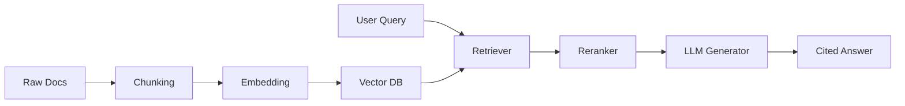

## 论文背景

RAG 的根本问题是：如何在不重训大模型参数的前提下，提升事实性与可更新性。

> “Parametric memory is powerful but stale; non-parametric memory is fresh but noisy.”  
> —— 来自多篇 RAG 系列工作的共同观点

## 方法主线

1. 先检索后生成（retrieve-then-read）
2. 生成中动态检索（interleaved retrieval）
3. 多跳检索与证据聚合

*图1：RAG 标准流水线，从文档处理到带引用回答*

## 结果解读

多数任务中，召回质量决定上限，重排质量决定稳定性。生成模型能力越强，越容易放大检索错误，因此”检索质量控制”比”换更大模型”更重要。

## 我的实践启发

- 先做语料治理，再做向量索引参数调优。  
- 引入引用标注与证据可视化，用户信任度提升明显。  
- 评估时必须分离“检索错”与“生成错”。
