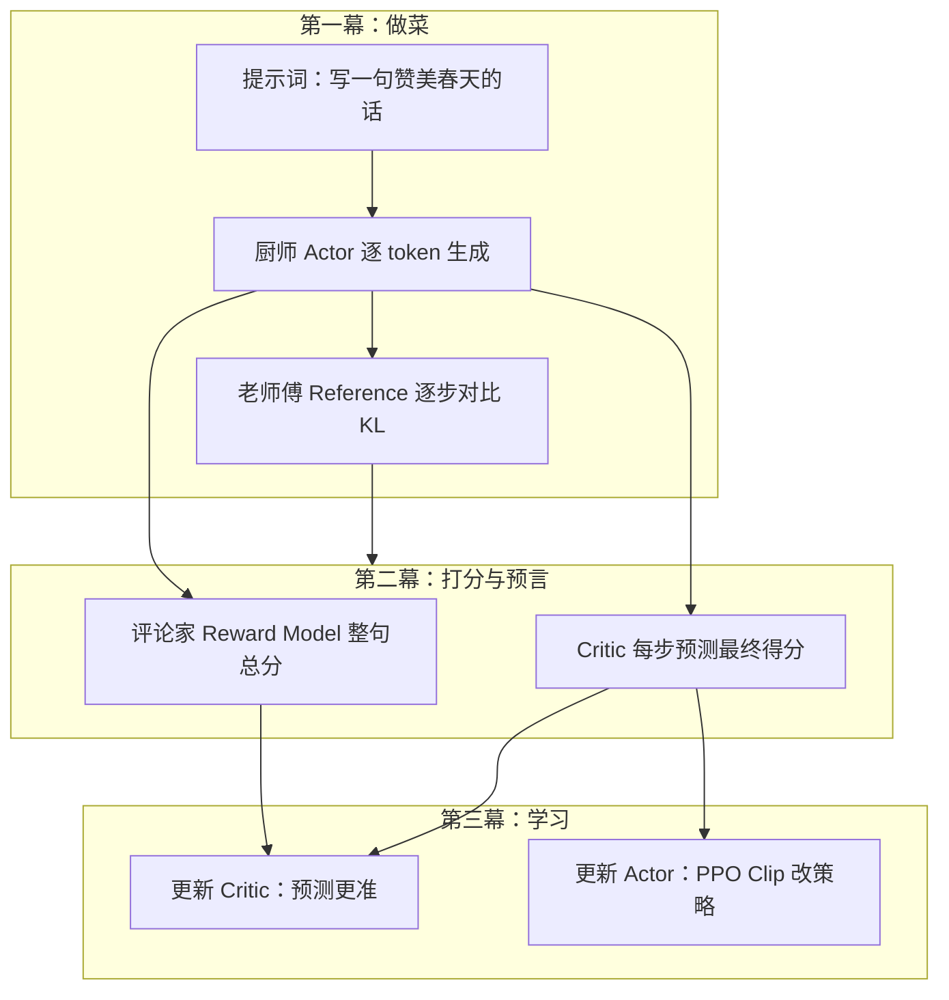
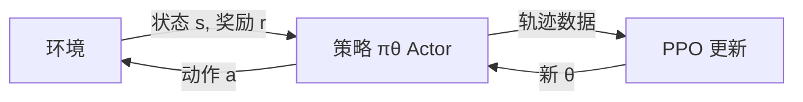
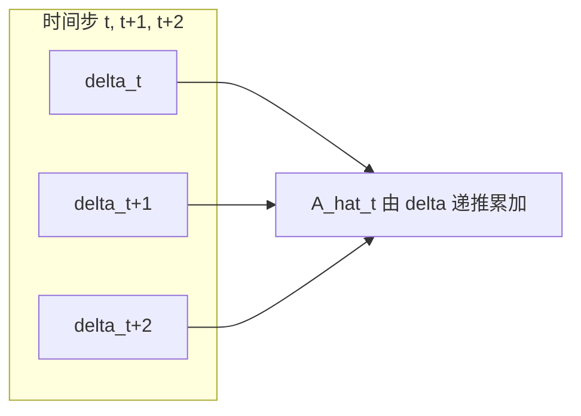
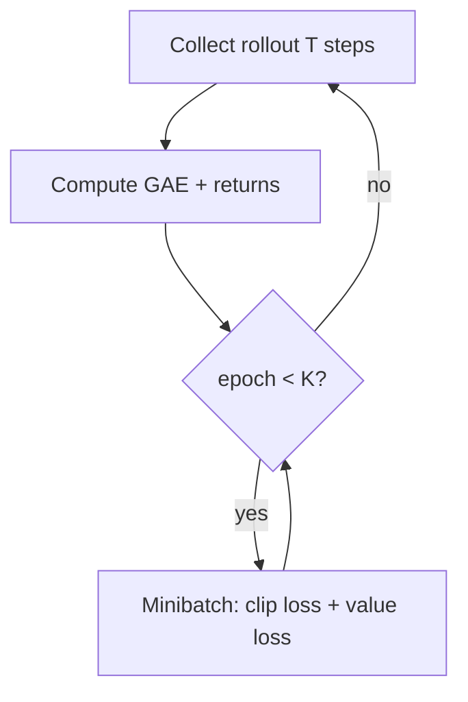
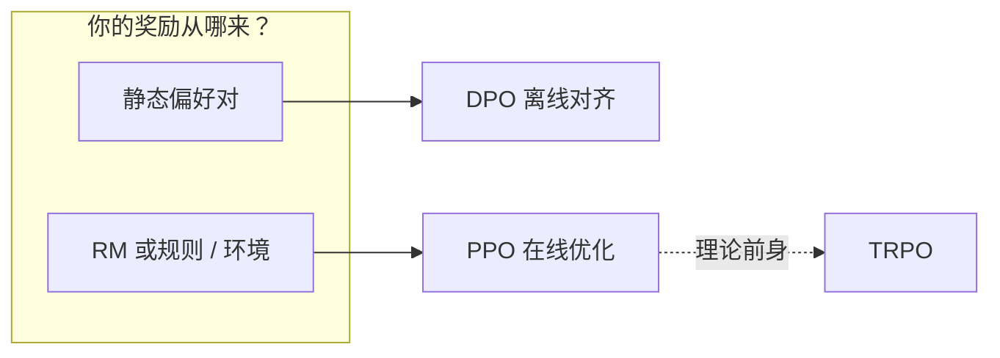
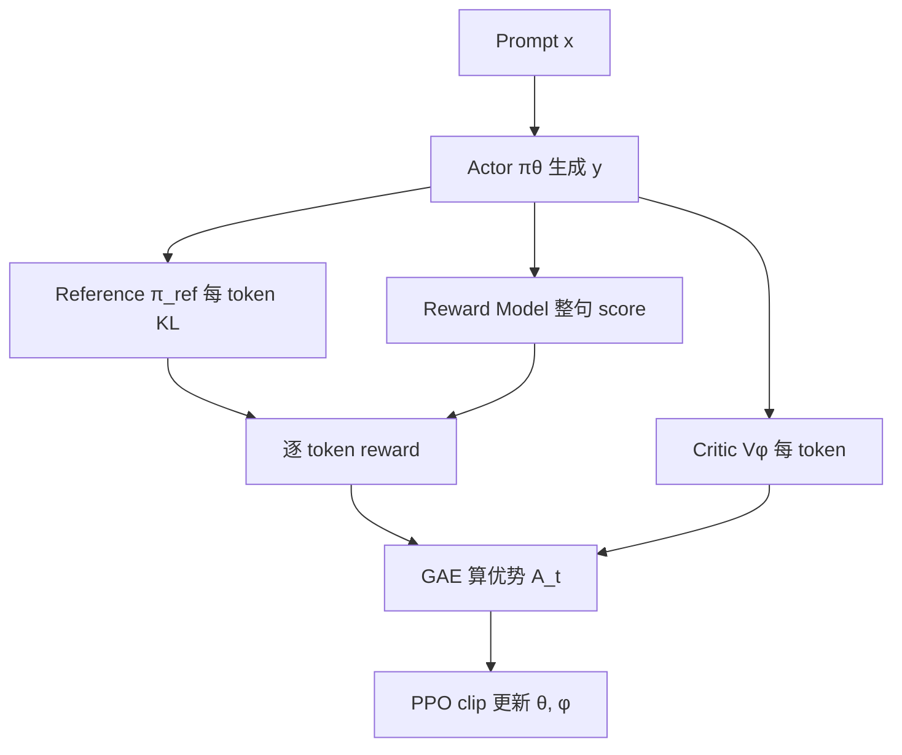

# 一文彻底理解 PPO：从原理到 PyTorch 实现

ChatGPT 一类模型的「对齐」阶段，底层常用 **PPO（Proximal Policy Optimization，近端策略优化）**。但一打开 TRL 文档，往往先看到四个名字：**Actor、Reference、Reward Model、Critic**——各自干什么、数据怎么流，很容易晕。

本文**先不讲公式**，用一个「厨师团队」的故事，把 RLHF 里 PPO 训练时的 **4 个模型** 以及它们如何配合，一口气建立直觉；然后再把同一套流程翻译成数学符号，并用手写 PyTorch 讲清经典 PPO 的 Clip 与 GAE，最后用 CartPole 跑通完整训练循环。

**阅读基础**：熟悉神经网络与梯度下降；若已做过 [SFT 微调](https://tangentllm.github.io/weblog/post/llm-sft-note/)，会更容易接上「对齐在 SFT 之后」这条线。

---

## 先用一个故事搞懂：RLHF 里 PPO 的四个模型

想象一家餐厅在培训一位**正在学做菜的厨师**。餐厅里还有三位「监工」——他们不吃闲饭，但分工完全不同。把 RLHF-PPO 想成：**一位学徒厨师 + 三位只看不乱改菜谱的裁判**，就够用。

### 四个角色：谁是谁

| 模型 | 通俗角色 | 它是干嘛的 | 训练 / 冻结 |
| :--- | :--- | :--- | :--- |
| **Actor（演员 / 策略）** | **正在学做菜的厨师** | 就是我们要训练的语言模型，负责一个字一个字地「炒」出回答。 | **要训练** |
| **Reference（参考模型）** | **老师傅 / 祖传菜谱** | 保存最初的 SFT 模型，永远不变；盯着厨师，别让它忘本。 | **冻结** |
| **Reward Model（奖励模型）** | **口味古怪的评论家** | 只看做好的**整道菜**，打一个总分；口味独特，也容易被「忽悠」。 | **冻结** |
| **Critic（价值模型）** | **品菜预言家 / 副导演** | 站在厨师边上，**每生成一个词**就猜：照这样炒下去，最终大概能得多少分。 | **要训练** |

下面模拟一次完整的「做菜 → 复盘 → 晚自习」，看这四人如何同台。



*图 1：四模型一轮 PPO 协作——只有厨师与预言家在收工后改参数；老师傅与评论家冻结。*

---

### 第一幕：厨师做菜，老师傅和评论家在旁边看着

#### 1. 厨师（Actor）开始炒菜（生成文本）

任务例如：「写一句赞美春天的话。」  
厨师往锅里**一个字一个字**下料：`春` → `天` → `真` → `美` → `。`

在 RL 语言里：每个 [token](https://tangentllm.github.io/weblog/post/tokenization-guide/) 是一次**动作**；整句是**一条轨迹（trajectory）**。

#### 2. 每扔一个字，老师傅（Reference）都立刻看一眼

老师傅心里装着最纯正、最安全的「家常菜谱」——也就是 **[SFT 微调](https://tangentllm.github.io/weblog/post/llm-sft-note/) 结束时的初始模型**，参数冻结。

厨师每准备放一个词，老师傅就对比：「按我的习惯，这个位置我通常会放什么？」

- 厨师打算放 `真`，老师傅一查，自己这里也常放 `真` → 分布接近，**KL 惩罚 ≈ 0.01**，只扣一点点。
- 厨师突然要放一个离谱的词（比如 emoji 辣椒）→ 老师傅心想：「我这辈子没这么炒过。」→ **KL 惩罚 ≈ 2.0**，狠扣一大笔。

这个 KL 惩罚是**每个 token 都会立刻到账的「及时刹车」**，保证厨师每一步都别离祖传菜谱太远。工程上常写成：在奖励里减去 $\beta \cdot D_{\mathrm{KL}}(\pi_\theta \parallel \pi_{\mathrm{ref}})$，或等价地放进 loss。

#### 3. 菜炒好了，评论家（Reward Model）尝一口，打总分

整句 `春天真美。` 出锅。评论家只评**成品**，不评半成品：「嗯……正常，但不够华丽，**6 分**。」

在 LLM 里，Reward Model 的分数往往**只在最后一个 token（或序列级）给出**，前面各 token 的「菜品总分」为 0——这是和经典 CartPole「每步都有环境奖励」最大的差别之一。

假设 KL 系数 $\beta = 0.5$，每个词的**即时奖励**大致是：

| Token | 评论家总分 | KL 扣分（示意） | 合计约 |
| :--- | :---: | :---: | :---: |
| `春` | 0 | −0.005 | **−0.005** |
| `天` | 0 | −0.005 | **−0.005** |
| `真` | 0 | −0.005 | **−0.005** |
| `美` | 0 | −0.005 | **−0.005** |
| `。` | **6** | −0.005 | **≈ 5.995** |

（KL 扣分 = $-\beta \cdot D_{\mathrm{KL}}(\pi_\theta \parallel \pi_{\mathrm{ref}})$，此处 $\beta=0.5$，每步 KL 约 0.01。）

也就是说：**终局大奖 + 全程 KL 扣分**，拼成每个位置的「真实奖励」——后面 Critic 和 PPO 都建立在这样一条**逐 token 奖励序列**上。

---

### 第二幕：事后复盘，预言家（Critic）登场

厨师只知道「最后得了 6 分」，却不知道写 `春` 是功臣还是累赘。若把 6 分全算在句号上，学不到东西。

**Critic 的工作**：在厨师**每写一个字之后**，立刻说——「按现在的半成品，我掐指一算，你**最终**大概能得 $V(s_t)$ 分。」

回到厨房现场（数字是示意）：

| 已生成 | Critic 预测「最终得分」 |
| :--- | :---: |
| `春` | 7.0 |
| `春天` | 7.2 |
| `春天真` | 6.8 |
| `春天真美` | 7.5 |
| `春天真美。` | 7.3 |

菜出锅，评论家给的真实总分：**6.0**。

把「预言」和「终局」对比，就得到厨师的**学习信号**：

- 写完 `春`：预测 7.0，实际 6.0 → **比预期差** → 这一步要适度「批评」。
- 写完 `美`：预测曾到 7.5，实际 6.0 → `美` 本身把预期抬高，说明这个动作不错，但后面收尾拉了胯 → `美` 仍值得**鼓励**，只是不能无脑全奖。

正式训练里，这一步不靠拍脑袋，而是用 **优势函数（Advantage）** 和 **GAE** 把终局分数「分配」回每个 token；故事里的「惊喜高/惊喜低」，对应的就是 $A_t > 0$ 还是 $A_t < 0$。后文经典 PPO 一节会写公式，这里只记住：**Critic 负责把稀疏的总分翻译成逐步的功过表。**

---

### 第三幕：收工后，只有两个学生上晚自习

一轮 rollout 结束后，**只有厨师（Actor）和预言家（Critic）改参数**；老师傅和评论家永远冻结。

**预言家（Critic）怎么学？**  
「写完 `春` 时我瞎报 7.0，最后才 6.0——下次同类前缀，我要猜得更接近真实。」  
这就是 **价值函数损失**：让 $V_\phi(s_t)$ 贴近「真实回报」目标（常由 GAE + 折扣回报构造）。

**厨师（Actor）怎么学？**  
拿着每一步的功过表：`美` 多鼓励，拖后腿的动作少做。  
同时 **步子别迈太大**——万一这次只是运气？这就是 PPO 的 **Clip（裁剪）**：限制新策略相对「刚炒完这道菜时的旧策略」变化幅度，避免一次更新把厨艺全改崩。

同一批 rollout 数据，PPO 还会**多训几个 epoch**（反复晚自习），但在 Clip 约束下，旧策略不能离得太远——故事里的「谨慎改菜谱」，对应数学里的 $r_t(\theta)=\pi_\theta(a_t \mid s_t)/\pi_{\mathrm{old}}(a_t \mid s_t)$，且 $r_t$ 被 clip 到 $[1-\epsilon,\,1+\epsilon]$。

---

### 全景小结：一圈流程

1. **厨师（Actor）** 炒菜 → 唯一真正产出回答的模型。  
2. **老师傅（Reference）** 全程 KL 刹车 → 别忘 SFT 之本。  
3. **评论家（Reward Model）** 终局打分 → 稀疏「大奖」。  
4. **预言家（Critic）** 逐步预测 + 事后分配功过 → 把大奖拆成每步信号。  
5. **学习**：Critic 猜更准；Actor 按功过表 + PPO Clip 改策略。

### 为什么不能合成两个模型？

- **老师傅不能和厨师合并**：要有一个**永远不变的参照**；若参照自己也天天变，「别跑偏」就没有标尺，厨师会懵。  
- **评论家不能和预言家合并**：评论家只会给**整道菜**打分；预言家要在**每个半成品**上估未来——能力不同。  
- **预言家必须单独训练**：「根据当前前缀猜终局」是独立技能，且要跟着 Actor 分布持续校准。

---

### 从故事到术语：读后对照这张表即可

| 故事 | RL / 工程术语 |
| :--- | :--- |
| 厨师 | **Actor** / policy $\pi_\theta$ |
| 老师傅 | **Reference** $\pi_{\mathrm{ref}}$（SFT 快照，冻结） |
| 评论家 | **Reward Model** $r_{\psi}(x,y)$（整句打分，冻结） |
| 预言家 | **Critic** / value $V_\phi(s_t)$（每步状态价值，训练） |
| 每个词 | 动作 $a_t$，状态 $s_t$ 为当前前缀 |
| KL 扣分 | $\beta \cdot D_{\mathrm{KL}}(\pi_\theta \parallel \pi_{\mathrm{ref}})$，逐 token |
| 终局 6 分 | 序列级 reward，通常只在末 token 非零 |
| 功过表 | **Advantage** $A_t$（常用 GAE 估计） |
| 步子别太大 | PPO **clip** on $r_t(\theta)$ |

建立直觉之后，下文将按同一逻辑展开：**先讲经典 RL 里 PPO 的 Clip 与 GAE（与是不是 LLM 无关）**，再附 **CartPole 的 PyTorch 实现**；最后回到 RLHF，把四模型与 TRL 里的模块一一对应。

---

## 强化学习视角：策略梯度与「更新别太猛」

在 CartPole 里，**状态** $s_t$ 是杆的角度与小车位置，**动作** $a_t \in \{0,1\}$ 是向左/向右推。策略 $\pi_\theta(a \mid s)$ 由神经网络输出动作概率；**回报** $G_t = \sum_{k=0}^{\infty} \gamma^{k} r_{t+k}$ 是折扣累积奖励，$\gamma \in (0,1]$ 是折扣因子。

**REINFORCE / 策略梯度** 的核心想法：提高带来高回报的动作概率。目标可写成：

$$
J(\theta) = \mathbb{E}_{\tau \sim \pi_\theta}\left[\sum_t \log \pi_\theta(a_t \mid s_t)\, \hat{A}_t\right]
$$

其中 $\hat{A}_t$ 是优势估计——动作比「平均水平」好多少。故事里的「功过表」，在经典 RL 里就是 $\hat{A}_t$。

问题在于：**一步梯度更新可能让 $\pi_\theta$ 变化过大**。新策略再去采样时，轨迹分布变了，之前收集的数据不再代表当前策略，方差爆炸，训练易崩。TRPO 用 KL 约束限制更新；PPO 用 **Clip** 达到类似效果，但实现简单得多。



*图 2：on-policy 循环——数据由当前策略采集，更新后旧数据作废（除非在 Clip 约束下复用若干 epoch）。*

---

## 从 TRPO 到 PPO：Clip 在解决什么问题

**TRPO** 近似求解：在信任域内最大化替代目标，约束 $D_{\mathrm{KL}}(\pi_{\mathrm{old}} \parallel \pi_\theta) \le \delta$。效果好，但二阶近似与共轭梯度成本高。

**PPO-Clip** 改用**裁剪后的重要性采样比**。记

$$
r_t(\theta) = \frac{\pi_\theta(a_t \mid s_t)}{\pi_{\mathrm{old}}(a_t \mid s_t)}
$$

则单步替代目标为：

$$
L^{\mathrm{CLIP}}(\theta) = \mathbb{E}_t\left[\min\left( r_t(\theta)\hat{A}_t,\; \mathrm{clip}\bigl(r_t(\theta), 1-\epsilon, 1+\epsilon\bigr)\hat{A}_t \right)\right]
$$


*图 3：当 $r_t(\theta)$ 超出区间 $[1-\epsilon,\, 1+\epsilon]$ 时，裁剪项接管，梯度不再推动策略进一步偏离旧策略。*

**为何取 $\min$？** 这是**悲观下界**：无论优势为正还是为负，都避免「过度利用」一次偶然的好 rollout。对应厨师故事里：**别因为一道菜偶然得高分，就把菜谱全盘推翻**。

常用 $\epsilon = 0.2$。当 $\hat{A}_t > 0$ 时，$r_t$ 被顶在 $1+\epsilon$ 以下；当 $\hat{A}_t < 0$ 时，$r_t$ 被压在 $1-\epsilon$ 以上——坏动作不会被一次性放大惩罚到策略崩溃。

总损失通常还包含 **价值损失** 与 **熵奖励**：

$$
L = -L^{\mathrm{CLIP}} + c_1 L^{\mathrm{VF}} - c_2 H(\pi_\theta)
$$

$L^{\mathrm{VF}}$ 让 Critic 拟合回报；熵项鼓励探索（CartPole 有用，LLM 里常调小或置零）。

---

## Actor-Critic 与 GAE：把「终局分」拆成每一步

**Critic** 估计 $V_\phi(s_t) \approx \mathbb{E}[G_t \mid s_t]$。**TD 误差**：

$$
\delta_t = r_t + \gamma V_\phi(s_{t+1}) - V_\phi(s_t)
$$

**GAE（Generalized Advantage Estimation，[Schulman et al., 2015](https://arxiv.org/abs/1506.02438)）** 把多步 TD 误差指数加权：

$$
\hat{A}_t^{\mathrm{GAE}} = \sum_{l=0}^{\infty} (\gamma\lambda)^{l}\, \delta_{t+l}
$$

$\lambda \in [0,1]$ 控制偏差–方差：$\lambda=0$ 只看一步；$\lambda \to 1$ 接近蒙特卡洛。工程上常用 $\gamma=0.99$、$\lambda=0.95$。



*图 4：GAE 用多步 δ 合成优势；对应故事中预言家把终局 6 分「分摊」到每个 token。*

实现上在 rollout 结束后**从后往前**递推（见下文代码 `compute_gae`）。算完后常做 **advantage normalization**（减均值除标准差），稳定训练。

---

## PPO 完整算法流程（经典 RL）

一轮 **update** 可记成：

1. **Collect**：用 $\pi_{\mathrm{old}}$ 在环境里跑 $T$ 步，存 $(s_t, a_t, r_t, \log\pi_{\mathrm{old}}(a_t \mid s_t), V_\phi(s_t))$。  
2. **Bootstrap**：用最后状态算 $V_\phi(s_{T})$，**GAE** 得 $\hat{A}_t$ 与 returns。  
3. **Optimize**：对同一批数据做 $K$ 个 epoch，每个 epoch 打乱后分 minibatch：  
   - 算 $r_t(\theta)$ 与 $L^{\mathrm{CLIP}}$，更新 Actor；  
   - 算 $L^{\mathrm{VF}} = (V_\phi(s_t) - \mathrm{target})^2$，更新 Critic；  
   - 梯度裁剪（如 `max_grad_norm=0.5`）。  
4. 令 $\pi_{\mathrm{old}} \leftarrow \pi_\theta$，进入下一轮 collect。



*图 5：PPO 单轮更新——同一批数据复用 K 次，但 clip 限制策略漂移。*

这与故事第三幕一致：**先完整炒一锅菜（rollout），再晚自习（多 epoch）**；PPO 的 clip 保证晚自习不会改菜谱改到认不出来。

---

## PyTorch 实现：CartPole 从零手写 PPO

下面是一套可在 CPU 上跑通的 **单环境、离散动作** PPO。正文只摘核心片段；完整可运行脚本见 `content/assets/code/ppo_cartpole.py`（与下文片段一致）。

### 依赖与运行

```bash
pip install gymnasium torch
python content/assets/code/ppo_cartpole.py
```

### 1. 共享 trunk 的 Actor-Critic

CartPole 状态 4 维，动作 2 类。共享 MLP 再分 policy / value 两头：

```python
import torch
import torch.nn as nn


class ActorCritic(nn.Module):
    def __init__(self, obs_dim: int, act_dim: int) -> None:
        super().__init__()
        self.body = nn.Sequential(
            nn.Linear(obs_dim, 64),
            nn.Tanh(),
            nn.Linear(64, 64),
            nn.Tanh(),
        )
        self.actor = nn.Linear(64, act_dim)
        self.critic = nn.Linear(64, 1)

    def forward(self, x: torch.Tensor) -> tuple[torch.Tensor, torch.Tensor]:
        h = self.body(x)
        logits = self.actor(h)
        value = self.critic(h).squeeze(-1)
        return logits, value
```

### 2. GAE（从后往前递推）

```python
def compute_gae(
    rewards: torch.Tensor,
    values: torch.Tensor,
    dones: torch.Tensor,
    next_value: torch.Tensor,
    gamma: float,
    gae_lambda: float,
) -> tuple[torch.Tensor, torch.Tensor]:
    advantages = torch.zeros_like(rewards)
    last_gae = 0.0
    for t in reversed(range(rewards.size(0))):
        next_non_terminal = 1.0 - dones[t]
        if t == rewards.size(0) - 1:
            next_v = next_value
        else:
            next_v = values[t + 1]
        delta = rewards[t] + gamma * next_v * next_non_terminal - values[t]
        last_gae = delta + gamma * gae_lambda * next_non_terminal * last_gae
        advantages[t] = last_gae
    returns = advantages + values
    return advantages, returns
```

rollout 结束后记得做优势归一化：`advantages = (advantages - advantages.mean()) / (advantages.std() + 1e-8)`。

### 3. PPO 更新（clip + value + entropy）

`old_logp` 必须在多 epoch 内 **detach**，否则比率 $r_t$ 定义错误：

```python
CLIP_EPS = 0.2
VF_COEF = 0.5
ENT_COEF = 0.01

ratio = torch.exp(new_logp - old_logp.detach())
pg1 = advantages * ratio
pg2 = advantages * torch.clamp(ratio, 1.0 - CLIP_EPS, 1.0 + CLIP_EPS)
policy_loss = -torch.min(pg1, pg2).mean()

value_loss = 0.5 * ((returns - value) ** 2).mean()
loss = policy_loss + VF_COEF * value_loss - ENT_COEF * entropy.mean()
```

### 4. 默认超参（`ppo_cartpole.py`）

| 超参 | 值 | 作用 |
| :--- | :---: | :--- |
| `CLIP_EPS` | 0.2 | clip 区间，见上文 $\epsilon$ |
| `GAMMA` | 0.99 | 折扣因子 $\gamma$ |
| `GAE_LAMBDA` | 0.95 | GAE 参数 $\lambda$ |
| `NUM_STEPS` | 1024 | 每次 rollout 步数 |
| `UPDATE_EPOCHS` | 4 | 同一批数据重复训练轮数 |
| `MINIBATCH_SIZE` | 256 | 每轮 minibatch 大小 |
| `LEARNING_RATE` | 3e-4 | Adam 学习率 |
| `MAX_GRAD_NORM` | 0.5 | 全局梯度裁剪 |

**预期现象**：单环境 CPU 实现下，回报通常能逐步升到 **100–200+**（随 seed 波动）。若要稳定接近 CartPole 上限 500，需并行环境、更长总步数、学习率退火等工程增强。

若回报长期在 50 以下，优先检查：advantage 是否归一化、`old_logp` 是否在 epoch 内 `detach`、学习率是否过大。

<details>
<summary>完整训练脚本在哪里？</summary>

正文只保留教学用片段。**可运行完整版**（rollout 收集、多 epoch minibatch、日志打印）在：

`content/assets/code/ppo_cartpole.py`

在 weblog 仓库根目录执行（需已 `pip install gymnasium torch`）：

```bash
python content/assets/code/ppo_cartpole.py
```

</details>

---

## 工程清单：复现 PPO 时容易漏掉的细节

[CleanRL 的 PPO 实现](https://docs.cleanrl.dev/rl-algorithms/ppo/) 与 [ICLR「37 项 PPO 实现细节」](https://iclr-blog-track.github.io/2022/03/25/ppo-implementation-details/) 指出：论文公式相同，**代码细节决定能否复现曲线**。下列 13 项在 CartPole / Atari 上几乎总是需要：

| # | 细节 | 不做会怎样 |
| :---: | :--- | :--- |
| 1 | 优势归一化（每批 rollout） | 更新尺度飘，难收敛 |
| 2 | Clip 参数 ε 固定 0.2 起调 | 更新过猛或过保守 |
| 3 | 多 epoch 复用同一 rollout | 样本效率低 |
| 4 | `old_logp` 冻结，epoch 内不变 | 比率 $r_t$ 定义错误 |
| 5 | GAE 而非裸蒙特卡洛 | 方差大、训练抖 |
| 6 | 全局梯度裁剪 | 偶发爆炸 step |
| 7 | 价值损失系数 $c_1 \approx 0.5$ | Critic 跟不上 Actor |
| 8 | 熵系数 $c_2$ 小量正向 | 探索不足（LLM 常更小） |
| 9 | Adam + 合理 lr | 比 SGD 稳 |
| 10 | 终止态 bootstrap $V(s_{t+1})$ | 截断轨迹偏差 |
| 11 | Actor / Critic 分离或共享 trunk | 表达能力与稳定性权衡 |
| 12 | Minibatch 打乱 | 打破轨迹相关性 |
| 13 | 向量化环境（可选） | 吞吐；非必须 |

LLM-RLHF 还会叠加：**KL 进 reward、response 级 RM 稀疏奖励、四模型显存、ref model 冻结**。但 **Clip + GAE + old policy** 与 CartPole 是同一套骨架。

### RLHF 落地：四模型显存与 TRL 在干什么

经典 CartPole 只加载 **一个** `ActorCritic`。换成 7B 级 LLM 的 RLHF-PPO，训练时往往要同时在 GPU 上驻留：

| 组件 | 是否训练 | 显存角色（量级直觉） |
| :--- | :---: | :--- |
| **Actor（policy）** | 是 | 一份 7B 权重 + 优化器状态（最大头） |
| **Reference** | 否 | 再一份 7B 冻结权重（算 KL / logprob） |
| **Reward Model** | 否 | 常 7B 或更小 RM；forward 给整句打分 |
| **Critic（value）** | 是 | 有时与 Actor 共享 backbone，有时单独小模型 |

粗算：同尺寸模型下，**PPO 阶段常接近 SFT 的 2～3 倍显存**（未计梯度检查点、LoRA、offload）。工程上常用：**Actor + Ref 用 4bit/8bit**、**RM 单独卡**、**Critic 用更小 hidden**、或 **DeepSpeed ZeRO / FSDP** 切分。

[Hugging Face TRL](https://huggingface.co/docs/trl/ppo_trainer) 的 `PPOTrainer` 把 rollout → reward → GAE → `step()` 封进一条流水线；你要改的多半是：**reward 怎么拼（RM + KL）**、**response 最大长度**、**ppo_epochs / mini_batch_size**。先理解本文 CartPole 里的 `old_logp.detach()` 与 clip，再读 TRL 源码，迁移成本会低很多。

**DPO 为何更省？** 没有在线 rollout，通常 **不需要 Critic**，也 **不必同时跑四套 7B forward**——只要成对偏好数据，把分类 loss 训在 Actor（+ 隐式 Ref）上即可。代价是奖励形式固定为「偏好对」，不如 PPO 灵活。

---

## PPO、TRPO 与 DPO：算法选型一张表

读到这里，你可能在想：既然 PPO 这么麻烦，**TRPO** 和 **DPO** 又是干什么的？三者解决的都是「**别让策略一次更新太猛**」，但工程代价差很多。

| 维度 | **TRPO** | **PPO（本文）** | **DPO** |
| :--- | :--- | :--- | :--- |
| 核心约束 | 显式 KL 信任域，二阶/共轭梯度 | Clip 比率 $r_t$，一阶梯度即可 | 把偏好学习改写成离线对比 loss |
| 是否需要 Critic | 通常要 | 要（经典 RL + RLHF） | 不要 |
| 是否需要 Reward Model | RLHF 需要 | RLHF 需要 | 不要（用偏好对代替） |
| 是否需要在线采样 | 要 | 要 | 不要（离线偏好数据） |
| 典型场景 | 机器人、早期 LLM 对齐 | InstructGPT 式 RLHF、可验证奖励 | 有成对数据、想快速对齐 |
| 实现难度 | 高 | 中（TRL / 手写均可） | 低（接近 SFT） |
| 灵活性 | 中 | **高**（任意 RM、多目标 reward） | 中（奖励隐含在偏好里） |

**怎么选（工程判断，不是教条）：**

- **先 SFT，有成对 chosen/rejected，想尽快出一版对齐模型** → 优先 **DPO**（或 IPO、ORPO 等变体），别一上来四模型 PPO。  
- **已有 RM，或奖励来自工具/规则/环境（代码测例、数学判题）且要在线探索** → **PPO** 仍合适；厨师团队里的「评论家 + 预言家」就是为这种动态奖励准备的。  
- **TRPO** 在 LLM 工程里已少见，理解它是为了看懂 PPO 论文里「信任域」从哪来；实际训练直接用 PPO 即可。



*图 7：选型先看奖励是「离线偏好」还是「在线可查询」；TRPO 可视为 PPO 的理论上一站。*

---

## 从故事回到公式：RLHF-PPO 与 TRL

开篇厨师团队，与经典 PPO 的对应关系如下。

| 环节 | CartPole | RLHF（InstructGPT 风格） |
| :--- | :--- | :--- |
| 状态 $s_t$ | 环境观测向量 | 提示 + 已生成前缀 |
| 动作 $a_t$ | 左/右推 | 下一个 token |
| 奖励 $r_t$ | 每步环境奖励 | 常为 0；末 token 加 RM 分并减 KL 惩罚 |
| Actor | `ActorCritic` 的 policy 头 | 可训练 LM（见 [Transformer 原理](https://tangentllm.github.io/weblog/post/transformer-in-depth/)） |
| Critic | value 头 | 常为小 LM 或线性头，估序列回报 |
| Reference | 无 | 冻结 SFT 快照，算 KL |
| Reward Model | 无 | 冻结，整句打分 |

**损失侧**（概念级，与 TRL `PPOTrainer` 一致）：

- **Policy**：对 response token 求 $L^{\mathrm{CLIP}}$，$r_t$ 用新旧策略的 **logprob 差**。  
- **Value**：让 $V_\phi$ 拟合 returns（returns 由 RM+KL 奖励经 GAE 得到）。  
- **KL**：可写入 reward，或单独 KL penalty 项；作用等同「老师傅刹车」。  



*图 6：RLHF-PPO 技术流——与图 1 厨师故事同构。*

### 与 Hugging Face TRL 的模块映射

| TRL / 工程组件 | 故事角色 | 说明 |
| :--- | :--- | :--- |
| `policy`（`AutoModelForCausalLM`） | 厨师 Actor | `generate` rollout |
| `ref_model` | 老师傅 | `create_reference_model`，无梯度 |
| `reward_model` | 评论家 | `compute_reward` |
| `value_model` | 预言家 Critic | 与 policy 可共享 backbone |
| `PPOTrainer.step` | 晚自习 | 内部算 GAE、clip、多 epoch |

**实践建议**：先跑通本文 CartPole，再读 TRL 源码里的 `logprobs_from_logits` 与 `masked_mean`——你会认出熟悉的 $r_t$ 与 clip。算法选型见上文 **PPO、TRPO 与 DPO** 对照表。

---

## 总结

本文用「厨师团队」讲清 **RLHF 里的 PPO**，再从 **近端策略优化** 的 Clip / GAE 推到 **PyTorch** 可运行实现。若你只记得五件事：

1. **RLHF-PPO 四模型**：Actor 生成，Reference 约束 KL，Reward 给终局分，Critic 把终局分拆成逐步优势；只有 Actor/Critic 训练。  
2. **PPO 核心**是 clipped 比率 $r_t(\theta)$，用 $\min$ 形成悲观更新，防止策略一步跳太远。  
3. **GAE** 在偏差与方差之间折中，是「功过表」的正式算法。  
4. **CartPole 手写实现** 与 TRL 共享同一套 clip + GAE + multi-epoch 逻辑；先经典 RL，再上大模型。  
5. **工程上** 优势归一化、冻结 `old_logp`、梯度裁剪，往往比改网络结构更重要。

### 建议你怎么练（下一步）

1. **今天**：在仓库根目录跑 `python content/assets/code/ppo_cartpole.py`，对照文中 `compute_gae` 与 clip loss 单步调试。  
2. **本周**：打开 [TRL PPO 文档](https://huggingface.co/docs/trl/ppo_trainer)，把四模型与本文厨师角色一一对应。  
3. **有偏好数据、显存紧**：先 [SFT](https://tangentllm.github.io/weblog/post/llm-sft-note/)，再考虑 DPO；确认 RM/在线奖励真有必要再上 PPO。

---

## 延伸阅读

- 站内：[LLM 微调实战笔记（SFT）](https://tangentllm.github.io/weblog/post/llm-sft-note/) — PPO 的上游  
- 站内：[大模型分词器完全指南](https://tangentllm.github.io/weblog/post/tokenization-guide/) — token 级「动作」从何而来  
- 论文：[Proximal Policy Optimization Algorithms](https://arxiv.org/abs/1707.06347)（Schulman et al., 2017）  
- 论文：[Training language models to follow instructions with human feedback](https://arxiv.org/abs/2203.02155)（Ouyang et al., 2022）  
- 论文：[High-Dimensional Continuous Control Using Generalized Advantage Estimation](https://arxiv.org/abs/1506.02438)（GAE）  
- 工程：[CleanRL PPO](https://docs.cleanrl.dev/rl-algorithms/ppo/) · [TorchRL PPO 教程](https://docs.pytorch.org/rl/stable/tutorials/coding_ppo.html)  
- 站内：[Transformer 原理解析](https://tangentllm.github.io/weblog/post/transformer-in-depth/) — 理解 Actor 骨干网络

---

## 常见问题

### PPO 为什么要保留 old policy？

比率 $r_t$ 必须相对**采集数据时的策略**计算。若 epoch 内用不断变化的新策略当分母，importance sampling 失效，clip 也失去意义。

### Clip 参数 ε（epsilon）一般设多少？

经典控制里 **0.2** 是常见起点；LLM RLHF 有时用 **0.1–0.2**，需与 KL 系数 $\beta$ 一起调。

### PPO 和 DPO 怎么选？

有成对偏好、想省显存 → 优先 DPO；要在线 RM、复杂奖励、可验证环境 → 仍考虑 PPO。详见正文 **「PPO、TRPO 与 DPO」** 一节的对照表。

### RM 会被「忽悠」怎么办？

故事里的「古怪评论家」不是玩笑——reward hacking 是 RLHF 经典问题。工程上常配合 KL、规则奖励、人工抽检与 RM 集成；单靠 PPO 无法自动解决。

<!-- FAQ structured data for search engines -->
<script type="application/ld+json">
{
  "@context": "https://schema.org",
  "@type": "FAQPage",
  "mainEntity": [
    {
      "@type": "Question",
      "name": "RLHF 里 PPO 需要哪四个模型？",
      "acceptedAnswer": {
        "@type": "Answer",
        "text": "Actor（策略语言模型）、Reference（冻结的 SFT 快照，用于 KL）、Reward Model（冻结，整句打分）、Critic（价值模型，估计每步未来回报）。训练中通常只更新 Actor 与 Critic。"
      }
    },
    {
      "@type": "Question",
      "name": "PPO 的 clip 参数 ε 一般设多少？",
      "acceptedAnswer": {
        "@type": "Answer",
        "text": "在经典强化学习任务中常从 0.2 起步；大模型 RLHF 中常在 0.1–0.2 之间，并与 KL 惩罚系数联合调参。"
      }
    },
    {
      "@type": "Question",
      "name": "为什么要保留 old policy？",
      "acceptedAnswer": {
        "@type": "Answer",
        "text": "策略比率 r_t 必须相对于采集 rollout 时的旧策略计算；同一批数据多 epoch 训练时 old log prob 需冻结，否则 importance sampling 与 clip 机制失效。"
      }
    }
  ]
}
</script>
