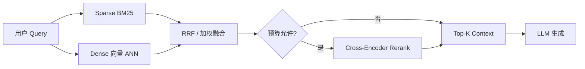

# RAG 混合检索策略深度解析：BM25、向量与 RRF 的生产级决策手册

**生产级 RAG 的默认召回栈**是：稀疏检索（BM25）与稠密向量检索并行，用 **RRF（Reciprocal Rank Fusion）** 合并排名，再视预算加 **Cross-Encoder Reranker** 精排后送入 LLM。纯向量检索在错误码、SKU、内部代号等词面匹配上容易漏召；纯 BM25 在同义改写和口语化问题上容易空结果。**RAG 混合检索**解决的是两种检索器「正交失效」的问题，而不是简单把两路分数相加。

去年 Q3，某金融科技团队的小陈把内部 Wiki 接进 RAG 后，用户抱怨「问 MySQL 1045 总答成权限概念课」。排查发现召回层只有 embedding：文档里写的是 `ERROR 1045 (28000): Access denied`，用户问的是口语版「数据库拒绝连接」。换模型没用；加上 BM25 双路 + RRF 后，同类问题的 Top-3 命中率从约 40% 提到 78%（团队自建 35 条查询集，**请以你的评测为准**）。生成侧几乎没动。

另一位做开源文档助手的维护者阿宁曾遇到相反误判：她以为「混合检索万能」，在仅 80 篇 Markdown 的库里强行双路，latency p95 从 180ms 涨到 290ms，Recall@5 却只升 2 个百分点。后来改为 **metadata 按版本过滤 + 单路向量**，延迟回落、体验反而更稳。这说明混合检索要服从 **语料规模与查询分布**，不是配置项勾选框。

> **Key Takeaways**
> - **RAG 混合检索** = BM25（稀疏）+ 向量（稠密）并行召回，推荐用 **RRF** 融合，避免硬比两种不可比的分数。
> - 技术文档 / API / 错误码语料：sparse 候选池宜 **大于** dense（例如各取 Top-50，sparse 可到 Top-100）。
> - 小库（约 100–500 chunks）可把 RRF 的 **k 调到 10–20**；TREC 默认 k=60 更适合大库。
> - 先固定 **30–50 条 golden 查询集** 看 Recall@5 / MRR，再调融合；**不要先改 prompt**。
> - 推荐栈：**Hybrid →（可选）Rerank → LLM**；双路延迟通常增加约 30%，用并行与 cascade 控制成本。

若你已读过 [RAG 系统重构实战：从 Demo 到生产](https://tangentllm.github.io/weblog/post/rag-production-refactor)，本文更聚焦**召回层**的 BM25+向量+RRF 决策；两篇可对照阅读。

本文面向已有基础 RAG、正在优化召回层的工程师。读完应能画架构、选融合方式、定评测流程，并知道**何时不必上混合**。更多同主题笔记见 [Tangentllm Notes 首页](https://tangentllm.github.io/weblog/) 与 [RAG 分类](https://tangentllm.github.io/weblog/categories)。

想先建立整体图景？可看 [Hybrid Search 公开讲解（YouTube，第三方）](https://www.youtube.com/watch?v=J3ovAXmG1I8)，与本文 BM25 + 向量 + RRF 栈一致。

---

## 为什么生产环境应默认做 RAG 混合检索

### Dense 与 Sparse 各自擅长什么

| 维度 | 稀疏（BM25） | 稠密（向量） | 混合检索 RAG |
|------|-------------|-------------|--------------|
| 词面精确匹配 | 强 | 弱 | 强 |
| 同义 /  paraphrase | 弱 | 强 | 强 |
| OOD 代号、新品 SKU | 可命中 | 易漏 | 可命中 |
| 实现复杂度 | 低（倒排） | 中（embedding + ANN） | 中 |
| 典型失效 | 「慢查询」对不上「性能优化」 | `1045` 对不上 `Access denied` | 互补 |

BM25 基于词频与逆文档频率，在 [BEIR](https://github.com/beir-cellar/beir) 等基准上平均 NDCG@10 约在 40+ 量级；稠密模型在通用语义查询上往往更强，但在 **API 文档、法律、医疗、日志** 等术语密集语料里，词面匹配经常与语义同样重要甚至更重要。混合检索在混合查询评测里 NDCG 可明显高于单路（公开综述见 [混合检索架构决策框架](https://tianpan.co/zh/blog/2026-04-17-hybrid-retrieval-architecture-beyond-embeddings)；RRF 原始论文见 [Cormack et al., SIGIR 2009](https://plg.uwaterloo.ca/~gvcormac/cormacksigir09-rrf.pdf)）。

### 正交失效：一词之差，两路各漏一半

- **Query A**：`ERROR 1045 access denied` → BM25 命中错误码片段；向量可能漂到「数据库权限管理」泛文。
- **Query B**：「怎么让 RAG 少胡说」→ 向量命中「降低幻觉」；BM25 可能 0 命中（无词面重叠）。
- **Query C**：内部项目代号 `Proj-Nebula-2026` → 典型 OOD，向量训练集未见过；BM25 或学习型稀疏更可靠。

两路失败模式**正交**，所以合并是架构问题，不是「分数调大一点」能解决的。

### 何时可以暂不混合

- 库很小（<200 chunks）且 **metadata 过滤** 已极强（按产品/版本筛后再向量）。
- 纯 FAQ，问法与文档标题高度同构。
- 延迟预算极紧且语料几乎无术语 / 代号。

此时优先把 **分块、评测集、metadata** 做好，可能比硬上双路更划算。

**[延伸阅读]** 按标签浏览站内 [RAG / 检索相关文章](https://tangentllm.github.io/weblog/tags)。

---

## 混合检索的三种实现形态



### 形态一：双路并行 + 应用层融合

`rank_bm25` + FAISS / Chroma / 旧版纯向量库：两路各取 Top-K，在应用里 RRF 或加权。适合 **百万级以下**、已有 Python 栈、向量库暂不支持 hybrid 的团队。代价是维护两套索引；公开经验里端到端延迟常增加 **约 30%**（并行可部分抵消）。

LangChain 可用 `EnsembleRetriever` 把多个 retriever 组合；生产环境更常见的是 **自己写 RRF**，便于打日志对比每路贡献的 doc_id：

```python
def rrf_score(ranks: list[int], k: int = 20) -> float:
    return sum(1.0 / (k + r) for r in ranks)

# doc_id -> list of ranks from each retriever
scores = {}
for doc_id, rank_lists in merged_ranks.items():
    scores[doc_id] = rrf_score(rank_lists, k=20)
top_docs = sorted(scores, key=scores.get, reverse=True)[:20]
```

要点：**按 doc_id 去重**后再算分；同一文档在两路各出现一次，RRF 分应累加两路贡献，而不是在 context 里粘贴两遍。

### 形态二：搜索引擎双字段

Elasticsearch / OpenSearch：`text` 字段跑 BM25，`dense_vector` 跑 kNN，查询层 **RRF 一次搞定**。适合已用 ES 做日志 / 文档搜索的团队。注意 mapping 里向量维度与 embedding 模型一致（如 `all-MiniLM-L6-v2` 为 384 维）。

### 形态三：向量库原生 Hybrid

Milvus 2.5+ 稠密 + 稀疏（BM25 或 SPLADE 编码为稀疏向量）、Qdrant、Weaviate 等提供 hybrid API。适合 **新栈**、希望索引与融合在同一引擎内完成。详见 [Milvus 混合检索文档](https://milvus.io/docs/multi-vector-search.md)。

### 进阶：三路（BM25 + Dense + SPLADE）

IBM、Pinecone 等公开材料指出，在术语极密集场景加 **学习型稀疏（SPLADE、BGE-M3 sparse）** 可能再有一档收益，但运维与索引成本更高。多数团队 **BM25 + Dense + RRF** 已是目的地，不是过渡方案；SPLADE 在 jargon 极高时再评估。

---

## RAG 混合检索融合策略：RRF、加权与级联

### RRF：生产默认（boring default）

对文档 \(d\)，在排名列表 \(i\) 上的贡献为 \(\frac{1}{k + \text{rank}_i(d)}\)，总分为各列表贡献之和。**不依赖 BM25 与 cosine 的分数尺度**，工业界首选。

- **k**：TREC 传统默认 **60**；语料仅 **100–300 页** 时常用 **10–20**，让前排名次权重更尖锐。
- **候选池**：可对 sparse 取更大 K（如 dense 30、sparse 100），再 RRF 截断到最终 Top-20。

手算直觉（k=60）：文档 D1 在 BM25 排第 0、向量排第 1，则得分 \(\approx 1/60 + 1/61\)。D2 若一路第 0、另一路未进 Top-K，仍可能靠单路高分排前。公式细节可参考 [Hybrid Search: BM25 and Dense + Fusion](https://mbrenndoerfer.com/writing/hybrid-search-bm25-dense-retrieval-fusion)。

### 加权融合（alpha）与分数陷阱

\(\text{score} = \alpha \cdot \text{norm}(\text{BM25}) + (1-\alpha) \cdot \text{norm}(\text{dense})\)

需要 **Z-score 或 min-max 归一化**；不同查询、不同索引版本会导致 \(\alpha\) 漂移。适合已有成熟归一化管线、且要做 **查询路由**（见下）的团队。法律等场景有文献报告 \(\alpha \approx 0.3\) 附近较优，**必须在你自己的 golden set 上网格搜索**，勿照搬。

### Cascade：成本优先

先用 BM25 筛 Top-100，再仅对子集算向量相似度。可节省 **约 40%** 向量计算（业界经验区间），效果常能保留九成以上。适合向量推理贵、语料大、且多数查询带明显关键词的场景。

| 策略 | 优点 | 缺点 | 推荐场景 |
|------|------|------|----------|
| RRF | 稳、无需分数对齐 | 需调 k、双路 K | **默认生产** |
| 加权 alpha | 可偏置 sparse/dense | 归一化脆弱 | 有路由 + 评测 |
| Cascade | 省算力 | 向量路召回受 BM25 截断 | 大库、成本敏感 |

---

## 中文与技术文档场景的工程要点

### 分词决定 BM25 上限

中文 BM25 依赖 **jieba、IK、HanLP** 等分词；「登录失败」与「无法登陆」若分词不一致，稀疏路会抖动。建议：索引与查询 **同一分词器**；专有名词加自定义词典（产品名、错误码）。

### 代码、版本号、API 路径

- 保留原始 token（`v1.2.3`、`/api/v2/users`）勿过度 stem。
- 错误码、UUID、SKU 查询：**提高 sparse 权重或 K**，必要时单独一路 keyword 精确匹配。
- 代码块 chunk 时避免从函数中间切断，否则 BM25 命中片段不可执行。

### Chunk 与混合检索的交互（踩坑）

某团队把 chunk 从 512 提到 1024，离线 Recall@5 升了 8%，线上「胡编」投诉升了 12%。根因是 **边界句被截断**：BM25 命中长 chunk 中间一句，生成模型却缺少完整上下文。混合检索放大了「召回到错误粒度」的问题。

**排障顺序**：固定 chunk 策略 → 固定评测集 → 再开 hybrid → 最后 rerank。

---

## 混合检索 + Reranker：推荐生产栈

1. **召回**：BM25 ∥ Dense，各 Top-50～100，RRF 合并为 Top-20～30。  
2. **精排**：Cross-Encoder（如 `bge-reranker`）对 Top-N 重打分，取 Top-5～10 进 context。  
3. **生成**：LLM + 引用约束（若需要）。

Rerank 通常比换更大生成模型 **更便宜、更稳**。延迟上：双路 +30% 左右，rerank 再加 50–200ms（视 batch 与模型而定），需在 SLA 表里分开列项。

**[讨论参数与勘误]** 欢迎在 [GitHub Issues](https://github.com/tangentllm/weblog/issues) 贴你的语料规模与 k 取值，便于补充对照表。

---

## RAG 混合检索评测与调参：别从 prompt 开始

### 构建查询集

建议 **30–50 条** 起步，覆盖：

- **精确类**（40%）：错误码、API 名、配置项  
- **语义类**（40%）：口语 paraphrase  
- **OOD 类**（20%）：新代号、未登录文档里的 SKU  

每条标注 **相关 chunk ID**（可多选），才能算 Recall@K、MRR、NDCG。

### 指标与生成质量

- **Recall@5 / MRR**：衡量召回层；应先于幻觉率调优。  
- **幻觉率 / 人工打分**：受 chunk 质量、生成 prompt 影响； hybrid 召回错片段时，换模型也救不了。

公开教程中的相对增益表（如纯向量 62 → BM25+向量 74）仅作 **量级示意**，你必须用自建集复现。

### A/B 检查清单

1. 单路 dense vs 单路 BM25 vs hybrid（同 chunk、同 K）  
2. RRF 的 k ∈ {10, 20, 60}  
3. sparse/dense 候选 K 对称 vs 不对称  
4. 加 rerank 前后对比  
5. 线上抽样 50 问人工判「是否引用了正确段落」  
6. 延迟 p95 是否仍满足 SLA  
7. 通过后再动 prompt / 模型

更多 RAG 工程笔记见 [Tangentllm Notes 关于页](https://tangentllm.github.io/weblog/about) 了解本站定位。

---

## 常见踩坑与排障

| 现象 | 可能原因 | 处理 |
|------|----------|------|
| hybrid 后更差 | 分块截断、重复 doc 占满 context | 去重；调 chunk；查边界 |
| 分数融合诡异 | 未归一化硬比 BM25 与 cosine | 改 RRF |
| 延迟暴涨 | 串行双路、rerank 过大 N | 并行；cascade；缩小 rerank N |
| 中文命中不稳 | 分词不一致 | 统一分词器 + 自定义词典 |
| 索引不一致 | 两路文档 ID / 版本不同步 | 同一 pipeline 写双索引 |

### 查询路由（可选进阶）

2025–2026 常见做法：用轻量分类器或规则判断 query 是否含 **标识符模式**（正则、实体识别），动态把 RRF 权重或 alpha 偏向 sparse；口语化 query 偏向 dense。需额外评测集验证，避免过拟合规则。

---

## 实施步骤（可直接照着做）

1. 冻结当前 chunk 与 metadata 规范。  
2. 建 golden 查询集并跑 dense-only 基线。  
3. 上 BM25（或引擎 sparse），双路并行 + **RRF（k=20 起步）**。  
4. 网格调 k 与双路 K；记录 Recall@5。  
5. 预算允许则加 rerank，再测生成侧抽样。  
6. 通过后再考虑 SPLADE 第三路或查询路由。

示例代码与实验记录可放在 [weblog 仓库](https://github.com/tangentllm/weblog)。

---

## 常见问题（FAQ）

### RAG 混合检索和「只加一个 rerank」有什么区别？

Rerank 解决的是 **召回结果里谁更相关**；混合检索解决的是 **该召回的文档有没有进候选池**。若错误码文档根本没进 Top-50，rerank 无能为力。正确顺序是 hybrid 扩召回面，再 rerank 提精度。

### RRF 和 Elasticsearch 的 RRF 是同一回事吗？

思想一致：用排名融合，弱化绝对分数。具体 `rank_constant` 默认值因版本而异，调参仍建议在你的 golden set 上比较 Recall@5，而不是照搬文档默认值。

### 中文维基 / 技术手册要不要上 SPLADE？

先证明 **BM25 + 向量** 在评测集上触顶，再评估 SPLADE 或 BGE-M3 的稀疏路。SPLADE 带来额外索引体积与推理成本；术语极高且 BM25 分词已调优时，收益更明显。

### 混合检索会让幻觉一定下降吗？

不一定。召回到 **相关但过时** 的段落，或 chunk 截断导致断章取义，幻觉反而可能上升。必须同时看 **引用命中率** 与人工判读，不能只看检索指标。

---

## 结论

**RAG 混合检索**不是银弹：它修复的是 sparse 与 dense **各漏一半** 的结构性问题。工程上的默认答案足够朴素：**BM25 + 向量 + RRF**，小库调低 k，术语库放大 sparse 候选，用 golden set 证明收益，再叠 rerank。

若你正在搭第一条生产 RAG，优先级建议是：**评测集 > 混合召回 > rerank > 换大模型**。下一篇可写「RAG golden set 怎么建」；有踩坑案例欢迎在 [Issues](https://github.com/tangentllm/weblog/issues) 交流，我会把共性补进 [站内标签](https://tangentllm.github.io/weblog/tags)。

---

## 附录：RRF 手算微例（k=60）

| 文档 | BM25 排名 | 向量排名 | RRF 分（约） |
|------|-----------|----------|--------------|
| D1 | 0 | 1 | 1/60 + 1/61 ≈ 0.033 |
| D2 | 3 | 0 | 1/63 + 1/60 ≈ 0.033 |
| D3 | 1 | 未进 Top-K | 1/61 ≈ 0.016 |

D1、D2 接近时，说明 **两路都靠前** 的文档应优先进入 context；仅单路暴高的文档需结合业务判断是否足够可信。
