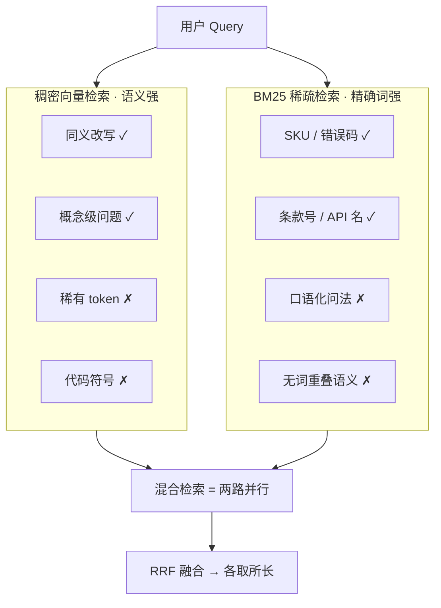
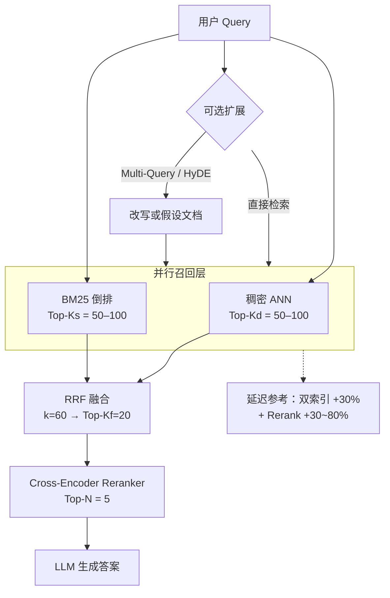
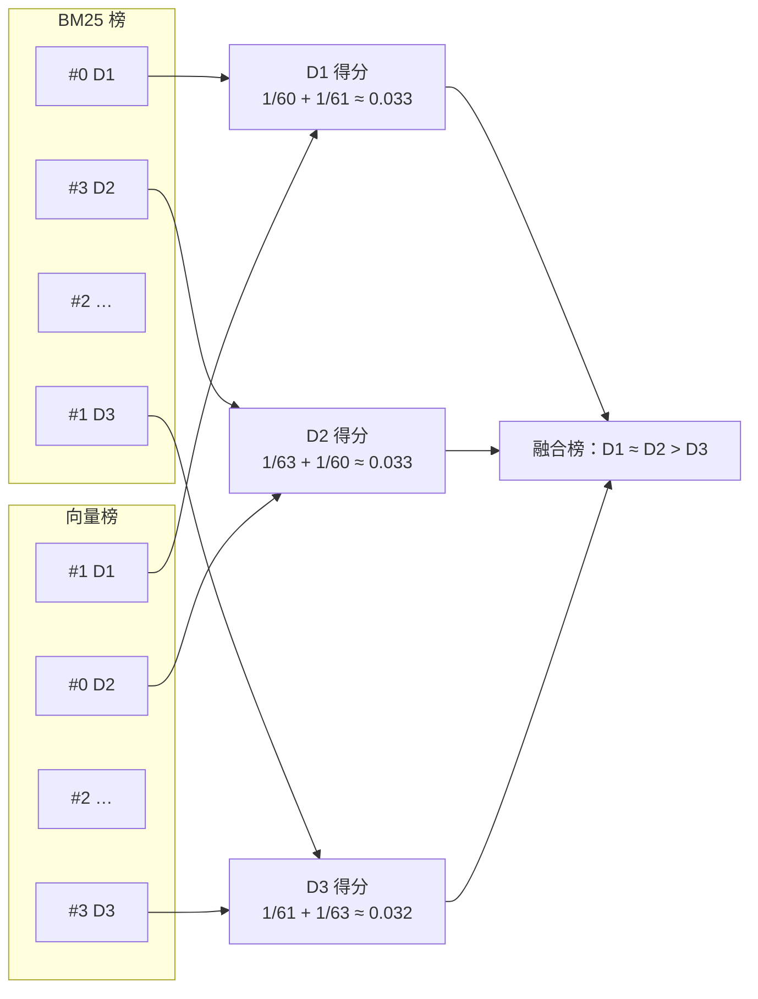
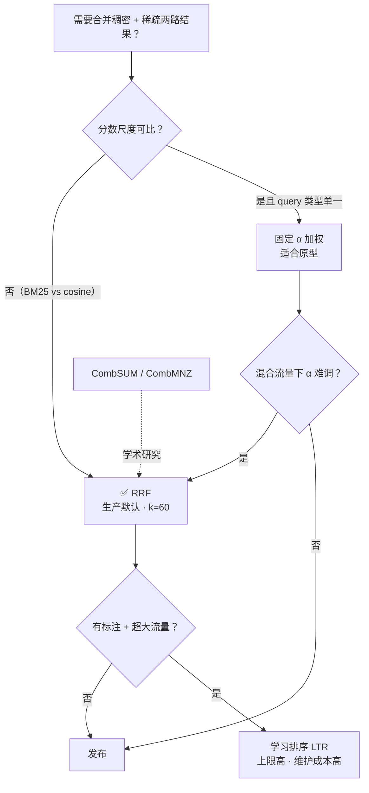
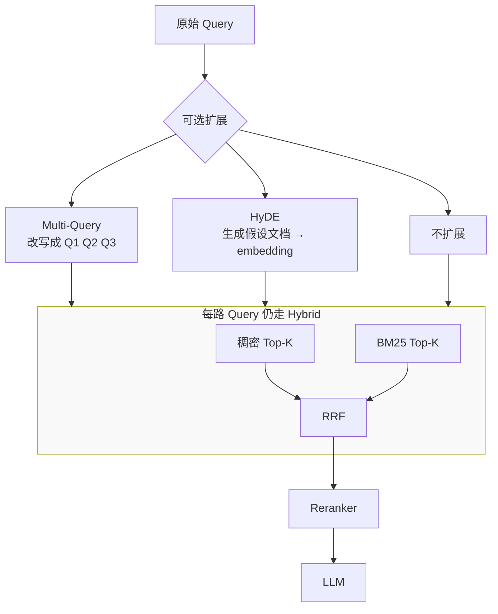
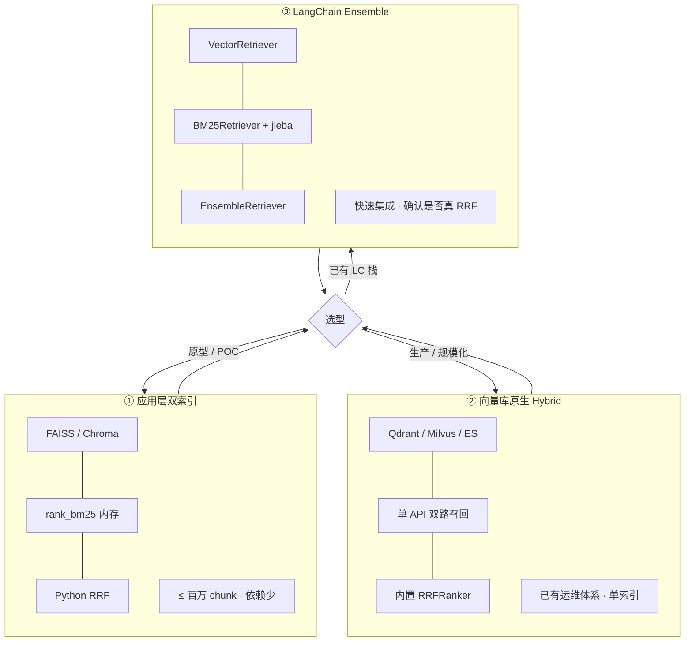
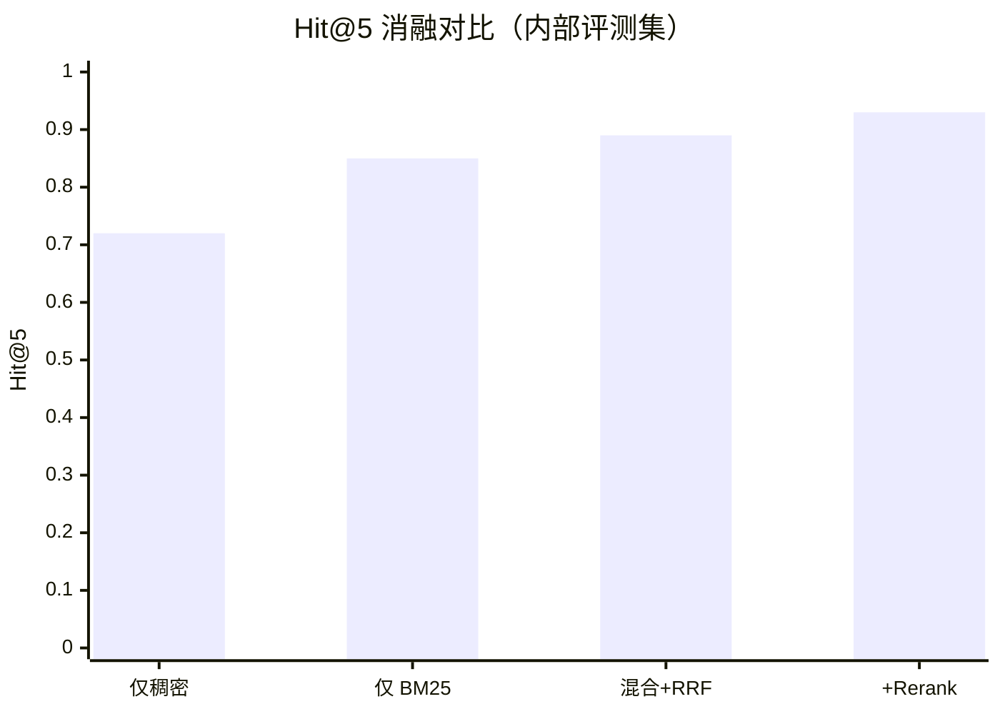

---
title: RAG 混合检索策略深度解析：从 BM25+向量到 RRF 与生产取舍
slug: rag-hybrid-retrieval-strategy
date: 2025-05-20
readTime: 24 分钟
category: 工程实践
tags: RAG, BM25, Hybrid Search, RRF, 检索增强生成
cover: ./content/assets/posts/covers/rag-hybrid-retrieval.svg
excerpt: 纯向量 RAG 常漏 SKU 与错误码？详解 BM25 与稠密检索如何互补、RRF 为何是生产默认融合，含中文 jieba 分词要点、Python 示例与消融评测清单。
---

# RAG 混合检索策略深度解析：从 BM25+向量到 RRF 与生产取舍

**RAG 混合检索**（hybrid retrieval）的标准做法是：对同一条用户查询，并行跑 **稠密向量检索**（语义）和 **BM25 稀疏检索**（关键词），再用 **RRF（倒数排名融合）** 合并两路排名，最后可选 **Cross-Encoder Reranker** 精排后送入 LLM。这是 2026 年生产 RAG 的默认 Retrieve 形态，而不是「向量不够用再上的高级功能」。

上周，算法工程师陈默给业务方演示内部知识库问答。销售问：「**KB-2024-7831 的保修政策是什么？**」

向量检索返回三段「通用保修条款」，没有一条提到该 SKU。陈默临时用 `rank_bm25` 在笔记本上跑了一遍，正确 chunk 排在第一位。问题不在模型，而在 Retrieve 只开了向量一路。

类似事故在运维文档（`ERROR 0x4A2`）、法务条款号、车牌序列号查询里反复出现：**向量把稀有 token 抹进了泛化语义里，BM25 却能在毫秒内钉死精确词。**

如果你已经搭过纯向量 [RAG 系统重构实战](https://tangentllm.github.io/weblog/post/rag-production-refactor/) 里的单路方案，但 Hit@5 卡在 70% 上下、生成端总在「泛泛而谈」，这篇会把 **双路失效模式、RRF 公式直觉、中文 BM25 分词坑、以及三种落地方式** 一次讲透。读完你应该能判断：该不该上混合检索、融合算法选哪种、参数从哪组默认值起跑。

> **Key Takeaways**
> - **RAG 混合检索** = 稠密 + BM25 并行召回 + RRF 融合；生产默认再加 Reranker，而不是调两周 `weights=[0.4, 0.6]`。
> - 向量擅长同义改写（「退货」≈「申请售后」），BM25 擅长型号、错误码、API 名；两路互补，单路都有「耻辱柱」查询类。
> - **不要**把 BM25 分数和 cosine 相似度直接加权相加；尺度不可比，RRF 只看排名，\(k=60\) 是稳健起点（Cormack et al., SIGIR 2009）。
> - 中文 BM25 必须先 **jieba 分词**；LangChain 默认按空格切词，在中文语料上稀疏路几乎失效。
> - SPLADE / learned sparse 是 v2 升级；多数团队应先跑通 **BM25 + Dense + RRF**，再考虑稀疏神经网络。

**本文结构预览**：失效模式 → 完整流水线 → BM25 / 向量两路 → RRF 推导与代码 → 多路召回与 SPLADE → 数据库落地 → 评测与决策框架。

---

## 前置知识

阅读本文前，你应已理解：文本 embedding、余弦相似度、以及 [论文解读：RAG 的演化路径](https://tangentllm.github.io/weblog/post/paper-rag-survey/) 里 Retrieve–Augment–Generate 的基本分工。切块大小与 embedding 选型（可参考 [RAG 系统重构实战](https://tangentllm.github.io/weblog/post/rag-production-refactor/) 中的 bge-m3 部分）会影响混合检索上限。

---

## 稠密 vs 稀疏：两路检索的失效模式

### 稠密检索：语义强，精确词弱

稠密检索把 query 和 document 映射到同一向量空间，用 ANN（HNSW、IVF 等）找最近邻。它擅长：

- 用户换说法：「怎么取消订单」与文档里的「申请退款流程」
- 概念级问题：「不可抗力能否免责」

它容易死在：

- **低频专有 token**：产品型号 `KB-2024-7831`、错误码 `0x4A2`、车牌 `AB-123-CD`
- **代码符号**：`UserService.authenticate` 与 `authenticateUser` 在向量空间里可能并不近
- **数字与版本号**：embedding 对「3.2.1」和「3.2.2」的区分度常不足

### BM25：精确词强，改写弱

BM25（Best Matching 25）是经典稀疏检索：基于词频（TF）和逆文档频率（IDF），在倒排索引上打分。1994 年提出至今，在 BEIR 等 benchmark 的**特定 query 子集**上，仍有不少场景能打败通用稠密模型，尤其是「查询里含有文档里才出现的罕见词」时。

它容易死在：

- 用户不说文档里的词：只问「保修」，文档写「质保」
- 长距离语义：两段话主题相关但没有词重叠

### 查询类型 → 谁更靠谱（速查表）

| 查询类型 | 示例 | 稠密 | BM25 | 混合收益 |
|---|---|:---:|:---:|:---:|
| 口语化 FAQ | 「想退货怎么办」 | ★★★ | ★ | 中 |
| 型号 / SKU | `KB-2024-7831 保修` | ★ | ★★★ | **高** |
| 错误码 / 日志 | `ERROR 0x4A2 重启` | ★ | ★★★ | **高** |
| 法规 / 条款 | 「不可抗力 疫情」 | ★★ | ★★ | 高 |
| 代码符号 | `def forward(self, x)` | ★ | ★★★ | **高** |

*图 1：稠密检索与 BM25 的互补关系——口语 FAQ 偏稠密，SKU/错误码偏 BM25。*



法务团队的李薇曾用纯向量搜合同：问「**不可抗力条款 疫情**」，向量路能召回相关段落，但排名在第三四位；BM25 对「不可抗力」命中更稳。融合后 Top-1 才是带条款编号的那一段，LLM 才没有编造条款号。

---

## RAG 混合检索架构：Retrieve 阶段完整流水线

[RAG 系统重构实战](https://tangentllm.github.io/weblog/post/rag-production-refactor/) 里，Retrieve 常被简化成 `similarity_search(k=5)`。生产级 **RAG 混合检索策略** 应至少包含四层：

1. **并行召回**：稠密 Top-\(K_d\)，稀疏 Top-\(K_s\)（常各取 50–100）
2. **融合**：RRF 合并为 Top-\(K_f\)（如 20）
3. **精排（推荐）**：[Reranker 精排](https://tangentllm.github.io/weblog/post/rag-production-refactor/) 压到 Top-\(N\)（如 5）再进 LLM
4. **可选扩展**：Multi-Query、HyDE 在**混合之前或并行**增加 recall，而不是替代 BM25

*图 2：RAG 混合检索标准流水线；K 值为文内推荐默认。*



**工程提示**：双索引若部署在两个系统（FAISS + 内存 BM25），端到端延迟通常增加约 30%（[社区实践](https://dev.to/sapotacorp/why-hybrid-search-is-the-boring-default-we-keep-recommending-49mh)），但 Recall@10 从单路 60–70% 提到 90% 附近的案例并不罕见，具体取决于语料与 query 分布。第三方综述曾报告混合相对纯稠密 **端到端准确率提升约 26–31%**（[Atlan Hybrid RAG 综述](https://atlan.com/know/hybrid-rag/)，厂商 benchmark，仅供参考，务必在自己的评测集上复现）。

**想先对照自己的 Retrieve 流水线？** 对照 [RAG 系统重构实战](https://tangentllm.github.io/weblog/post/rag-production-refactor/)，把「单路向量 + Reranker」扩展为上图的四层结构即可。

---

## BM25 在 RAG 里：够用即可的数学

### 从 TF-IDF 到 BM25

词 \(t\) 在文档 \(d\) 中的 BM25 贡献（单字段简化写法）：

\[
\text{score}(d,q) = \sum_{t \in q} \text{IDF}(t) \cdot \frac{f(t,d)\,(k_1+1)}{f(t,d)+k_1\,(1-b+b\cdot|d|/\text{avgdl})}
\]

- \(f(t,d)\)：词 \(t\) 在 \(d\) 中出现次数 
- \(|d|\)：文档长度，\(\text{avgdl}\) 为语料平均长度 
- \(k_1 \in [1.2, 2.0]\)、\(b \in [0.75, 1.0]\) 为平滑超参；`rank_bm25` 默认 \(k_1=1.5, b=0.75\)

直觉：罕见词（高 IDF）+ 适度词频加分，过长文档被长度归一惩罚。

### 中文：分词不是可选项

英文按空格切词即可。中文必须分词，否则「退换货政策」整串当一个 token，BM25 退化成整句匹配。

某企业文档问答项目（53AI 社区复盘）曾用 LangChain 默认 `BM25Retriever` 做混合，调 `weights` 两周，最终只比纯向量好一点点。事后发现：**稀疏路在中文上几乎没起作用**。根因是默认按空格分词，中文 chunk 被当成超长「词」。修复方式：用 **jieba** 切词再建索引。

```python
# bm25_chinese.py - 中文 BM25 最小正确姿势
import jieba
from rank_bm25 import BM25Okapi

def tokenize_zh(text: str) -> list[str]:
 return [w for w in jieba.cut(text) if w.strip()]

corpus_tokens = [tokenize_zh(doc.page_content) for doc in chunks]
bm25 = BM25Okapi(corpus_tokens)

def search_bm25(query: str, top_k: int = 50) -> list[tuple[int, float]]:
 q_tokens = tokenize_zh(query)
 scores = bm25.get_scores(q_tokens)
 ranked = sorted(enumerate(scores), key=lambda x: -x[1])[:top_k]
 return ranked
```

LangChain 封装时，把 `preprocess_func` 指到 `tokenize_zh`：

```python
from langchain_community.retrievers import BM25Retriever

bm25_retriever = BM25Retriever.from_documents(
 chunks,
 preprocess_func=tokenize_zh,
)
```

---

## 稠密向量路：embedding 与 ANN

稠密路负责「用户没说出文档里的原词」的那一半流量。工程上关注三点：

1. **模型**：中文场景常用 `bge-m3`、`text-embedding-3-small` 等；选型见 [bge-m3 选型复盘](https://tangentllm.github.io/weblog/post/rag-production-refactor/)。
2. **Top-K 与候选集**：ANN 先召回 `num_candidates`（如 100）再精排 Top-K，K 太小会伤 recall。
3. **度量**：归一化向量用 cosine / inner product 等价；未归一化时注意度量一致。

混合检索里，稠密路不必单独调到「完美」，目标是与 BM25 **覆盖不同失败模式**。

---

## 分数不可比：为什么用 RRF，而不是加权分数

### 加权融合为何脆弱

设稠密分数 \(s_d \in [0,1]\)（cosine），BM25 分数 \(s_b\) 可达几十上百，且随语料统计漂移。常见做法：

\[
s_{\text{final}} = \alpha \cdot \hat{s}_d + (1-\alpha) \cdot \hat{s}_b
\]

需要对 \(\hat{s}\) 做 min-max 或 z-score 归一化。\(\alpha\) 对 query 类型敏感：SKU 查询该靠近 BM25，闲聊该靠近向量。**固定 \(\alpha\)** 在混合流量下往往输给 **按 query 动态调 \(\alpha\)**（2026 研究方向），而调参成本又高于 RRF。

### RRF 公式与直觉

**RRF（Reciprocal Rank Fusion，倒数排名融合）** 由 Cormack、Clarke、Buettcher 在 SIGIR 2009 提出（[论文 PDF](https://plg.uwaterloo.ca/~gvcormac/cormacksigir09-rrf.pdf)）。对文档 \(d\)，

\[
\text{RRF}(d) = \sum_{i \in \text{lists}} \frac{1}{k + \text{rank}_i(d)}
\]

- \(\text{rank}_i(d)\)：\(d\) 在第 \(i\) 路结果中的排名（从 0 或 1 起算，实现时保持一致即可）
- \(k\)：平滑常数，**默认 60**；\(k\) 越小，头部排名权重越大

直觉像多位评委只报名次、不报分数：一个 chunk 在「向量榜第 2 + BM25 榜第 3」会胜过「向量榜第 1 + BM25 榜第 50」。**RAG 多路召回**用 RRF 合并，无需训练、几乎不调参。

### 手算示例（\(k=60\)）

| 文档 | BM25 排名 | 向量排名 | RRF 分（rank 从 0） |
|---|---|---|---|
| D1 | 0 | 1 | \(1/60 + 1/61 \approx 0.033\) |
| D2 | 3 | 0 | \(1/63 + 1/60 \approx 0.033\) |
| D3 | 1 | 3 | \(1/61 + 1/63 \approx 0.032\) |

D1、D2 接近，融合会抬升「两路都靠前」的文档；仅一路极高的文档，若另一路排名很后，会被拉下来。

*图 3：RRF（k=60）按排名倒数累加；两路都靠前的文档总分更高。*



### Python：RRF 实现

```python
# rrf.py
from collections import defaultdict

def reciprocal_rank_fusion(
 ranked_lists: list[list[str]],
 k: int = 60,
 top_n: int = 20,
) -> list[tuple[str, float]]:
 """ranked_lists: 每路为 doc_id 按相关性降序排列的列表"""
 scores: dict[str, float] = defaultdict(float)
 for lst in ranked_lists:
 for rank, doc_id in enumerate(lst):
 scores[doc_id] += 1.0 / (k + rank)
 return sorted(scores.items(), key=lambda x: -x[1])[:top_n]

# 示例
bm25_ids = ["D1", "D3", "D5", "D2"]
dense_ids = ["D2", "D1", "D4", "D3"]
print(reciprocal_rank_fusion([bm25_ids, dense_ids]))
```

### 融合算法怎么选（决策表）

| 方法 | 优点 | 缺点 | 适用 |
|---|---|---|---|
| **RRF** | 无分数归一化、鲁棒、工业默认 | 不利用原始分数幅度 | **生产 RAG 首选** |
| 固定 \(\alpha\) 加权 | 实现简单 | 混合 query 流量下难调 | 原型、query 类型单一 |
| CombSUM / CombMNZ | 经典 IR | 仍要归一化 | 学术研究 |
| 学习排序（LTR） | 上限高 | 要标注、维护成本高 | 超大流量、有标注团队 |

*图 4：生产 RAG 默认走 RRF；有标注团队再考虑 LTR。*



---

## 不止两路：Multi-Query、HyDE 与混合的关系

**混合检索**解决的是「稀疏 vs 稠密」信号互补。下面能力与它**叠加**，不是替代：

| 技术 | 作用 | 与混合的关系 |
|---|---|---|
| Multi-Query | 把一个问题改写成多条 query 分别召回 | 每路 query 仍可走 BM25+向量+RRF |
| HyDE | 用 LLM 生成假设文档再 embedding | 多一条稠密召回路径 |
| [Reranker](https://tangentllm.github.io/weblog/post/rag-production-refactor/) | 对候选做 cross-encoder 精排 | 放在 RRF **之后** |

*图 7：Multi-Query / HyDE 扩展 recall，不替代 BM25；Rerank 永远在 RRF 之后。*



推荐顺序：**扩展 query（可选）→ 双路召回 → RRF → Rerank → Top-N → LLM**。陈默团队后来把「调 embedding 模型两周」改成「加 BM25 + RRF 一天」，Hit@5 从 0.72 提到 0.89，再叠 `bge-reranker-v2-m3` 到 0.93（内部评测集，非公开 benchmark）。

---

## 进阶稀疏：SPLADE 何时值得上

**SPLADE**（Formal et al., 2021, [arXiv:2107.05720](https://arxiv.org/abs/2107.05720)）用 Transformer 产出**可解释稀疏向量**，能对 query 做「车 → 车辆、汽车」式扩展，仍走倒排索引。相对 BM25：

| 维度 | BM25 | SPLADE |
|---|---|---|
| 同义词 / 扩展 | 弱 | 强 |
| OOV 型号、错误码 | **强** | 弱（未见 token 无扩展） |
| 索引成本 | 低 | 高（需存稀疏向量） |
| 查询延迟 | 毫秒级 | 若查询时跑 Transformer +100–300ms；**索引期预计算**可缓解 |

**观点**：SPLADE、BGE-M3 sparse 适合 v2 语料以自然语言为主、同义改写多的场景；**第一步仍建议 BM25 + Dense + RRF**。Milvus 2.5+、Qdrant 等已支持原生 hybrid + RRF，见 [Milvus 混合检索文档](https://help.aliyun.com/zh/milvus/use-cases/full-text-retrieval-by-milvus-bm25-algorithm-and-application-of-hybrid-retrieval-to-rag-system) （本仓库 [RAG 重构文](https://tangentllm.github.io/weblog/post/rag-production-refactor/) 用的是 FAISS）。

---

## 三种落地方式

*图 5：按团队规模与运维能力选型——原型用应用层，规模化用 DB 原生。*



### 1. 应用层双索引（原型 / 百万级以下）

- 稠密：FAISS / Chroma 
- 稀疏：`rank_bm25` 内存索引 
- 应用内 `reciprocal_rank_fusion`

优点：依赖少、逻辑透明。缺点：双份索引运维、分布式时要自己_shard。

开源参考 [Hybrid-Search-RAG-Engine](https://github.com/im-anishraj/Hybrid-Search-RAG-Engine) 在 20 条 QA 上报告 Hybrid Hit@5 **95%** vs 纯 FAISS **85%**、纯 BM25 **90%**（小样本，仅说明「有一路独占命中」的价值）。

### 2. 向量数据库原生 Hybrid

| 系统 | 能力摘要 |
|---|---|
| **Qdrant** | dense + sparse（BM25 / SPLADE），`Fusion.RRF` |
| **Milvus 2.5+** | 内置 Sparse-BM25 + `RRFRanker` |
| **Elasticsearch 8.x+** | `query` + `knn` + `rank.rrf` |

适合已有运维体系、希望单 API 完成召回与融合的团队。

### 3. LangChain `EnsembleRetriever`

```python
from langchain.retrievers import EnsembleRetriever

ensemble = EnsembleRetriever(
 retrievers=[vector_retriever, bm25_retriever],
 weights=[0.5, 0.5], # 注意：部分版本用加权而非 RRF，读文档确认
 c=60,
)
```

务必确认版本行为是 RRF 还是分数加权；中文务必接 **jieba** 的 `BM25Retriever`。

---

## RAG 混合检索参数与评测：怎么证明「真的更好」

### 推荐默认（起跑线）

| 参数 | 建议值 | 说明 |
|---|---|---|
| 各路召回 K | 50–100 | 先保 recall，再靠 Rerank 压噪 |
| RRF 的 \(k\) | 60 | 论文与 ES 默认；调试可试 20–80 |
| RRF 输出 | 20 | 送入 Reranker |
| Rerank 输出 | 5 | 送入 LLM context |

### 指标

- **Recall@K / Hit@K**：正确答案是否在 Top-K 
- **MRR**：第一个正确结果的平均倒数排名 
- **端到端 EM / 人工判分**：生成答案是否事实正确（最终 KPI）

### 消融实验（必做四组）

1. 仅稠密 
2. 仅 BM25（中文 + jieba） 
3. 混合 + RRF 
4. 混合 + RRF + Reranker 

只有第 3 组显著优于 1、2，才说明混合值得长期维护。

*图 6：陈默团队内部评测集 Hit@5；须在自己的数据集上复现。*



**准备做 Rerank 对照实验？** 见 [RAG 系统重构实战](https://tangentllm.github.io/weblog/post/rag-production-refactor/) 里的 `bge-reranker-v2-m3` 与 top-10/top-3 配置。

---

## 决策框架：什么时候用、什么时候别用

### 适合上 RAG 混合检索

- 企业知识库、客服 SOP、合规 PDF（型号、条款号多） 
- 代码库、API 文档、运维 runbook 
- Query 流量**无法**事先分为「只要语义」或「只要关键词」

### 可以暂缓

- 语料 < 500 chunk，暴力全文塞进 prompt 更便宜 
- 问题 100% 可由 SQL / 结构化 API 回答 
- 仅英文短 FAQ、且用户永远用文档原词提问（少见）

### 与 fine-tuning、GraphRAG 的边界

- **混合检索**：外置知识、可更新、可引用来源 
- **Fine-tuning**：内化风格与格式，不自动解决「知识截止」 
- **GraphRAG**：强关系推理；成本高，与 hybrid 可组合（图遍历 + 文本 chunk 双召回）

---

## 常见问题（FAQ）

### RAG 混合检索和「多路召回」是一回事吗？

口语里经常混用。**多路召回**泛指多条独立召回通道（向量、BM25、图谱、SQL、Multi-Query 等）。**RAG 混合检索**通常特指 **稠密 + 稀疏** 两路，再用 RRF 等算法融合。你可以有多路召回，其中一路内部仍是 hybrid（例如：HyDE 稠密 + 标准稠密 + BM25，三路 RRF）。

### RRF 的 rank 从 0 还是从 1 开始？

实现里统一即可。Elasticsearch 与多数开源实现按 0-based rank 代入 \(1/(k+\text{rank})\)。换起点会改变绝对分值，但**同一实现内**的相对排序不变。跨系统对比指标时，不要混用两种约定。

### 只有 Chroma / 老版 Pinecone，没有原生 hybrid 怎么办？

在应用层维护第二套 BM25 索引（`rank_bm25` 或 Whoosh），两路各取 Top-K，在 Python 里 `reciprocal_rank_fusion`。延迟大约增加 20–30%，但功能等价。语料超过百万条时，再评估迁到 Qdrant / Milvus / ES。

### 混合检索能替代 Reranker 吗？

不能。RRF 解决的是「两路榜单如何合并」；Reranker 用 cross-encoder 对 query–chunk 做**深度交互**，压掉「两路都勉强相关」的噪声。实践上常见组合：各路 K=80 → RRF 出 20 → Rerank 出 5。若只能二选一，优先 Rerank（在已有单路召回的前提下）；若召回层就漏了正确 chunk，Rerank 救不回来。

### 动态 alpha（按 query 调稠密/稀疏权重）值得做吗？

当你的流量里**同时存在**大量 SKU/错误码类 query 和大量口语化 query，且固定 RRF 仍不满意时，可以尝试 query 分类器调节 \(\alpha\)。这是 2026 年的研究前沿，工程成本高于 RRF。默认路径仍是：**先 RRF，有标注数据再 LTR / 动态 alpha**。

---

## Elasticsearch 混合检索示例（RRF 原生）

若团队已在用 Elasticsearch 8.x+，可在一次请求里并行 BM25 与 kNN，并用 `rank.rrf` 融合（概念性 JSON，字段名以你集群版本文档为准）：

```json
{
 "retriever": {
 "rrf": {
 "retrievers": [
 {
 "standard": {
 "query": { "match": { "content": "KB-2024-7831 保修" } }
 }
 },
 {
 "knn": {
 "field": "content_vector",
 "query_vector": "[...]",
 "k": 50,
 "num_candidates": 100
 }
 }
 ],
 "rank_constant": 60
 }
 },
 "size": 20
}
```

`rank_constant` 即 RRF 的 \(k\)。调小到 20 会让榜首更「尖锐」，调大到 100 更平滑。TechBytes 等实践文在**小语料**上常用 `k=20` 做实验，生产仍以 60 为起点更稳。

---

## Milvus 混合检索片段

Milvus 2.5+ 支持内置 BM25 稀疏字段与 `RRFRanker`（详见[阿里云 Milvus 混合检索案例](https://help.aliyun.com/zh/milvus/use-cases/full-text-retrieval-by-milvus-bm25-algorithm-and-application-of-hybrid-retrieval-to-rag-system)）：

```python
from pymilvus import AnnSearchRequest, RRFRanker

req_dense = AnnSearchRequest(
 data=[query_embedding], anns_field="dense", param={"metric_type": "COSINE"}, limit=50
)
req_sparse = AnnSearchRequest(
 data=[query_text], anns_field="sparse_bm25", param={"metric_type": "BM25"}, limit=50
)
ranker = RRFRanker(60)
results = client.hybrid_search(
 collection_name="docs",
 reqs=[req_dense, req_sparse],
 ranker=ranker,
 limit=20,
 output_fields=["text"],
)
```

这与应用层手写 RRF 等价，优势是召回、融合在同一服务内完成，运维一份索引。

---

## 视频：Hybrid Search 直观讲解

Weaviate 对 hybrid search（稀疏 + 稠密 + 融合）有简短可视化说明，适合给团队做 onboarding：

https://www.youtube.com/watch?v=EaOQc8ppJdU

---

## 生产落地检查清单

上线 **RAG 混合检索** 前，建议逐项打勾：

- [ ] 稀疏路在中文语料上已用 **jieba**（或领域词典）分词，并单独测过 Hit@5 
- [ ] 稠密与稀疏 **Top-K 足够大**（建议各 ≥50），再 RRF 截断 
- [ ] 融合使用 **RRF**（或确认框架等价实现），而非未归一化的分数加权 
- [ ] 至少做过 **四组消融**（仅稠密 / 仅 BM25 / 混合 / 混合+Rerank） 
- [ ] 监控指标含 **Recall@K** 与端到端答案正确率，而不只是平均相似度 
- [ ] 错误码、SKU、版本号类 query 有 **人工回归用例**（向量「耻辱柱」集） 
- [ ] 文档更新后 **双索引同步**（向量与 BM25 同版本） 
- [ ] 延迟预算含第二路检索 + 可选 Rerank（通常 +30%～80% 视模型而定）

陈默团队在这张清单上补了第 1、6 条之后，业务演示里 SKU 类问题从「经常胡编」变成「可引用条款原文」。混合检索不是银弹，但它把 Retrieve 从「赌 embedding 万能」拉回到「**两路信号 + 可测 recall**」的工程常态。

---

## 总结：RAG 混合检索的五条工程原则

落地 **RAG 混合检索** 时，把下面五条当作发布前自检，而不是背概念：

1. **生产默认**：BM25 + 稠密 + **RRF**；Reranker 是性价比最高的下一档。 
2. **中文 BM25 必须分词**；否则混合检索≈纯向量。 
3. **别直接加权** BM25 分数与 cosine；用 RRF 或确认框架真在做 RRF。 
4. **先消融再调参**；别在错误的稀疏路上调 `weights`。 
5. **SPLADE 是 v2**；OOV 精确词多的语料，BM25 仍不可替代。

---

## 延伸阅读

- [论文解读：RAG 的演化路径](https://tangentllm.github.io/weblog/post/paper-rag-survey/)：检索增强生成背景 
- [RAG 系统重构实战：从 Demo 到生产的那些坑](https://tangentllm.github.io/weblog/post/rag-production-refactor/)：bge-m3、FAISS、切块与索引持久化 
- [RAG 系统重构实战（Reranker 一节）](https://tangentllm.github.io/weblog/post/rag-production-refactor/)：bge-reranker-v2-m3 与 top-10/top-3 
 

---

## 参考文献

1. Cormack, G. V., Clarke, C. L. A., & Buettcher, S. (2009). Reciprocal rank fusion outperforms condorcet and individual rank learning methods. SIGIR.  
2. Formal, T., Piwowarski, B., & Clinchant, S. (2021). SPLADE: Sparse Lexical and Expansion Model for First Stage Ranking. arXiv:2107.05720.  
3. Lewis, P., et al. (2020). Retrieval-Augmented Generation for Knowledge-Intensive NLP Tasks. NeurIPS.

---

**下一步**：按本文手算 + `rrf.py` 在你的评测集上跑四组消融；若 Hit@5 提升明显，再把索引迁到 Qdrant / Milvus 原生 hybrid。若混合检索与 Reranker 仍拉不上去、且语料术语密集，可再读 [Embedding 模型微调](https://tangentllm.github.io/weblog/post/embedding-finetune-domain-rag/)。若你也在做金融/中文长文档 RAG，建议对照 [RAG 生产实战](https://tangentllm.github.io/weblog/post/rag-production-refactor/) 里的 bge-m3 + Reranker 配置。
