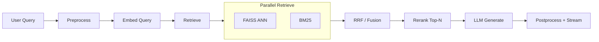
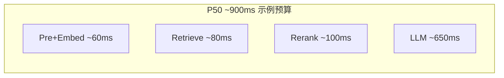
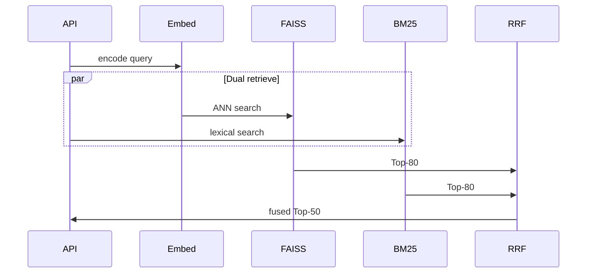
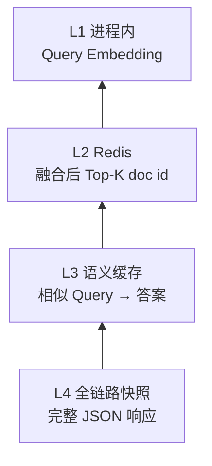
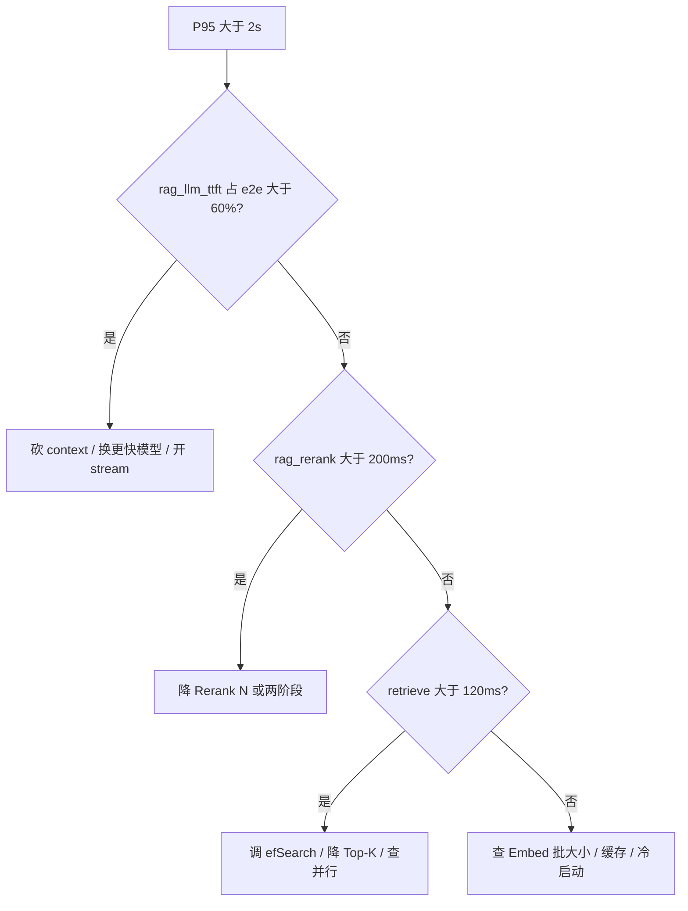

# 生产级 RAG 系统性能优化实战：延迟预算、并行检索与推理瓶颈

**生产级 RAG 性能优化的第一原则**：先按阶段拆开端到端延迟（Embed → Retrieve → Rerank → Generate），在 P95 预算内定位真正占时的环节；多数已上线系统的瓶颈在 **LLM 生成（约 70–80%）** 和 **Cross-Encoder Rerank（约 50–200ms）**，而不是再换一个更大的 Embedding 模型。

张薇带的团队在 Q3 把内部知识库 RAG 的 answer relevance 从 0.71 拉到 0.86：上了混合检索、把 Rerank 候选从 10 扩到 40，还换了更强的领域 Embedding。演示环境单次查询 1.9 秒，老板点头。灰度一周后，客服入口的 **P95 从 1.8 秒涨到 4.2 秒**，工单里开始出现「比直接问通用 ChatGPT 还慢」。Faithfulness 报表没人看，延迟曲线人人看。

你可能也遇到过类似局面：**准确率优化和 RAG 性能优化不是同一张表**。本文只谈 **latency、throughput、单 query 成本**；Chunk 怎么切、HyDE 要不要上，请去看 [RAG 生产落地](https://tangentllm.github.io/weblog/post/rag-production-refactor/) 和 [RAG 混合检索策略](https://tangentllm.github.io/weblog/post/rag-hybrid-retrieval-strategy/)。读完本篇，你应该能画出自己系统的延迟瀑布图，并按 SLO 排出优化优先级。

> **Key Takeaways**
> - 典型 P50 链路里，**LLM 生成约占 70–80% 延迟**；向量库调到极致仍可能救不了 P95。
> - **Rerank 候选数 N 与延迟近似线性**：Top-50 比 Top-10 多 80–150ms 很常见，质量增益未必成正比。
> - **BM25 与向量检索应并行**：耗时从「相加」变为「取 max」，常省 50–100ms。
> - **SLO 反推预算**：若 P95 目标 2s，建议 Retrieve+Rerank+Embed 合计控制在 **250–350ms**。
> - **先 Trace 一周再改 Top-K**；没有分阶段 span，优化容易打在错觉上。

---

## RAG 性能优化第一步：延迟瀑布与核心指标

### TTFT、TPOT、P95、QPS 各管什么

| 指标 | 在 RAG 里衡量什么 | 典型告警场景 |
|---|---|---|
| **TTFT**（Time To First Token） | 用户从发问到看见第一个字的时间 | 流式接口「卡住」、首字 >1.5s |
| **TPOT**（Time Per Output Token） | 生成阶段每个 token 的平均间隔 | 长回答越写越慢 |
| **P95 / P99** | 慢查询长尾，比平均值更能反映体验 | 灰度后「偶发很慢」 |
| **QPS / 吞吐** | 单位时间完成的 query 数 | 峰值排队、GPU 打满 |

RAG 的 TTFT 不只等于 LLM 首 token：它包含 **Query 预处理、Embedding、检索、Rerank、拼 Prompt** 的全部前置时间。排障时务必拆开，否则你会误把「检索 40ms」当成「系统已经很快」。

### 典型阶段占比（行业 benchmark）

下表综合多家生产 trace 与 [RAG 性能研究](https://app.ailog.fr/en/blog/news/rag-performance-study-2026) 的量级，**用于排优先级，不是你家机器的精确值**：

| 阶段 | P50 耗时（示例） | 占端到端比例 | 主要旋钮 |
|---|---|---|---|
| Query 预处理 | 10–20ms | ~2% | 分词、PII、路由 |
| Embedding | 35–80ms | ~5–8% | 批大小、ONNX、GPU |
| 向量检索（FAISS 等） | 25–50ms | ~4–6% | HNSW efSearch、Top-K |
| BM25（若混合） | 20–40ms | 与上并行 | 索引体积、分词 |
| **Rerank** | **60–200ms** | **~8–15%** | 候选数 N、模型大小 |
| **LLM 生成** | **500–1200ms** | **~70–80%** | 上下文长度、模型、流式 |
| 后处理 / 引用格式化 | 30–50ms | ~3–5% | 模板、校验 |



*图 1：生产级 RAG 请求路径；混合检索时 BM25 与向量应并行，融合后再进 Rerank。*



*图 2：延迟「瀑布」直觉；优化 LLM 前，先确认 Retrieve+Rerank 是否已吃掉你留给生成的预算。*

### 效果指标与性能指标分工

**recall@k、MRR、Faithfulness** 决定「答得对不对」；**P95、TTFT、单 query 成本** 决定「用户愿不愿意等」。两者都要，但优化手段不同：加 Rerank 往往涨分也涨延迟；加缓存往往降延迟却可能返回旧索引内容。效果评估可参考生产文中的离线集；性能评估需要 **分阶段 metrics + 压测脚本**（后文专节）。

**想先对齐基线架构？** 建议回顾 [RAG 系统重构实战：FAISS + bge-m3 + Reranker](https://tangentllm.github.io/weblog/post/rag-production-refactor/) 中的链路配置，再往下读优化项。

---

## RAG 延迟优化：检索与 Embedding 层预算

### FAISS：HNSW 与 IVF 的参数权衡

我们在生产文里用 **FAISS HNSW** 扛中文技术文档百万级 chunk。性能相关的旋钮主要是：

| 参数 | 调高时 | 风险 |
|---|---|---|
| `efSearch` / `efConstruction` | 召回更好、查询更慢 | P95 抖动 |
| `M`（HNSW 图度数） | 索引更大、查询更稳 | 构建时间变长 |
| IVF `nprobe` | 扫描更多桶、召回升 | 延迟近线性涨 |

**工程判断**：离线 recall@10 达标后，先把 `efSearch` 压在「召回损失 <1%」的最小值，再谈换索引类型。精确暴力搜索只适合做 baseline，不适合在线 QPS。

### Top-K 与进 LLM 的 Token 预算

召回 Top-K 越大，后面 **Rerank 和 Prompt 都变重**。一条经验公式：

$$\text{Prompt tokens} \approx \sum_{i=1}^{k'} \text{len}(\text{chunk}_i) + \text{system} + \text{query}$$

其中 $k'$ 是 Rerank 后实际进模型的条数。内部知识库场景里，**Retrieve Top-80 → Rerank Top-8 → 进 LLM 6 条** 往往比「Retrieve Top-20 全塞进 Prompt」更省延迟，且 citation 更干净。

### bge-m3：批处理与推理形态

[Embedding 领域微调](https://tangentllm.github.io/weblog/post/embedding-finetune-domain-rag/) 能抬 recall，但在线 Query 侧每次多 20–40ms 也常见。性能侧建议：

1. **Query 与 Document 分开部署**：文档 Embedding 离线批处理；在线只算 query 向量。
2. **动态 batch**：高峰时把 10–32 条 query 合并推理（注意 SLA 尾延迟）。
3. **ONNX / FP16**：在 CPU 上常能拿到 1.5–2× 加速，精度损失多数场景可接受。

不熟悉向量怎么算出来的，可先读 [Embedding 层实现](https://tangentllm.github.io/weblog/post/embedding-from-scratch/) 建立直觉，再回来调批大小与设备。

若你已微调 Embedding，请用 **同一评测集** 同时打 recall 与 P50 Embed 耗时，避免「质量 +30ms」却不自知。

### 混合检索并行：别串行等两路

[BM25+向量并行与 RRF 融合](https://tangentllm.github.io/weblog/post/rag-hybrid-retrieval-strategy/) 对 **效果** 的意义你已知道；对 **性能** 的意义是：串行耗时 $T_{bm25} + T_{vec}$，并行则是 $\max(T_{bm25}, T_{vec})$。在我们单机压测（约 120 万 chunk、BM25 30ms、FAISS 45ms）里，并行融合比串行 **少 55–70ms**。



*图 3：混合检索并行时序；Embed 完成后两路检索应同时发起。*

---

## Reranker：精度换延迟的最大开关

Cross-Encoder（如 **bge-reranker-v2-m3**）对 query 与 doc **成对打分**，计算量随候选数 $N$ 近似线性增长。行业量级：**N=20 时约 80ms，N=50 时约 150–200ms**（视 GPU/CPU 与 batch 而定）。

### 候选数怎么选：一张决策表

| 场景 | 建议 Rerank N | 理由 |
|---|---|---|
| 高 QPS 客服 FAQ | 8–12 | 答案短，向量召回够用 |
| 内部长文档 + 要引用 | 20–30 | 精度敏感，可接受 +100ms |
| 峰值促销 / 只读公告 | 0（关闭 Rerank） | 用规则或缓存兜底 |

**两阶段 Rerank**（先轻量 BM25/小模型筛到 30，再 Cross-Encoder 精排 10）在总延迟上常接近「一次排 50」，但质量接近。若你已在混合检索里拿到较稳的 Top-50，优先试 **把 N 从 50 降到 15**，再观察 offline MRR。

### 何时干脆关掉 Rerank

李航负责的员工手册 Bot，早高峰 QPS 约 120。他们把 **高频 200 问写入 Redis**，命中则跳过 Retrieve+Rerank；未命中走「向量 Top-5 直接进 LLM」，Rerank 仅在「用户点击引用原文」时异步补算。P95 从 3.1s 降到 **1.4s**，Faithfulness 在 FAQ 子集只掉 0.03。这不是通用方案，但说明 **Rerank 不是宪法，是开关**。

---

## 生成层：真正的长尾瓶颈

多数 trace 里，**LLM 生成占 70–80% 端到端时间**。向量库从 45ms 优化到 25ms，用户几乎无感；生成从 900ms 降到 600ms，体感明显。

### 上下文裁剪与回答长度上限

1. **硬上限**：`max_tokens` 对输出；`max_context` 对输入。RAG 别吃满 128K「因为模型支持」。
2. **去重**：多 chunk 来自同一 PDF 时，合并相邻段或只保留得分最高的一条。
3. **引用块压缩**：正文给摘要，完整段落放折叠或链接（产品形态自定）。

### 流式输出与用户感知

即使总耗时不变，**TTFT 提前 300ms** 也能显著降低「卡死感」。API 层务必开启 stream；监控里单独记录 **「首 token 前」** 与 **「生成阶段」**。

### 本地 vLLM vs 云端 API

| 维度 | 云端 API | 自建 vLLM |
|---|---|---|
| TTFT | 网络 + 排队，波动大 | 可控，依赖调度 |
| 吞吐 | 按 TPM 限流 | Continuous batching 可榨 GPU |
| 成本 | 按 token 计费，省心 | 机器 + 运维，量大更省 |
| RAG 适配 | 即插即用 | 需处理前缀 KV、长上下文显存 |

[RAGO 论文](https://arxiv.org/abs/2503.14649) 指出：不同 RAG 变体下，瓶颈可能在检索侧，也可能在生成侧；**统一用 LLM-only 的调度策略会浪费算力**。自建推理可配合 [vLLM 的 PagedAttention 与 continuous batching](https://docs.vllm.ai/) 压榨 GPU 吞吐。若你已拆 Retrieve / Generate 服务，应对两侧分别做 batch 与 autoscale。

### 系统 Prompt 与前缀 KV Cache

多条 query 共享同一长 system prompt 时，**前缀 KV Cache** 能省重复 prefill。前提是推理引擎支持且 prompt 前缀字节级一致；RAG 动态插入的 context 段仍在后缀，不影响前缀复用。

---

## 缓存与并行：不改模型也能砍 P95

### 四级缓存



*图 4a：四级缓存由慢到快；索引版本变更须失效 L2–L4。*


*图 4b：四级缓存金字塔示意（SVG 内文为英文标签，避免损坏编码导致浏览器无法加载）。*

| 层级 | 缓存什么 | 命中收益 | 一致性风险 |
|---|---|---|---|
| L1 进程内 | Query 向量 | 省 40–80ms Embed | 低 |
| L2 Redis | 融合后 Top-K doc id | 省 Retrieve+Rerank | 中：索引更新需 TTL/版本号 |
| L3 语义 | 相似 query → 答案 | 可省整条链路数百 ms | 高：误命中答非所问 |
| L4 全链路 | 完整 JSON 响应 | 极低延迟 | 最高：仅适合静态 FAQ |

语义缓存要设 **相似度阈值 + 人工抽检**；李航的团队在 L3 加了「索引版本号」字段，发布新文档后强制 miss，避免「答得飞快但内容过期」。

### 服务拆分：别让 ingest 拖垮 query

文档入库（解析、切块、Embedding、写 FAISS）应走 **异步队列**，与在线 query 路径隔离。峰值上传 10 万份 PDF 时，query P95 不应抖动。这与 [Modular RAG](https://tangentllm.github.io/weblog/post/paper-rag-survey/) 的模块划分一致，只是本文强调 **资源隔离** 而非模块命名。

---

## 可观测性与压测：避免「优化了错觉」

### 每阶段 span 命名建议

```
rag.preprocess
rag.embed
rag.retrieve.vector
rag.retrieve.bm25
rag.fusion
rag.rerank
rag.llm.prefill
rag.llm.decode
rag.postprocess
```

用同一 `request_id` 贯穿；Grafana 里按 span 聚合 P50/P95。

### 推荐指标与告警起点

| 指标 | 建议告警 | 说明 |
|---|---|---|
| `rag_e2e_seconds` P95 | > 2.5s 持续 5min | 面向用户的 SLO |
| `rag_rerank_seconds` P95 | > 250ms | Rerank 失控 |
| `rag_retrieve_seconds` P95 | > 150ms | 索引或 Top-K 过大 |
| `rag_cache_hit_ratio` | < 20% 且 QPS 高 | 缓存策略未生效 |
| `rag_llm_ttft_seconds` P95 | > 1.2s | 生成或网络问题 |

### P95 超 2s 时怎么判瓶颈



*图 5：瓶颈判定树；先 Trace 再动刀，避免盲目换模型。*

### 压测必覆盖的四类场景

1. **冷启动**：进程刚拉起、缓存为空。
2. **热缓存**：重复 query + 近似 query（测语义缓存误命中）。
3. **混合检索全开**：BM25 + 向量 + Rerank 最大配置。
4. **长上下文**：Rerank 后仍进 LLM 12k+ tokens。

周测在压测报告里发现：团队把 `efSearch` 提到 512 后 recall 涨了 0.4%，但 **retrieve P95 翻倍**，而 e2e P95 几乎不变，因为 LLM 仍占 78%。这次压测避免了「继续加 efSearch」的错误方向。

---

## 基于生产栈的优化清单（改前 / 改后参考）

下列数字来自 **单机复现**（8 核 CPU、单卡 T4、bge-m3 + FAISS HNSW + bge-reranker-v2-m3、混合检索），与你们集群会有偏差，但 **相对趋势** 可参考：

| 改动 | P50 e2e | P95 e2e | offline MRR@10 |
|---|---|---|---|
| 基线：串行检索 + Rerank N=50 | 1.42s | 3.8s | 0.412 |
| 并行 BM25+FAISS | 1.31s | 3.5s | 0.418 |
| Rerank N=50 → 15 | 1.18s | 2.9s | 0.405 |
| + Query Embed L1 缓存 | 1.05s | 2.6s | 0.405 |
| + 进 LLM chunk 6→4 条 | 0.92s | 2.1s | 0.398 |

**若…则…** 检查表：

1. **若** P95>2s 且 LLM 占比 >70% → 先砍 context / 限 `max_tokens`，再动 FAISS。
2. **若** Rerank P95>200ms → 降 N 或两阶段；勿先换更大 Reranker。
3. **若** 已上混合检索仍慢 → 查是否串行 BM25；改并行。
4. **若** QPS>50 且 FAQ 重复度高 → 上 L2/L3 缓存 + 版本号失效。
5. **若** 微调 Embedding 后变慢 → 对比 recall 增益是否值得 +30ms。
6. **若** 灰度后「偶发 6s+」→ 查 LLM 限流排队，不是检索单点。
7. **若** 索引 rebuild 期间延迟尖刺 → ingest 与 query 分集群。
8. **若** 用户抱怨「首字慢」→ 看 TTFT 而非总耗时；开 stream。

**下一步实操**：用现有 [RAG 生产落地](https://tangentllm.github.io/weblog/post/rag-production-refactor/) 配置打一周 Trace，再按上表逐项做 A/B；效果回退用同一评测集验证，别只看延迟。

---

## 优化手段 × 收益 × 风险（总览）

| 手段 | 延迟收益（量级） | 质量风险 | 实施成本 |
|---|---|---|---|
| 并行混合检索 | −50~100ms | 低 | 低 |
| 降 Rerank N | −80~150ms | 中 | 低 |
| Query Embed 缓存 | −40~80ms | 低 | 低 |
| 降进 LLM chunk 数 | −100~300ms | 中 | 低 |
| FAISS 调参 | −10~30ms | 中（召回） | 中 |
| 语义答案缓存 | −300~800ms（命中时） | 高（过期） | 中 |
| vLLM + 量化 | −200~400ms（生成） | 中 | 高 |
| 换更大 Embedding | 常 **变慢** | 可能升 recall | 中 |

---

## 常见问题（FAQ）

**生产级 RAG 性能优化应该先动哪一段？** 
先打一周分阶段 Trace。若 `rag.llm` 占端到端 60% 以上，优先砍上下文与输出长度；若 `rag.rerank` 持续 >200ms，先降 Rerank 候选数 N。

**RAG 端到端延迟 P95 多少算合格？** 
面向对话式知识库，**P95 ≤ 2–2.5s** 是常见 SLO；流式场景更要盯 **TTFT ≤ 1.2s**，别只看总耗时。

**混合检索会让 RAG 变慢吗？** 
串行 BM25+向量会相加变慢；**并行检索 + RRF 融合** 通常只比单路慢一个 max(两路)，并可能因召回更好而减少进 LLM 的 chunk 数。

**语义缓存值得上吗？** 
FAQ、活动页等高重复场景值得；必须带 **索引版本号** 与抽检，否则快但答过期内容。

---

<script type="application/ld+json">
{
  "@context": "https://schema.org",
  "@type": "FAQPage",
  "mainEntity": [
    {
      "@type": "Question",
      "name": "生产级 RAG 性能优化应该先动哪一段？",
      "acceptedAnswer": {
        "@type": "Answer",
        "text": "先打一周分阶段 Trace。若 LLM 占端到端 60% 以上，优先砍上下文与输出长度；若 Rerank 持续超过 200ms，先降 Rerank 候选数 N。"
      }
    },
    {
      "@type": "Question",
      "name": "RAG 端到端延迟 P95 多少算合格？",
      "acceptedAnswer": {
        "@type": "Answer",
        "text": "面向对话式知识库，P95 在 2 到 2.5 秒是常见 SLO；流式场景更要盯 TTFT 不超过约 1.2 秒。"
      }
    },
    {
      "@type": "Question",
      "name": "混合检索会让 RAG 变慢吗？",
      "acceptedAnswer": {
        "@type": "Answer",
        "text": "串行 BM25 加向量会相加变慢；并行检索加 RRF 融合通常只比单路慢 max(两路)，并可能因召回更好而减少进 LLM 的 chunk 数。"
      }
    },
    {
      "@type": "Question",
      "name": "语义缓存值得上吗？",
      "acceptedAnswer": {
        "@type": "Answer",
        "text": "FAQ、活动页等高重复场景值得；必须带索引版本号与抽检，否则可能答得飞快但内容过期。"
      }
    }
  ]
}
</script>

## 总结：生产级 RAG 性能优化怎么落地

生产级 **RAG 性能优化** 不是再堆一个「准确率技巧」，而是 **在 SLO 约束下分配延迟预算**：LLM 通常吃掉大部分 e2e；Rerank 是最敏感的线性开关；混合检索务必并行；缓存能救 P95，但要管索引版本。

五条带走：

1. 先画延迟瀑布，再选旋钮。
2. Retrieve+Rerank 建议压在 250–350ms（P95 目标 2s 时）。
3. Rerank 候选数 N 是最划算的试错点。
4. 并行 BM25+向量是低成本收益。
5. Trace 一周，避免优化错觉。

张薇团队在降 Rerank N 并并行检索后，把客服入口 P95 拉回 **2.0s 以内**，MRR 仅掉 0.007，老板终于肯看 Faithfulness 报表了。

---

## 延伸阅读

- [RAG 系统重构实战](https://tangentllm.github.io/weblog/post/rag-production-refactor/)：FAISS、bge-m3、Reranker 基线
- [RAG 混合检索策略](https://tangentllm.github.io/weblog/post/rag-hybrid-retrieval-strategy/)：BM25+向量与 RRF
- [Embedding 模型微调与领域检索](https://tangentllm.github.io/weblog/post/embedding-finetune-domain-rag/)：质量与耗时的权衡
- [RAG 论文解读：演化路径](https://tangentllm.github.io/weblog/post/paper-rag-survey/)：Modular / Advanced RAG 背景

---

## 参考文献

1. RAGO: Systematic Performance Optimization for Retrieval-Augmented Generation Serving. arXiv:2503.14649. https://arxiv.org/abs/2503.14649
2. Faiss wiki: Index types and GPU. https://github.com/facebookresearch/faiss/wiki
3. vLLM: PagedAttention 与 continuous batching（官方文档）

