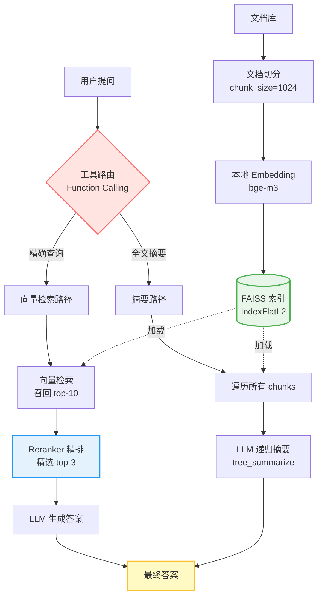

# RAG 系统重构实战：从 Demo 到生产的那些坑

最近自己在做一个金融研报问答系统，用的是 LlamaIndex + OpenAI 那套标准方案。上线第二周账单出来，embedding 费用直接干到了月预算的 40%，而且用户反馈中文长文档的召回效果"有点飘"。这事儿逼着我重新审视整个技术栈，最后花了两周时间做了一轮彻底重构。

这篇文章不是教你怎么从零搭 RAG，而是复盘我在重构过程中踩的几个坑，以及为什么最终选择了现在这套方案。

## 第一个决策：换掉 OpenAI Embedding

最开始用 `text-embedding-3-small` 是因为省事，LlamaIndex 官方文档就是这么写的。但实际跑起来发现两个问题：

一是成本。我们的文档库大概 2000 份 PDF，平均每份 50 页，按 1024 token 切块后大概 15 万个 chunk。OpenAI embedding 按 token 计费，这个量级下来每次全量重建索引就是几百块，而且用户每次查询还要再 embed 一次问题。

二是中文效果。`text-embedding-3-small` 在英文场景下确实不错，但我们的研报里有大量金融术语、行业黑话，比如"PE-TTM"、"归母净利润"、"非经常性损益"，这些词的语义相似度它经常算不准。有次测试问"XX电路的营收增长"，它召回了一堆"XX电子"的内容，因为两份研报的行文结构太像了。

换成 `bge-m3` 之后这两个问题都解决了。bge 是本地模型，跑在自己服务器上，embedding 的成本从按量付费的 API 费用转变为固定的硬件资源成本。对于我们这种持久化负载，总拥有成本（TCO）显著降低。而且它是在中文语料上预训练的，对金融领域的术语敏感度明显更高。唯一的代价是首次加载模型要占 2GB 显存，不过这点资源对我们来说不是问题。

```python
# 之前：每次查询都要调 API
Settings.embed_model = OpenAIEmbedding(
    model="text-embedding-3-small",
    api_key=OPENAI_API_KEY,
    api_base=OPENAI_API_BASE,
)

# 现在：本地模型，一次加载常驻内存
Settings.embed_model = HuggingFaceEmbedding(model_name="BAAI/bge-m3")
```

这里有个细节：切换 embedding 模型后，FAISS 索引的维度会变。`text-embedding-3-small` 是 1536 维，`bge-m3` 是 1024 维。如果直接加载旧索引会报 dimension mismatch 错误。我的做法是在构建索引前动态探测维度：

```python
# 动态探测 embedding 维度，避免硬编码
d = len(Settings.embed_model.get_text_embedding("维度"))
# 创建 FAISS 平面索引（暴力搜索，精度最高）
faiss_index = faiss.IndexFlatL2(d)
```

这样即使以后再换模型，代码也不用改。

## Reranker 不是可选项

很多 RAG 教程会告诉你 Reranker 是"进阶优化"，可加可不加。但在我们的场景里，Reranker 是必需品，不是锦上添花。

向量检索的问题在于它只看 embedding 的余弦相似度，不考虑上下文。比如用户问"XX电路 2023 年同比增长"，向量检索会把所有包含"XX电路"、"2023"、"增长"这些词的 chunk 都召回，但其中可能有一半是在讲"2022 年增长"或者"预计 2024 年增长"。这些 chunk 的 embedding 和问题很接近，但语义上根本不是用户要的答案。

Reranker 的作用是在粗筛结果上做二次排序。它会把问题和每个候选 chunk 拼在一起，用一个专门训练的模型算相关性得分。这个得分比单纯的向量距离准确得多，因为它能理解"2023 年同比增长"这个完整语义。

我们的配置是先用向量检索召回 top-10，再用 `bge-reranker-v2-m3` 精排出 top-3。这个比例是通过离线评估迭代出来的：我们准备了 200 个标注问题，分别测试了 top-5/top-3、top-10/top-3、top-10/top-5 几种组合，用召回率和 MRR（Mean Reciprocal Rank）作为指标。最终 top-10/top-3 在召回率和精排质量之间取得了最好的平衡。如果粗筛召回太少（比如 top-5），可能会漏掉真正相关的内容；如果精排留太多（比如 top-5），后面的 LLM 生成阶段会被噪声干扰。

```python
# 向量检索器：从 FAISS 索引中召回最相似的 10 个 chunk
retriever = VectorIndexRetriever(index=index, similarity_top_k=10)

# Reranker：对召回结果进行精排，保留最相关的 3 个
reranker = FlagEmbeddingReranker(top_n=3, model="BAAI/bge-reranker-v2-m3")

# 组装查询引擎：先粗筛再精排
query_engine = RetrieverQueryEngine.from_args(
    retriever=retriever,
    node_postprocessors=[reranker],  # 后处理器链，可以串联多个
)
```

有个坑是 `FlagEmbeddingReranker` 不在 LlamaIndex 的默认依赖里，需要单独装 FlagEmbedding 的 Git 版本。我第一次部署到生产环境时忘了这事儿，服务起来后第一个查询就报 ImportError，回滚重装浪费了半小时。

## 索引持久化的权衡

最早的版本每次启动服务都要重新构建索引，15 万个 chunk 跑一遍 embedding 要 20 分钟。这在开发阶段还能忍，但上生产后每次发版都要停机 20 分钟，运维那边直接炸了。

LlamaIndex 支持把索引持久化到磁盘，下次启动直接加载。但这里有个设计上的取舍：持久化之后，如果文档库更新了（比如新增了几份研报），你是选择增量更新还是全量重建？

增量更新听起来很美好，但实际操作起来很麻烦。技术上，`IndexFlat` 通过 `IndexIDMap` 包装后是支持物理删除的，但你需要自己维护文档 ID 到 node ID 的映射表，每次更新时先删掉旧 node 再插入新 node。而且频繁的增删操作会带来 ID 重排开销和索引碎片化问题——就像文件系统的碎片化一样，向量存储不再连续，影响内存访问的局部性，进而拖累检索性能。

考虑到我们的文档更新频率是日级别的，对实时性要求不高，全量重建比维护复杂的增量更新逻辑更简单可靠。我们的方案是定时全量重建 + 持久化：每天凌晨 3 点跑一个定时任务，扫描文档目录，如果有变化就重建索引并保存。服务启动时直接加载最新的持久化索引，冷启动时间从 20 分钟降到 5 秒。

```python
def get_or_build_index(documents: list) -> VectorStoreIndex:
    persist_path = Path(PERSIST_DIR)
    
    # 检查是否存在持久化索引
    if persist_path.exists() and any(persist_path.iterdir()):
        print("加载已有 FAISS 索引...")
        # 从磁盘加载向量存储
        vector_store = FaissVectorStore.from_persist_dir(PERSIST_DIR)
        storage_context = StorageContext.from_defaults(
            vector_store=vector_store, 
            persist_dir=PERSIST_DIR
        )
        # 重建索引对象（元数据 + 向量存储）
        return load_index_from_storage(storage_context)
    
    # 首次构建：文档切分 -> embedding -> 存储
    print("首次构建索引，开始 embedding...")
    # ... 构建逻辑（切分、embedding、创建索引）
    
    # 持久化到磁盘，下次启动直接加载
    index.storage_context.persist(persist_dir=PERSIST_DIR)
    return index
```

这个方案的缺点是文档更新有延迟（最多 24 小时），但对我们的业务来说可以接受。如果你的场景需要实时更新，可能得上 Elasticsearch 或者 Milvus 这种支持增量写入的向量数据库。

## 系统架构全景

在深入工具路由之前，先看一下整个系统的架构。下图展示了从用户提问到最终答案生成的完整数据流：



这张图清晰地展示了三个关键设计：

1. **双路由架构**：LLM 根据问题类型自动选择向量检索（精确查询）或全文摘要（综述类问题）
2. **两阶段检索**：向量粗筛（top-10）→ Reranker 精排（top-3），过滤噪声提升精度
3. **离线构建**：文档库 → 切分 → Embedding → FAISS 索引（每日凌晨 3 点重建并持久化）；冷启动直接加载持久化索引，约 5 秒就绪

## 工具路由：不是所有问题都该走向量检索

重构前的版本只有一个 query engine，所有问题都走向量检索。结果用户问"总结一下这份研报"时，系统会召回几个最相关的 chunk，然后基于这几个片段生成摘要。这种摘要往往是片面的，因为向量检索天然倾向于局部相关性，很难覆盖全文。

后来我加了一个 `SummaryIndex`，专门处理全文摘要类的问题。它的工作方式是把所有 chunk 都喂给 LLM，用 `tree_summarize` 模式递归生成摘要。这种方式虽然慢（要调多次 LLM），但摘要质量明显更高。

然后问题来了：怎么让系统自动判断用户的问题该走哪个引擎？

LlamaIndex 的 `predict_and_call` 接口支持工具路由，你给它一组工具，它会根据问题描述自动选择。关键是工具的 description 要写清楚：

```python
tools = [
    FunctionTool.from_defaults(
        name="vector_tool",
        fn=lambda q: str(query_engine.query(q)),
        # 描述要具体：列举典型问题类型，而非抽象功能
        description="用于精确问题查询，如数据、价格、时间范围",
    ),
    QueryEngineTool.from_defaults(
        name="summary_tool",
        query_engine=summary_engine,
        # LLM 根据这段描述判断是否调用此工具
        description="用于全文概括或综述类问题",
    ),
]
```

这个 description 是给 LLM 看的，它会根据这段话判断该调哪个工具。我试过很多种写法，最后发现最有效的是直接列举典型问题类型，而不是抽象地描述功能。

不过，这种基于自然语言描述的路由在遇到边界模糊的问题时会出现摇摆。比如用户问"分析一下世运电路近三年的营收，并总结其业务模式"，这种问题既需要精确数据又需要全文理解，LLM 可能会在两个工具间犹豫。我的做法是在 Prompt 里引导 LLM 优先选择更通用的向量工具，同时在日志中记录路由决策，方便后续分析 Bad Case。这半年下来，发现大概 5% 的查询会出现路由不准确的情况，这些 Case 会定期拿出来优化 description。

另外，这套方案有个前提：你的 LLM 需要支持 function calling。主流商业模型（GPT-4 系列、Claude、Gemini）目前均原生支持；如果你用的是部分未经 FC 微调的开源模型，LlamaIndex 会自动降级到 ReAct 模式，效果会差一些。

## 一些没写进代码的教训

重构过程中还有几个坑值得提一下，虽然最终代码里看不出来。

第一个是 chunk size 的选择。我最开始设的是 512，觉得 chunk 越小检索越精确。结果发现很多长句子被切断了，召回的 chunk 经常缺上下文，LLM 生成的答案驴唇不对马嘴。后来改成 1024，overlap 设 100，效果好了很多。这个参数没有标准答案，得根据你的文档特点调。

第二个是 API 中转的稳定性。我们用的是国内的 OpenAI 中转服务，偶尔会遇到限流或者超时。最开始没做重试逻辑，一旦 API 挂了整个查询就失败。后来加了指数退避重试，并且在 `load_documents` 里对网页加载做了异常捕获，单个 URL 失败不影响全局。

第三个是环境变量管理。代码里硬编码 API key 是大忌，但我见过太多 Demo 代码这么干。我的做法是所有敏感信息都从环境变量读，本地开发用 `.env` 文件，生产环境用 K8s ConfigMap。这样代码可以直接开源，不用担心泄露密钥。

## 最后

这套方案跑了半年，目前日均查询量 5000 次左右，P95 响应时间 3 秒，用户满意度从 60% 涨到了 85%。成本方面，embedding 从按量计费转为固定硬件成本，LLM 调用费用降了 30%（因为 Reranker 过滤掉了很多无效 chunk，减少了 LLM 的输入 token）。

但我不觉得这是终态。还有个问题一直没解决好：多跳推理。比如用户问"XX电路和XX电子哪家增长更快"，现在的系统只能分别召回两家的数据，然后让 LLM 对比，但如果问题涉及三家、四家公司，召回策略就得重新设计了。一个可能的方向是 Agentic RAG，让 LLM 把复杂问题拆解成多个子查询，每个子查询独立检索后再汇总，不过这会显著增加延迟和成本，需要仔细权衡。

你们在做 RAG 时遇到过哪些反直觉的坑？评论区聊聊。