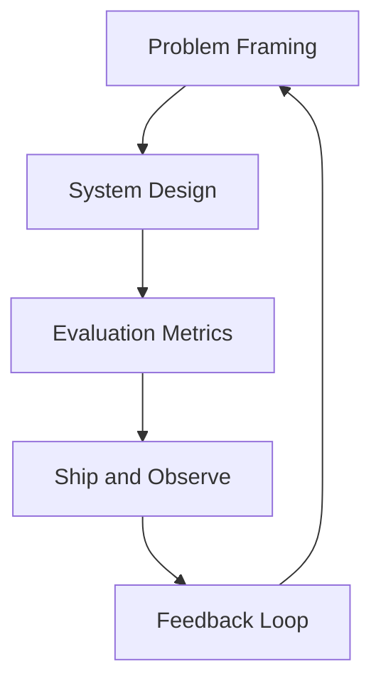

## 变化太快，什么能力不会过时

我越来越相信，工程师的长期优势来自三个层次：

1. 抽象能力：把混乱需求变成可执行系统。  
2. 评估能力：知道“好”是什么，并能量化。  
3. 交付能力：在真实约束下把方案落地。

*图1：工程师长期优势的能力闭环：定义问题、评估结果、持续交付*

## 从“会用模型”到“会做系统”

单次 prompt 的成功不等于产品可用。真正的门槛在于：

- 数据闭环  
- 监控与回滚  
- 成本与延迟控制  
- 团队协作中的知识沉淀

## 写在最后

模型会持续变强，但对问题本质的理解、对用户价值的敏感度、对工程质量的坚持，才是最难被替代的部分。
