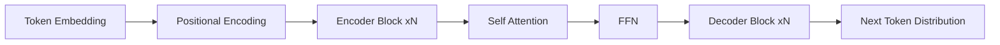

## 为什么 Transformer 成为主流

Transformer 的核心价值在于将序列建模从“逐步递归”转为“全局并行”。在长上下文场景中，这个变化同时影响了训练效率和表达能力。



*图1：Transformer 从输入嵌入到输出分布的主干计算链路*

## 自注意力的核心计算

给定输入矩阵 $X \in \mathbb{R}^{n \times d}$，通过线性映射得到：

$$Q = XW_Q, \quad K = XW_K, \quad V = XW_V$$

单头注意力定义为：

$$\operatorname{Attention}(Q,K,V) = \operatorname{softmax}\left(\frac{QK^T}{\sqrt{d_k}}\right)V$$

多头注意力将表示空间拆分到多个子空间，有助于学习不同语义关系。

## 一个最小实现

```python
import torch
import torch.nn.functional as F

def scaled_dot_product_attention(q, k, v, mask=None):
    score = q @ k.transpose(-2, -1) / (q.size(-1) ** 0.5)
    if mask is not None:
        score = score.masked_fill(mask == 0, float("-inf"))
    prob = F.softmax(score, dim=-1)
    return prob @ v, prob
```

## 常见模块对比

| 模块 | 输入输出形状 | 主要作用 | 复杂度 |
|---|---|---|---|
| Self-Attention | $n \times d \rightarrow n \times d$ | 全局依赖建模 | $O(n^2)$ |
| FFN | $n \times d \rightarrow n \times d$ | 特征变换与非线性 | $O(nd^2)$ |
| LayerNorm | $n \times d$ | 稳定训练 | $O(nd)$ |

## 工程层面的关键点

1. 长上下文下，注意力显存是瓶颈。
2. 混合精度与激活重计算对训练吞吐非常关键。
3. 推理场景中 KV Cache 的布局会显著影响延迟。

> 如果你只记住一件事：Transformer 的优势不是一个公式，而是一整套可并行、可扩展、可工程化的设计哲学。
